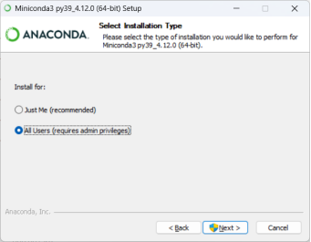

# 安装环境管理工具(Conda)

PyTorch采用Python语言接口来实现编程，故需先安装Python运行环境及常用工具包，然后再安装PyTorch。然而，由于安装Python及常用工具包的过程较为繁琐且容易出错（主要指包依赖及版本冲突等问题），于是开源社区组织将Conda环境管理工具、Python运行环境及常用工具包打包集成到一个安装软件包中（MiniConda /
AnaConda），安装该集成软件包即可完成Python运行环境及常用工具包的安装，实现包的便捷获取与环境的统一管理。

Conda是一个为Python而设的开源包管理和环境管理工具，用于安装Python及相应的包（库），即Python环境安装、运行、管理平台。MiniConda是一款小巧的Python环境管理工具，是AnaConda的一个小型版本，只包含Conda、Python及其所依赖的包，以及少量其他有用的包，包括pip、zlib等。安装MiniConda后，即可使用conda命令安装任何其他软件工具包并创建环境等。

首先，到Conda官网下载与电脑操作系统相匹配的MiniConda安装文件，建议读者下载一个相对稳定的版本（此处采用的是Python3.8），防止最新版本在使用中出现其他问题。下载成功后根据指示完成安装（若是Windows系统，请将其安装到除C盘外的其他磁盘，以防止使用中C盘空间不足，此处安装于D盘），如图1-1所示。

:::{figure-md}

图 1-1 MiniConda 安装过程中
:::

