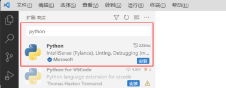
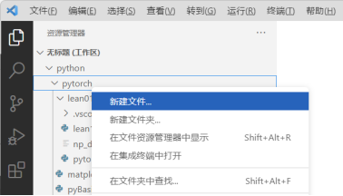
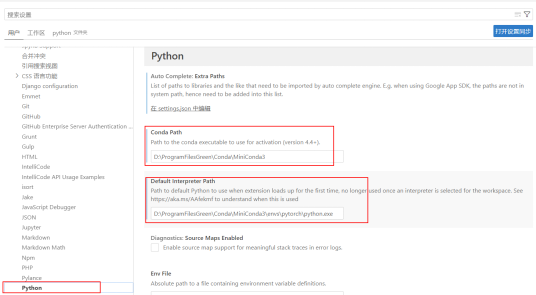
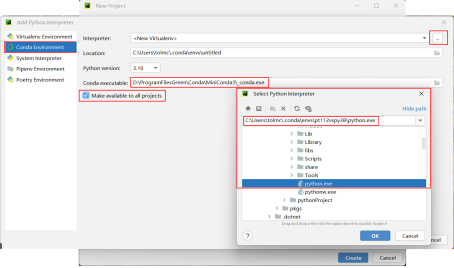
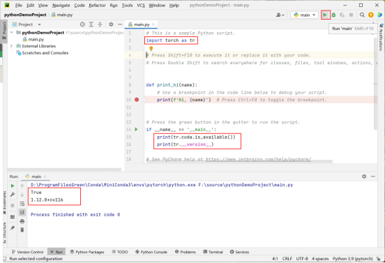

# 源码集成开发环境(PyCharm/Visual Studio Code)

&ensp;&ensp;&ensp;&ensp;
在编写代码时，可以通过文本编辑器（如记事本或VI）编写，但此类文本编辑器的功能太少，使编写代码的效
率过低。而源代码集成开发环境（以下简称IDE）则是具备代码智能提示、语法高亮、项目管理、代码跳转、
代码补全甚至版本管理等功能的源代码编写工具，可极大提升编写程序的效率，Visual
Studio Code与PyCharm是用于编写Python程序时常用的集成开发环境。

- （1）Visual Studio Code

&ensp;&ensp;&ensp;&ensp;
Visual Studio Code（以下简称VSCode）是一款免费的IDE，可支持包括Python在内的多种编程语言，
可在Visual Studio Code官网下载。 下载并安装完成后，需在VSCode中进行配置使其支持Python语言
开发，方法如下：

&ensp;&ensp;&ensp;&ensp;
运行VSCode，按快捷键Ctrl+Shift+X打开扩展面板，于搜索框中输入“python”，在如图1-11所示的结果
中选择发布者是“Microsoft”的Python扩展并点击“安装”按钮。

:::{figure-md}


图 1-11 搜索并安装Python 扩展
:::

&ensp;&ensp;&ensp;&ensp;
安装完成后，可在电脑D盘或其他磁盘新建一个文件夹用于存放后续编写的Python程序，本书新建的文件夹为“F:
\source\python”。点击“打开文件夹”按钮，选择新建的文件夹并点击“添加”，从而把用于存放Python程
序的文件夹添加到VSCode中，使后续所有新建的Python源代码文件均保存在此文件夹下。添加完成后，在左
侧的文件夹工作区中，单击鼠标右键并在弹出的菜单中选择“新建文件”，输入新程序名称后即可开始编写代码，
如图1-12所示。

:::{figure-md}


图 1-12 工作区中新建源码文件
:::

&ensp;&ensp;&ensp;&ensp;
接下来，对VSCode中Python程序的运行环境进行设置：在VSCode中依次点击“文件首选项设置”，在弹出的
界面中依次选择“扩展Python”，依次设置“Conda Path”“Default Interpreter Path”为当前虚拟开
发环境MiniConda的路径、当前虚拟环境中Python解析程序的路径，如图1-13所示。

:::{figure-md}


图 1-13 配置MiniConda及Python 解释器
:::


- （2）PyCharm

&ensp;&ensp;&ensp;&ensp;
PyCharm分为商业收费版与免费社区版，本书使用的是免费社区版，可在PyCharm官网下载。
下载并安装完成后，需在PyCharm中配置虚拟开发环境MiniConda及当前虚拟环境中Python解析程序的路径。
其配置方法如图1-14所示。

```{image} ../../_static/1/1.4/1-14-1.png
:align: center
:alt: 图 1-14 PyCharm中配置MiniConda中的Python解析器
```

```{image} ../../_static/down_.png
:align: center
```

```{image} ../../_static/1/1.4/1-14-2.png
:align: center
:alt: 图 1-14 PyCharm中配置MiniConda中的Python解析器
```

```{image} ../../_static/down_.png
:align: center
```
:::{figure-md}


图 1-14 PyCharm中配置MiniConda中的Python解析器
:::

&ensp;&ensp;&ensp;&ensp;
在Windows命令行窗口中运行MiniConda，然后激活上述步骤创建的虚拟环境（conda
activate pt112vspy38）。点击如图1-15所示的绿色右键头“Run main”按钮或按“Shift+
F10”快捷键即可运行当前程序，若配置正确，则在下方“Terminal”窗口中即可看到当前程序的输出。


:::{figure-md}


图 1-15 PyCharm中运行调试程序
:::
