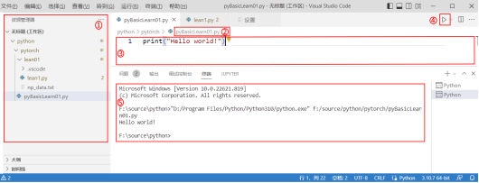

# Python 编程基础


Python是一门简单、易懂的编程语言，其语法与英语语法较为类似，能用类似于英语的语句方式进行程序编写，
对非计算机专业或首次接触编程的人来讲，是一种较合适的入门编程语言。同时，Python也是目前全世界范围内研究机构及学校应用得最多的编程语言之一，
也是机器学习领域中最流行的语言，如各种深度学习框架、库均提供了Python编程接口。因此，无论是为了进行深度学习研究，
或是数据科学等其他方面的研究工作，Python都是当下最合适的编程语言。Python是一门解释执行语言，即通过解释器，
以翻译一行执行一行的方式运行程序，可以理解为逐行解释并执行代码，遇到有错误的行或执行完毕后程序停止。


截止至本书编写，Python主要有2.x和3.x两大版本，其中3.x是当前主流版本，本章中的开发环境主要基于3.8版本，
若未特别说明则也适用于3.8及新的版本。以下内容将以VSCode集成开发环境（以下简称IDE）为例，
介绍该IDE的使用方法及Python编程基础。

1. IDE 基础


本节以VSCode为例，使读者提前熟悉IDE的使用方法，其主界面如图1-18所示：其中红字标识的①区显示工作区中的所有源码文件，
②区是当前源码文件名，③区是源代码输入编辑区，④区是运行程序按钮，⑤区是程序输出显示区。

:::{figure-md}



图 1-18 VSCode 主界面
:::


在进行下述编程练习时，首先在编程主界面中的①区点击鼠标右键新建文件learn.py（文件扩展名是.py，
名称为英文字母即可），在③区输入源代码并点击④区按钮后，即能在⑤区查看是否按预期输出。
在学习任何编程语言时，第一个程序往往是学习如何显示出“Hello world!
”，使用Python完成该程序的写法如下所示。

:::{literalinclude} ../codes/chapter_1_5_1_01.py
:caption: chapter_1_5_1_01.py
:language: python
:linenos:
:::

```text
hello word!
```


该行代码中“print”是一个函数（后续代码中将大量用到此函数，用于显示数据或其他内容）；
括号中的“Hello world!”是向该函数输入的参数；符号“#”后的文字为注释，用于描述该行代码的功能或作其他说明。
整行代码的意思是：调用print函数，其输入参数是“Hello world!”，点击运行按钮即可在输出区显示结果。

2. 数据类型


Python中主要有整数（integer，简称int）、浮点数（float）、字符串（string，简称str）等数据类型，
类（class）表示某数据的类别，使用type()
函数可查看变量的数据类型。应特别注意，字符串必须用英文半角单引号' '或双引号" "
，不能使用中文全角单引号‘’或双引号“”。

:::{literalinclude} ../codes/chapter_1_5_1_02.py
:caption: chapter_1_5_1_02.py
:language: python
:linenos:
:::

```text
<class 'int'>
<class 'str'>
```

3. 算数运算


使用Python语言所执行的加减乘除等运算与数学中的算术表示类似，+表示加法，-表示减法，*
表示乘法，/表示除法（注：除数不能是0）。

:::{literalinclude} ../codes/chapter_1_5_1_03.py
:caption: chapter_1_5_1_03.py
:language: python
:linenos:
:::

```text
2
1.6666666666666667
```

4. 常量与变量


如上示例使用的某个具体数字或某个字符串，称为常量，如：1、2.3、"string"
等。与常量对应的是变量，变量带有名称，可存放其他值，如下所示。

:::{literalinclude} ../codes/chapter_1_5_1_04.py
:caption: chapter_1_5_1_04.py
:language: python
:linenos:
:::

```text
222
come
```


运行以上代码可发现，变量就像一个抽屉，用于存放各种数据或值，在程序运行中可以向变量赋不同的值，也可以存放变量运算后的结果。

:::{literalinclude} ../codes/chapter_1_5_1_05.py
:caption: chapter_1_5_1_05.py
:language: python
:linenos:
:::

```text
555
come on!NoNoNo.
```

5. bool 型


bool型作为表示是/否的类型，其取值只能是True或False中的任意一个，主要用于bool运算（and、or、not）中判断某个条件的状态。

:::{literalinclude} ../codes/chapter_1_5_1_06.py
:caption: chapter_1_5_1_06.py
:language: python
:linenos:
:::

```text
False
```

6. 列表


列表可以用来表示一串数据，若要访问列表中的某个数据，可以通过带下标的索引访问，其中列表中第一个元素的下标是0；也可以访问列表中的连续几个数据（称为切片）。

:::{literalinclude} ../codes/chapter_1_5_1_07.py
:caption: chapter_1_5_1_07.py
:language: python
:linenos:
:::

```text
[1, 2, 3, 4, 5]
1
[2, 3, 4]
[1, 2]
```

7. 字典


字典是以键名:键值成对的方式存储数据，如："age":23, "name":Leeming, "wechat":
mahuaten等。

:::{literalinclude} ../codes/chapter_1_5_1_08.py
:caption: chapter_1_5_1_08.py
:language: python
:linenos:
:::

```text
23
```

8. if条件判断语句


if条件判断语句是指当if条件成立时才执行代码，if … else …语句是指根据不同的条件执行不同的代码。

:::{literalinclude} ../codes/chapter_1_5_1_09.py
:caption: chapter_1_5_1_09.py
:language: python
:linenos:
:::

```text
It’s a number!
Bigger!
```

9. for 循环语句


在循环执行某些代码时可使用for循环语句，如循环访问列表、数组等。

:::{literalinclude} ../codes/chapter_1_5_1_10.py
:caption: chapter_1_5_1_10.py
:language: python
:linenos:
:::

```text
1
2
3
4
5
```

10. 函数


在Python中，可以将一段有规律的、可重复使用的代码命名、定义为函数，便于调用执行，达到一次编写、多次调用的目的。同时，函数还可以定义参数，调用时将参数传递给函数中的代码，函数执行完成后可以返回值，以供调用方处理。

:::{literalinclude} ../codes/chapter_1_5_1_11.py
:caption: chapter_1_5_1_11.py
:language: python
:linenos:
:::

```text
***************
This is first text line
***************
3 + 5 = 8
add(3,5) return: 8
```

11. 面向对象编程


面向对象编程是一种将对象作为程序基本单位的编程思想，一个对象主要由数据（又称为属性）及函数（有些称为方法）组成，其中对象在定义时叫类，在使用时需要创建该类的一个实例化对象，以猫举例如下。

:::{literalinclude} ../codes/chapter_1_5_1_12.py
:caption: chapter_1_5_1_12.py
:language: python
:linenos:
:::


上述代码定义了一个**Cat类，用于抽象表示猫这类动物**，当要表示具体某只猫时，则需用类Cat实例化一个对象出来，设置对象的属性后，该**对象即表示某只具体的猫**，以上即是类和对象的区别。
