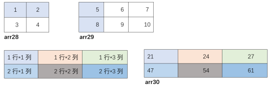
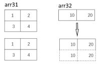

# Numpy 数组及运算

1. Numpy 导入


在Python中使用第三方包时，均需在代码起始行导入包，如下所示。

:::{literalinclude} ../codes/chapter_1_5_2_01.py
:caption: chapter_1_5_2_01.py
:language: python
:linenos:
:::


其中NumPy中生成随机数的Random模块常用函数如表1-1所示：

:::{table} 表1-1 Random模块常用函数
:align: center
:widths: grid

| 函数                | 描述          |
|-------------------|-------------|
| np.random.random  | 生成0到1之间的随机数 |
| np.random.uniform | 生成均匀分布的随机数  |
| np.random.randn   | 生成标准正态的随机数  |
| np.random.randint | 生成随机的整数     |
| np.random.normal  | 生成正态分布      |
| np.random.shuffle | 随机打乱顺序      |
| np.random.seed    | 设置随机数种子     |
| random_sample     | 生成随机的浮点数    |

:::

2. 数组


调用NumPy中的array函数可生成NumPy数组。如传递一个Python列表作为参数，则返回的NumPy数组就包括Python列表中的所有元素，其中访问NumPy中的元素与访问Python列表中的元素一致，使用lst[n]
方式访问（lst是数组名，n是从0开始的数组索引）。


其中NumPy中数组创建相关常用函数如表1-2所示：

:::{table} 表1-2 数组创建常用函数
:align: center
:widths: grid

| 函数                    | 	描述                             |
|-----------------------|---------------------------------|
| np.zeros((3,4))	      | 创建3×4的元素全为0的数组                  |
| np.ones((3,4))	       | 创建3×4的元素全为1的数组                  |
| np.empty((2,3))	      | 创建2×3的空数组，空数据中的值并不为0，而是未初始化的垃圾值 |
| np.zeros_like(ndarr)	 | 以ndarr相同维度创建元素全为0数组             |
| np.ones_like(ndarr)	  | 以ndarr相同维度创建元素全为1数组             |
| np.empty_like(ndarr)	 | 以ndarr相同维度创建空数组                 |
| np.eye(5)	            | 该函数用于创建一个5×5的矩阵，对角线为1，其余为0      |
| np.full((3,5), 666)	  | 创建3×5的元素全为666的数组，666为指定值        |

:::

:::{literalinclude} ../codes/chapter_1_5_2_02.py
:caption: chapter_1_5_2_02.py
:language: python
:linenos:
:::

```text
[1, 2, 3, 5]
[1 2 3 5]
<class 'list'>
<class 'numpy.ndarray'>
```


通过不同函数，可以创建不同种类的数组，如随机数数组：

:::{literalinclude} ../codes/chapter_1_5_2_03.py
:caption: chapter_1_5_2_03.py
:language: python
:linenos:
:::

```text
[0.29773903 0.82727708 0.76538624]
[0.82727708 0.76538624 0.29773903]
```


特定值数组（如全0、全1的数组）：

:::{literalinclude} ../codes/chapter_1_5_2_04.py
:caption: chapter_1_5_2_04.py
:language: python
:linenos:
:::

```text
[0. 0. 0.]
[1. 1. 1.]
[666 666 666]
```


按指定规则递增/递减的数组：

:::{literalinclude} ../codes/chapter_1_5_2_05.py
:caption: chapter_1_5_2_05.py
:language: python
:linenos:
:::

```text
[0 1 2 3 4 5 6 7 8 9]
[0 1 2 3 4 5 6 7 8 9]
[1.  1.5 2.  2.5 3.  3.5 4.  4.5]
[9 8 7 6 5 4 3 2 1 0]
```


在指定取值范围内，按指定数量等分的数组：

:::{literalinclude} ../codes/chapter_1_5_2_06.py
:caption: chapter_1_5_2_06.py
:language: python
:linenos:
:::

```text
[ 1.  2.  3.  4.  5.  6.  7.  8.  9. 10.]
```


同时，还可以将数组的数据保存到文件中，后续可从文件中恢复数组数据。

:::{literalinclude} ../codes/chapter_1_5_2_07.py
:caption: chapter_1_5_2_07.py
:language: python
:linenos:
:::

```text
[0.24175633 0.90959386 0.43980117 0.76418946 0.32679251 0.40891362
 0.38175381 0.91604818 0.8212697  0.16786087]
[0.24175633 0.90959386 0.43980117 0.76418946 0.32679251 0.40891362
 0.38175381 0.91604818 0.8212697  0.16786087]
```

3. NumPy 的算术运算


维度和元素个数相同的NumPy数组所进行的加减乘除算术运算是指：将每个数组中每个位置的元素进行相应运算后，再放回新数组相应位置的过程，如下所示。


:::{literalinclude} ../codes/chapter_1_5_2_08.py
:caption: chapter_1_5_2_08.py
:language: python
:linenos:
:::

```text
[ 6  8 10]
[-4 -4 -4]
[ 5 12 21]
[0.2        0.33333333 0.42857143]
```


4. 数组变形


上节生成的是一维数组（即只有一行数据），在深度学习中用得较多的则是多维数组（排成多行多列的成批数据），为方便读者理解，本书将有些多维数组的叫法与数学上的叫法相统一，即一维数组称为向量、二维数组称为矩阵、三维及三维以上数组称为张量，在NumPy中生成多维数组如下所示。

:::{literalinclude} ../codes/chapter_1_5_2_09.py
:caption: chapter_1_5_2_09.py
:language: python
:linenos:
:::

```text
arr3 的形状: (2, 3)
[[1 2 3]
 [6 7 8]]
```


多维数组之间也可以进行算术运算，其要求是参与运算的多维数组形状相同，以矩阵为例，要求矩阵的行数和列数均相同。

:::{literalinclude} ../codes/chapter_1_5_2_10.py
:caption: chapter_1_5_2_10.py
:language: python
:linenos:
:::

```text
arr3 + arr4=: [[ 4  4  4]
 [14 14 14]]
arr3 * arr4=: [[ 3  4  3]
 [48 49 48]]
arr3 * 10=: [[10 20 30]
 [60 70 80]]
```


在生成数组时可将数组中的元素按指定值填充：


:::{literalinclude} ../codes/chapter_1_5_2_11.py
:caption: chapter_1_5_2_11.py
:language: python
:linenos:
:::

```text
[[0. 0. 0.]
 [0. 0. 0.]
 [0. 0. 0.]]
[[0. 0. 0.]
 [0. 0. 0.]
 [0. 0. 0.]]
[[1. 0. 0.]
 [0. 1. 0.]
 [0. 0. 1.]]
[[1 0 0]
 [0 2 0]
 [0 0 3]]
```


多维数组中元素的获取举例如下：

:::{literalinclude} ../codes/chapter_1_5_2_12.py
:caption: chapter_1_5_2_12.py
:language: python
:linenos:
:::

```text
[[ 1.  2.  3.  4.  5.]
 [ 6.  7.  8.  9. 10.]
 [11. 12. 13. 14. 15.]
 [16. 17. 18. 19. 20.]
 [21. 22. 23. 24. 25.]]
[[ 1.  2.  3.]
 [ 6.  7.  8.]
 [11. 12. 13.]]
[[ 6.  7.  8.  9. 10.]
 [11. 12. 13. 14. 15.]
 [16. 17. 18. 19. 20.]]
[ 1.  2.  3.  4.  5.  6.  7.  8.  9. 10. 11. 12. 13. 14. 15. 16. 17. 18.
 19. 20. 21. 22. 23. 24.]
[[24. 24.  1.]
 [18. 10. 10.]
 [19. 13.  6.]
 [12.  2.  1.]]
[[21. 16. 12.]
 [17.  8. 14.]
 [18. 15. 18.]
 [ 9. 12. 17.]]
```


5. Numpy 的点积运算


点积运算在NumPy中用NumPy.dot(A,B)
表示，又称内积，要求A的第2个维度与B的第1个维度相同才能进行点积运算。以矩阵为例，即A的第2个维度（列）必须与B的第1个维度（行）相同时才能进行点积运算，其使用方法如下。


:::{literalinclude} ../codes/chapter_1_5_2_13.py
:caption: chapter_1_5_2_13.py
:language: python
:linenos:
:::

```text
[[21 24 27]
 [47 54 61]]
```

:::{figure-md}



图 1-19 点积运算示意图

:::

6. NumPy 的广播功能


如前所述的数组算术运算中，要求参与运算的数组须具备相同的形状。实际在NumPy中，形状不同的数组之间也可以进行运算，其中形状较小的数组会被扩展成与形状较大数组相同的形状（如行数较少，则将原行的数值复制到新增行；如列数较少，则将原列的数值复制到新增列）后，再进行算术运算，这就是NumPy的广播功能，其扩展示意如图1-20所示，使用方法如下。


:::{literalinclude} ../codes/chapter_1_5_2_14.py
:caption: chapter_1_5_2_14.py
:language: python
:linenos:
:::

```text
[[1 2]
 [3 4]]
[[10 40]
 [30 80]]
```


:::{figure-md}


图 1-20 数组扩展示意图
:::
