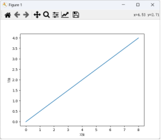
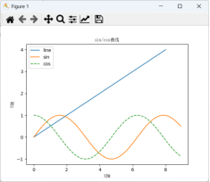
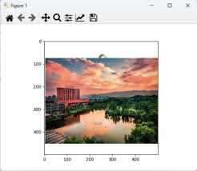
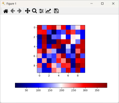
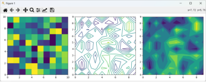

# 图形绘制基础

&ensp;&ensp;&ensp;&ensp;
在使用Python进行数据处理、深度学习的研究实验中，将数据或图表通过绘制并显示出来，对查看数据及提升理解的深度具有显著作用。Matplotlib（以下简称绘图包）即是用于轻松绘制图形和实现数据可视化的便利工具，其基础用法如下。

1. 绘制简单图形

&ensp;&ensp;&ensp;&ensp;
通过绘图包中的模块绘制简单的曲线，其结果如图1-21所示，代码如下。

:::{literalinclude} ../codes/chapter_1_5_3_01.py
:language: python
:linenos:
:::

&ensp;&ensp;&ensp;&ensp;
绘图时，可以在同一界面上绘制多个图形，效果如图1-22所示，代码如下。

:::{literalinclude} ../codes/chapter_1_5_3_02.py
:language: python
:linenos:
:::

:::::{grid}
::::{grid-item}
:::{figure-md}

图1-21 直线图形显示结果
:::
::::

::::{grid-item}
:::{figure-md}

图1-22 多个图例显示效果
:::
::::

:::::

2. 显示图片

&ensp;&ensp;&ensp;&ensp;
通过绘图包读入图片并显示，其结果如图1-23所示。

:::{literalinclude} ../codes/chapter_1_5_3_03.py
:language: python
:linenos:
:::

3. 显示颜色图谱

&ensp;&ensp;&ensp;&ensp;
通过绘图包读入颜色数据并显示，代码如下，其结果如图1-24所示。

:::{literalinclude} ../codes/chapter_1_5_3_04.py
:language: python
:linenos:
:::

:::::{grid}
::::{grid-item}
:::{figure-md}

图1-23 图片显示效果
:::
::::

::::{grid-item}
:::{figure-md}

图1-24 颜色图谱显示效果
:::
::::

:::::

4. 显示等高线图

&ensp;&ensp;&ensp;&ensp;
通过绘图包读入颜色数据并按热像图与等高线图等方式显示出来，代码如下，其结果如图1-25所示。

:::{literalinclude} ../codes/chapter_1_5_3_05.py
:language: python
:linenos:
:::

:::{figure-md}

图1-25 多种方式显示颜色数据
:::
