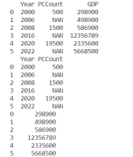

# 框架基础(Pytorch)

&ensp;&ensp;&ensp;&ensp;
PyTorch是一个建立在Torch库之上的Python包，旨在加速深度学习应用。PyTorch提供了一种类似于NumPy的抽象方法来表征张量（或多维数组），利用GPU来加速训练；同时，PyTorch采用动态计算图结构，可低延迟甚至是零延迟的改变网络行为。

&ensp;&ensp;&ensp;&ensp;
PyTorch主要由4个包组成：

- **torch**：与NumPy类似的通用包，可将张量类型转换为可在GPU上进行计算的类型。

- **torch.autograd**：能构建计算图形并自动获取梯度的包。

- **torch.nn**：具有共享层和损失函数等功能的神经网络操作包。

- **torch.optim**：具有通用优化算法的包。

1．导入torch包

&ensp;&ensp;&ensp;&ensp;
PyTorch深度学习框架在导入时其包的名称为torch，如下示例可查看当前框架的版本号。

:::{literalinclude} ../codes/chapter_1_5_4_01.py
:caption: chapter_1_5_4_01.py
:language: python
:linenos:
:::

```text
1.13.1+cu116
```

2. 创建张量(Tensor)

&ensp;&ensp;&ensp;&ensp;
几何代数中定义的张量（Tensor）是基于向量和矩阵的推广，可以将标量视为零阶张量，向量视为一阶张量，矩阵视为二阶张量。标量是一个单独的数；向量是一列数，且这些数是有序排列的；矩阵是二维数组，其中每一个元素被两个索引所确定。

&ensp;&ensp;&ensp;&ensp;
张量是一个可用来表示在一些矢量、标量和其他张量之间的线性关系的多线性函数，可理解为一个n维数值阵列。通俗来讲，可以将任意一张彩色图片表示为一个三阶张量，其三个维度分别是图片的高度、宽度和色彩数据；同时，也可以用四阶张量表示一个包含多张图片的数据集，其四个维度分别是图片在数据集中的编号与图片的高度、宽度和色彩数据。

&ensp;&ensp;&ensp;&ensp;
PyTorch的Tensor可以是零维（又称为标量或一个数）、一维（行或列）、二维（又称矩阵）及多维的数组。与NumPy中的ndarray相似，其最大区别是NumPy会把ndarray放在CPU中进行运算，而PyTorch的Tensor会放在GPU中进行加速运算。其中常见创建Tensor的方法如表1-3所示（*
size表示可以接收多个参数）。

:::{table} 表 1-3 创建Tensor 的常见方法
:align: center
:widths: grid

| 函数                        | 功能                             |
|---------------------------|--------------------------------|
| tensor(*size)             | 	直接从参数构造一个张量，支持List、Numpy数组    |
| eye(row, column)	         | 创建指定行数、列数的二维Tensor             |
| linspace(stat,end,steps)	 | 将区间[start,end)均分成steps份        |
| logspace(stat,end,steps)	 | 将区间[10^start,10^end)均分成steps份  |
| rand/randn(*size)	        | 生成[0,1)均匀分布/标准正态分布数据           |
| ones(*size)	              | 返回指定shape的张量，元素初始为1            |
| zeros(*size)	             | 返回指定shape的张量，元素初始为0            |
| ones_like(t)	             | 返回与t的shape相同的张量，且元素初始为1        |
| zeros_like(t)	            | 返回与t的shape相同的张量，且元素初始为0        |
| arrange(stat,end,step)	   | 在区间[start,end)上以间隔step生成一个序列张量 |
| from_Numpy(ndarray)	      | 从ndarray创建一个Tensor             |

:::

&ensp;&ensp;&ensp;&ensp;
以下示例将演示如何用torch创建张量：

:::{literalinclude} ../codes/chapter_1_5_4_02.py
:caption: chapter_1_5_4_02.py
:language: python
:linenos:
:::

```text
tensor([1, 2, 3, 4, 5, 6, 7, 8, 9], dtype=torch.int32)
tsr2 size: torch.Size([2])
xx size torch.Size([5, 6])
yy size torch.Size([5, 6])
zz size torch.Size([5, 6])
```

3. Tensor 基本计算

&ensp;&ensp;&ensp;&ensp;
Tensor可以进行加减乘除等基本运算，其运算及相应的显示结果如下所示。

:::{literalinclude} ../codes/chapter_1_5_4_03.py
:caption: chapter_1_5_4_03.py
:language: python
:linenos:
:::

```text
xx+yy= tensor([[1., 1., 1., 1., 1., 1.],
        [1., 1., 1., 1., 1., 1.],
        [1., 1., 1., 1., 1., 1.],
        [1., 1., 1., 1., 1., 1.],
        [1., 1., 1., 1., 1., 1.]])
xx-yy= tensor([[-1., -1., -1., -1., -1., -1.],
        [-1., -1., -1., -1., -1., -1.],
        [-1., -1., -1., -1., -1., -1.],
        [-1., -1., -1., -1., -1., -1.],
        [-1., -1., -1., -1., -1., -1.]])
xx*yy= tensor([[0., 0., 0., 0., 0., 0.],
        [0., 0., 0., 0., 0., 0.],
        [0., 0., 0., 0., 0., 0.],
        [0., 0., 0., 0., 0., 0.],
        [0., 0., 0., 0., 0., 0.]])
xx/yy= tensor([[0., 0., 0., 0., 0., 0.],
        [0., 0., 0., 0., 0., 0.],
        [0., 0., 0., 0., 0., 0.],
        [0., 0., 0., 0., 0., 0.],
        [0., 0., 0., 0., 0., 0.]])
```

4. Tensor 形状改变

&ensp;&ensp;&ensp;&ensp;
张量的形状可以通过reshape操作改变，代码示例如下。

:::{literalinclude} ../codes/chapter_1_5_4_04.py
:caption: chapter_1_5_4_04.py
:language: python
:linenos:
:::

```text
xx size: torch.Size([5, 6])
yy size: torch.Size([30])
zz size: torch.Size([5, 3, 2])
```

&ensp;&ensp;&ensp;&ensp;
修改形状的常用函数如表1-4所示。

:::{table} 表 1-4 Tensor 修改形状常用函数
:align: center
:widths: grid

| 函数            | 说明                                                                                                                     |
|---------------|------------------------------------------------------------------------------------------------------------------------|
| size()	       | 返回张量的shape属性值，与函数shape（0.4版新增）等价                                                                                       |
| numel(input)	 | 计算Tensor的元素个数                                                                                                          |
| view(*shape)	 | 修改Tensor的shape，与Reshape（0.4版新增）类似，但View返回的对象与源Tensor共享内存，修改一个，另一个同时修改。Reshape将生成新的Tensor，而且不要求源Tensor是连续的。view(-1)展平数组 |
| resize	       | 类似于view，但在size超出时会重新分配内存空间                                                                                             |
| item	         | 若Tensor为单元素，则返回Python的标量                                                                                               |
| unsqueeze	    | 在指定维度增加一个“1”                                                                                                           |
| squeeze	      | 在指定维度压缩一个“1”                                                                                                           |

:::

5. 与Numpy 之间的转换

&ensp;&ensp;&ensp;&ensp;
PyTorch中的张量可以和NumPy之间的表示进行转换，其示例代码如下。

:::{literalinclude} ../codes/chapter_1_5_4_05.py
:caption: chapter_1_5_4_05.py
:language: python
:linenos:
:::

```text
yy type= <class 'numpy.ndarray'>
zz type= <class 'torch.Tensor'>
```

6. 张量中元素访问

&ensp;&ensp;&ensp;&ensp;
和Python数组一样，张量也可以通过索引和切片访问元素，其中常见的元素访问函数如表1-5所示。

:::{table} 表1-5 常用的元素访问函数
:align: center
:widths: grid

| 函数	                            | 说明                                                 |
|--------------------------------|----------------------------------------------------|
| index_select(input,dim,index)	 | 在指定维度上选择一些行或列                                      |
| nonzero(input)	                | 获取非0元素的下标                                          |
| masked_select(input,mask)	     | 使用二元值进行选择                                          |
| gather(input,dim,index)	       | 在指定维度上选择数据，输出的形状与index（index的类型必须是LongTensor类型的）一致 |
| scatter_(input,dim,index,src)	 | 为gather的反操作，根据指定索引补充数据                             |

:::
Tensor元素访问示意如下：

:::{literalinclude} ../codes/chapter_1_5_4_06.py
:caption: chapter_1_5_4_06.py
:language: python
:linenos:
:::

```text
tensor([[ 0,  1,  2,  3,  4,  5],
        [ 6,  7,  8,  9, 10, 11]], dtype=torch.int32)
tensor([[ 1,  2],
        [ 7,  8],
        [13, 14],
        [19, 20],
        [25, 26]], dtype=torch.int32)
tensor([[1, 2],
        [7, 8]], dtype=torch.int32)
```

7. 广播机制

&ensp;&ensp;&ensp;&ensp;
PyTorch的广播机制与NumPy类似，使用示例如下所示。

:::{literalinclude} ../codes/chapter_1_5_4_07.py
:caption: chapter_1_5_4_07.py
:language: python
:linenos:
:::

```text
tsrA1 size: torch.Size([5, 1])
tsrB1 size: torch.Size([3])
tsrC1 size: torch.Size([5, 3])
tsrC2 size: torch.Size([5, 3])  equal: tensor([[True, True, True],
        [True, True, True],
        [True, True, True],
        [True, True, True],
        [True, True, True]])
```

8. 逐元素运算

&ensp;&ensp;&ensp;&ensp;
PyTorch的逐元素运算操作与NumPy类似，其常见的函数如表1-6所示。

:::{table} 表1-6 常见逐元素运算函数
:align: center
:widths: grid

| 函数	                    | 说明                    |
|------------------------|-----------------------|
| abs/add	               | 绝对值 / 加法              |
| addcdiv(t, v, t1, t2)	 | t1与t2按元素逐个相除后，乘v加t    |
| addcmul(t, v, t1, t2)	 | t1与t2按元素逐个相乘后，乘v加t    |
| ceil/floor	            | 向上取整 / 向下取整           |
| clamp(t, min, max)	    | 将张量元素限制在指定区间[min,max] |
| exp/log/pow	           | 指数 / 对数 / 幂           |
| mul(或 *)/neg	          | 逐元素乘法 / 取反            |
| sigmoid/tanh/softmax	  | 激活函数                  |
| sign/sqrt	             | 取符号 / 开根号             |

:::

&ensp;&ensp;&ensp;&ensp;
逐元素运算函数使用示例如下所示：

:::{literalinclude} ../codes/chapter_1_5_4_08.py
:caption: chapter_1_5_4_08.py
:language: python
:linenos:
:::

```text
tensor([ 4,  6,  8, 10], dtype=torch.int32)
tensor([[ 31,  42,  53,  64],
        [ 61,  82, 103, 124],
        [ 91, 122, 153, 184],
        [121, 162, 203, 244]], dtype=torch.int32)
tensor([1, 2, 3, 3], dtype=torch.int32)
```

9. 数据预处理

&ensp;&ensp;&ensp;&ensp;
深度学习需要处理大量数据，而在此过程中一般需进行数据预处理，代码示例如下，原始数据及处理后的数据结果如图1-26所示。

:::{figure-md}


图 1-26 原始数据及处理后的数据结果
:::

:::{literalinclude} ../codes/chapter_1_5_4_09.py
:caption: chapter_1_5_4_09.py
:language: python
:linenos:
:::

```text
   Year PCCount       GDP
0  2000     500    298900
1  2006     NAN    498900
2  2008    1500    586900
3  2016     NAN  12356789
4  2020   19500   2335600
5  2022     NAN   5668500
   Year PCCount
0  2000     500
1  2006     NAN
2  2008    1500
3  2016     NAN
4  2020   19500
5  2022     NAN
0      298900
1      498900
2      586900
3    12356789
4     2335600
5     5668500
Name: GDP, dtype: int64
```

10. Autograd 自动求导

&ensp;&ensp;&ensp;&ensp;
现今大部分深度学习框架（PyTorch、TensorFlow等）都具备自动求导功能，在PyTorch中是靠torch.autograd包实现自动求导。该包为张量操作提供了自动求导功能，其包括torch.Function和autograd两个主要类。

&ensp;&ensp;&ensp;&ensp;
在自动求导的整个过程中，PyTorch采用计算图的形式进行组织，该计算图为动态图，且在每次前向传播时将重新构建，其中自动求导包括的主要步骤如下：

- （1）创建叶子节点的Tensor，使用requires_grad参数指定是否记录对其进行的操作，
  以便之后利用backward()
  方法进行梯度求解。requires_grad参数默认值为False，如果要对其求导需设置为True，然后与之有依赖关系的节点会自动变为True。

- （2）可利用requires_grad ()方法修改Tensor的requires_grad属性，同时调用.detach()
  或with torch.no_grad()：此时将不再计算张量的梯度，也不跟踪张量的历史记录。

- （3）通过运算创建的非叶子节点Tensor，会自动被赋予grad_fn属性，该属性表示梯度函数，而叶子节点的grad_fn值为None。

- （4）对得到的Tensor执行backward()
  函数，此时自动计算各变量的梯度，并将累加结果保存到grad属性中，一旦计算完成后，非叶子节点的梯度自动释放。

- （5）其中backward()
  函数接收的参数应和调用本函数的Tensor的维度相同（或是可广播为相同的维度）。如果求导的Tensor为标量，则backward()
  中的参数可省略。

- （6）反向传播的中间缓存会被清空，
  如果需要进行多次反向传播， 需要指定backward中的参数retain_graph值为True，多次反向传播时，梯度会累加。
- （7）非叶子节点的梯度，在backward()函数调用后即被清空。

- （8）可用torch.no_grad()包裹代码块的方式，以阻止autograd去跟踪requires_grad值为True的张量的历史记录。


11. Backward反向传播

&ensp;&ensp;&ensp;&ensp;
在PyTorch中的backward()
函数，通过反向传播过程可自动计算各叶子节点的梯度，同时其叶子节点的梯度值将累加到grad属性中，非叶子节点的计算操作将记录在grad_fn属性中。此处以z=wx+b（中间变量y=wx）为例介绍其实现的主要步骤。

:::{literalinclude} ../codes/chapter_1_5_4_10.py
:caption: chapter_1_5_4_10.py
:language: python
:linenos:
:::

```text
x,w,b的require_grad值为：False,True,True
y，z的requires_grad值分别为：True,True
x,w,b,y,z的叶子节点属性：True,True,True,False,False
x,w,b的grad_fn属性：None,None,None
y,z的叶子节点属性：False,False
tensor([2.1398], grad_fn=<AddBackward0>)
w,b,x的梯度分别为:tensor([2.]),tensor([1.]),None
非叶子节点y,z的梯度分别为:None,None
```
