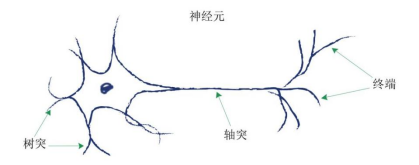
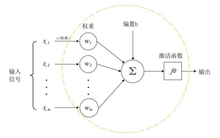

# 神经网络得初步认识

1. 神经元模型

尽管传统的计算机拥有强大的计算能力和巨大的存储空间，但是，像觅食、寻找同伴、躲避危险、寻求配偶等很多复杂任务对于计算机而言却并非易事。这使计算机科学家产生了强烈的好奇心，是什么使生物的大脑具有比计算机还强大的能力呢？虽然大脑的全部功能仍然未知，但让我们首先来探索生物大脑中的基本单元——神经元，看看它们是如何工作的。

:::{figure-md}

图 2-1 神经元结构图
:::

生物的大脑由上亿个神经元构成神经网络，生物神经网络中各个网络之间相互连接，通过神经递质相互传递信息。神经元将电信号沿着轴突，从树突传到树突，然后这些信号从一个神经元传递到另一神经元，这就是生物体感知外界信号的机制。实验表明，生物神经元不同于简单的线性函数，即神经元的输出不是简单的这种形式：输出 = （常数*输入）+（常数）。神经元会抑制输入，并不是有了输入以后立即反应，而是等到输入增强到一定程度才可以触发输出。直观上来分析，神经元并不希望传递微小的噪声信号，而只是传递具有意识的明显信号。如果某个神经元接收了足够多的神经递质（乙酰胆碱），超过了设定的某个阈值（Threshold），那么这个神经元会被激活，即达到兴奋状态，而后发送神经递质给其他的神经元。

1943 年，心理学家 McCulloch 和数学家 Pitts 根据生物神经元的结构，提出了一个简单的机器学习模型——MP神经元模型。

:::{figure-md}

图 2-2 MP神经元模型
:::

如上图所示，MP神经元模型接收来自m个其他神经元传递过来的输入信号（x1 ~ xm），这些输入信号通过带权重（w）的连接进行传递，然后神经元计算所有输入信号的加权总和得到信号组合值，再加上偏置（b），经过激活函数处理之后得到神经元的输出，传递给下一层神经元。其中，权重表示神经元之间的连接强度，权重的大小表示该连接在预测输出中的重要性；偏置实际上是对神经元激活状态的控制，即通过增加一个常数来相应地增加或降低激活函数的输入。

2. 多层神经网络

单个神经元的功能比较简单，若想模拟生物大脑的能力，单一的神经元是远远不够的。因此，需要很多神经元一起协作来完成更复杂的任务。这样通过一定的连接方式或者信息传递方式进行协作的多个神经元可以看成一个网络，即神经网络。

神经网络，也称为人工神经网络（Artificial Neural Network, ANN），是机器学习的一个子集，是深度学习算法的核心。给定一组神经元，可以将神经元作为节点创建一个神经网络。不同的神经网络有着不同方式的网络连接拓扑结构。目前，深度学习中常用的神经网络结构有前馈神经网络、记忆网络和图神经网络。

前馈神经网络（Feedforward Neural Network, FNN）中各个神经元按接收信息的先后分为不同的组，每一组可以看作一个神经层。前馈神经网络包含一个输入层、一个或多个隐藏层以及一个输出层。前馈神经网络的输入层接受数据，并将数据传递到网络的其他部分；隐藏层则负责将输入数据的特征抽象到另一个维度空间，以展现其更加抽象化的特征，从而更好地线性划分不同类型的数据；输出层则保存问题的结果或输出。在前馈神经网络中，每一层的神经元接受前一层神经元的信号，并且将信号传递给下一层的神经元。整个过程中，信号从输入层向输出层单方向传播，可以用一个有向无环图来表示。

记忆网络（Memory Networks, MemNN），也称为反馈网络，因为网络中的神经元不仅可以接受其它层的神经元的信号，还可以接收自己的历史信息。和前馈网络相比，记忆网络中的神经元具有记忆功能，信息不仅可以单向传播还可以双向传播，可以用一个有向循环图来表示。常见的反馈神经网络包括循环神经网络（Recurrent Neural Network, RNN）、长短期记忆网络（Long Short-Term Memory, LSTM）、Hopfield网络和玻尔兹曼机。

图神经网络（Graph Neural Networks, GNN），是定义在图结构数据上的神经网络，图中的每个节点都由一个或一组神经元构成。不同节点之间的连接可以是有向的，也可以是无向的。图神经网络结构中的每个节点都可以接受其相邻节点或者自身的信号。在实际应用中，很多数据是图结构的，比如知识图谱、社交网络、分子网络等，而前馈网络和反馈网络很难处理图结构的数据，图神经网络则很好地关联多个节点。

图2-3分别给出了三种不同的网络结构的示例图，其中圆形节点表示一个神经元。

:::{figure-md}

图 2-3 不同结构得神经网络
:::
