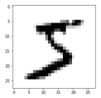
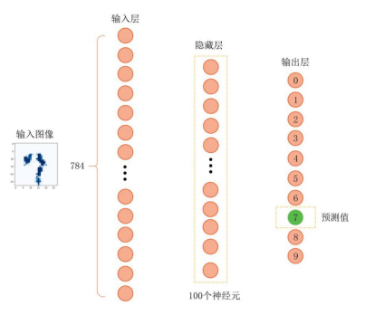
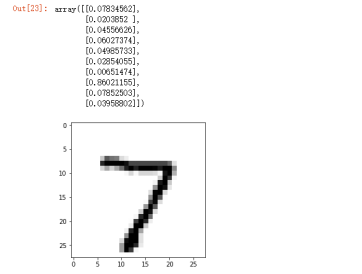
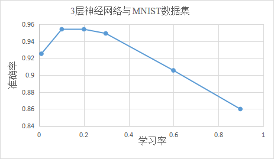
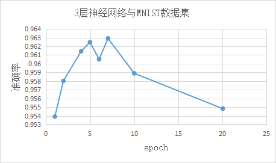
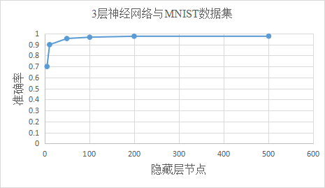

# 采用神经网络对手写数字进行分类

&ensp;&ensp;&ensp;&ensp;
本小节将详细介绍如何设计一个神经网络来实现对手写数字数据集的分类与识别。虽然手写数字的识别对人类来说很简单，但是对计算机程序来说却是一个挑战。程序需要识别出给定图片中的数字，如图2-15所示的手写数字，我们希望计算机可以识别出该数字是“0”。接下来，让我们按照下面的步骤来尝试构建一个用于识别手写数字的简单神经网络，并根据其训练过程来更好地理解神经网络的计算流程。

:::{figure-md}


图 2-15 手写数字
:::

1. 获取数据集

&ensp;&ensp;&ensp;&ensp;
首先，我们需要获取神经网络训练的对象。MNIST手写数字数据集是机器学习领域中非常经典的一个数据集，由60000个训练样本和10000个测试样本组成，每个样本都是一张28×28像素的灰度手写数字图片，数字范围从0到9。读者可以从网址[27]
下载数据集。

&ensp;&ensp;&ensp;&ensp;
但是直接下载下来的数据集，无法直接解压打开，因为这些文件是以字节形式存储的，不易于使用。因此，有研究者创建了以csv文件格式存储的数据集，参见网址<sup>[28]</sup>
。这些csv文件以纯文本格式存储表格数据，该文件中的每行是一个字符串序列，代表表格数据中的一行，每行中由逗号分隔的多个数据项代表表格中相应行的各列数据。读者可以从对应网址分别下载训练集[29]
和测试集[30]两个csv文件来进行后续操作。

&ensp;&ensp;&ensp;&ensp;
接下来请读者思考一个问题，是否只有在有大量数据的情况下，深度学习才有效呢？其实这种说法是部分正确的。如果神经网络的规模较小，参数较少，任务较简单，那么使用少量的数据进行训练，网络的参数依旧可以达到一个相对优秀的水平，神经网络的预测能力和拟合能力也较好。

```{note}
数据集，训练集，测试集

一组样本构成的集合称为数据集（Data Set）。在网络训练过程中，将数据集分为两部分：训练集和测试集。训练集（Training Set）中的样本用来训练模型，也叫训练样本（Training Sample）；测试集（Test Set）中的样本用来检验模型好坏、测试算法的性能和学习能力，也叫测试样本（Test Sample)。通常情况下，将数据集的80%作为训练集，20%作为测试集。将训练集和测试集分开可以防止信息泄漏（Information Leak），避免神经网络了解太多关于测试集中的样本特征，从而挑选有助于测试集数据的模型，这样的结果会过于乐观。

```

&ensp;&ensp;&ensp;&ensp;
我们刚才下载的MNIST数据集包含上万张照片。对于初学者来说，可以先训练小批次的数据集来学习创建一个神经网络的全部流程。因此，读者可以在网址[31]
下载含有100条记录的数据文件。

&ensp;&ensp;&ensp;&ensp;
下载好数据以后，我们需要用python代码来读取这些数据。先在电脑中适当位置创建一个目录，并把下载好的数据放在该目录下，新建一个python文件，尝试如下代码：

:::{literalinclude} ../codes/chapter_2_1_3_01.py
:language: python
:linenos:
:::

&ensp;&ensp;&ensp;&ensp;
接着，我们试着打印显示data_list[0]
，可以观察到第一个数字是“5”，这是图像的标签，也就是真实值，接下来的784个数字是构成图像像素的颜色值。如果你仔细观察，可以发现这些颜色值介于0和255之间：

```shell
5,0,0,0,0,0,0,0,0,0,0,0,0,0,0,0,0,0,0,0,0,0,0,0,0,0,0,0,0,0,0,0,0,0,0,0,0,0,0,0,0,0,0,0,0,0,0,0,0,0,0,0,0,0,0,0,0,0,0,0,0,0,0,0,0,0,0,0,0,0,0,0,0,0,0,0,0,0,0,0,0,0,0,0,0,0,0,0,0,0,0,0,0,0,0,0,0,0,0,0,0,0,0,0,0,0,0,0,0,0,0,0,0,0,0,0,0,0,0,0,0,0,0,0,0,0,0,0,0,0,0,0,0,0,0,0,0,0,0,0,0,0,0,0,0,0,0,0,0,0,0,0,0,3,18,18,18,126,136,175,26,166,255,247,127,0,0,0,0,0,0,0,0,0,0,0,0,30,36,94,154,170,253,253,253,253,253,225,172,253,242,195,64,0,0,0,0,0,0,0,0,0,0,0,49,238,253,253,253,253,253,253,253,253,251,93,82,82,56,39,0,0,0,0,0,0,0,0,0,0,0,0,18,219,253,253,253,253,253,198,182,247,241,0,0,0,0,0,0,0,0,0,0,0,0,0,0,0,0,0,0,80,156,107,253,253,205,11,0,43,154,0,0,0,0,0,0,0,0,0,0,0,0,0,0,0,0,0,0,0,14,1,154,253,90,0,0,0,0,0,0,0,0,0,0,0,0,0,0,0,0,0,0,0,0,0,0,0,0,0,139,253,190,2,0,0,0,0,0,0,0,0,0,0,0,0,0,0,0,0,0,0,0,0,0,0,0,0,11,190,253,70,0,0,0,0,0,0,0,0,0,0,0,0,0,0,0,0,0,0,0,0,0,0,0,0,0,35,241,225,160,108,1,0,0,0,0,0,0,0,0,0,0,0,0,0,0,0,0,0,0,0,0,0,0,0,81,240,253,253,119,25,0,0,0,0,0,0,0,0,0,0,0,0,0,0,0,0,0,0,0,0,0,0,0,45,186,253,253,150,27,0,0,0,0,0,0,0,0,0,0,0,0,0,0,0,0,0,0,0,0,0,0,0,16,93,252,253,187,0,0,0,0,0,0,0,0,0,0,0,0,0,0,0,0,0,0,0,0,0,0,0,0,0,249,253,249,64,0,0,0,0,0,0,0,0,0,0,0,0,0,0,0,0,0,0,0,0,0,46,130,183,253,253,207,2,0,0,0,0,0,0,0,0,0,0,0,0,0,0,0,0,0,0,0,39,148,229,253,253,253,250,182,0,0,0,0,0,0,0,0,0,0,0,0,0,0,0,0,0,0,24,114,221,253,253,253,253,201,78,0,0,0,0,0,0,0,0,0,0,0,0,0,0,0,0,0,23,66,213,253,253,253,253,198,81,2,0,0,0,0,0,0,0,0,0,0,0,0,0,0,0,0,18,171,219,253,253,253,253,195,80,9,0,0,0,0,0,0,0,0,0,0,0,0,0,0,0,0,55,172,226,253,253,253,253,244,133,11,0,0,0,0,0,0,0,0,0,0,0,0,0,0,0,0,0,0,136,253,253,253,212,135,132,16,0,0,0,0,0,0,0,0,0,0,0,0,0,0,0,0,0,0,0,0,0,0,0,0,0,0,0,0,0,0,0,0,0,0,0,0,0,0,0,0,0,0,0,0,0,0,0,0,0,0,0,0,0,0,0,0,0,0,0,0,0,0,0,0,0,0,0,0,0,0,0,0,0,0,0,0,0,0,0,0,0,0,0,0,0,0,0,0,0,0,0,0,0,0,0,0,0,0,0,0
```

2. 数据预处理

&ensp;&ensp;&ensp;&ensp;
接下来，我们需要将这些由逗号分割的数字列表转化成合适的数组。此时需要导入Python扩展库NumPy和Matplotlib，这有助于我们使用数组以及进行绘图。代码如下，让我们依次讨论这些代码分别完成了哪些任务。

&ensp;&ensp;&ensp;&ensp;
第一行代码接受了刚才打印出的training_data_list[0]
，并根据逗号分割符将这一长串字符串进行拆分。其中，split()
函数的作用就是按照指定的符号来拆分字符串。接下来的代码稍微有些复杂，我们分步来看。首先，all_values[1:]
表示除了列表中的第一个元素以外的所有值，也就是忽略第一个标签值，只要剩下的784个像素值。numpy.asfarray()
是一个numpy函数，这个函数将文本字符串转换成实数，并创建这些数字的数组。因此，第二行代码的含义是使用reshape()
函数将文本字符串转化为28×28的方形矩阵，并将其命名为image_array。第三行和第四行代码非常简单，就是使用imshow()
函数绘出image_array，同时选择灰度调色板，cmap
=‘Greys’来更好地显示手写字符。图2-16显示了这段代码的结果。很显然，绘制的图像是5，这也是我们所期望神经网络的预测结果。

:::{literalinclude} ../codes/chapter_2_1_3_02.py
:language: python
:linenos:
:::

:::{figure-md}


图 2-16 通过代码绘制的手写数字
:::

&ensp;&ensp;&ensp;&ensp;
通过上面的操作，我们了解了如何获取和使用MNIST数据文件的数据，并可视化了csv文件中的数据。接下来我们将对MNIST数据集进行处理，使其作为神经网络的输入。为了使神经网络梯度变化明显，我们最好将输入模型的数据映射至一个较小的范围，同时，注意到我们的输入的图像矩阵中有大量元素为0，这很容易导致梯度消失的问题。因此，在使用Sigmoid作为激活函数时，我们需要将输入的像素值从0到255缩放至0.01到1.0。我们首先将原始输入值除以255，得到0到1的输入值。然后，将所得到的值乘以0.99并加上0.01，使输入值的范围变为0.01到1.00。如下代码演示了这个过程。

:::{literalinclude} ../codes/chapter_2_1_3_03.py
:language: python
:linenos:
:::

&ensp;&ensp;&ensp;&ensp;
处理好数据以后，我们可输出部分值进行确认。

```shell
0.01      , 0.21964706, 0.89129412, 0.99223529, 0.98835294,
0.93788235, 0.91458824, 0.98835294, 0.23129412, 0.03329412,
0.01      , 0.01      , 0.01      , 0.01      , 0.01      ,
0.01      , 0.01      , 0.04882353, 0.24294118, 0.87964706,
0.98835294, 0.99223529, 0.98835294, 0.79423529, 0.33611765,
0.98835294, 0.99223529, 0.48364706, 0.01      , 0.01      ,
0.01      , 0.01      , 0.01      , 0.01      , 0.01      ,
0.01      , 0.01      , 0.01      , 0.01      , 0.01      ,
0.01      , 0.01      , 0.01      , 0.01      , 0.01      ,
0.64282353, 0.98835294, 0.98835294, 0.98835294, 0.99223529,
0.98835294, 0.98835294, 0.38270588, 0.74376471, 0.99223529,
0.65835294, 0.01      , 0.01      , 0.01      , 0.01      ,
0.01      , 0.01      , 0.01      , 0.01      , 0.01      ,
0.01      , 0.01      , 0.01      , 0.01      , 0.01      ,
0.01      , 0.01      , 0.208     , 0.934     , 0.99223529,
0.99223529, 0.74764706, 0.45258824, 0.99223529, 0.89517647,

```

&ensp;&ensp;&ensp;&ensp;
观察可知，这些值当前的范围为0.01到0.99。我们可以将其作为输入值，输入神经网络进行训练和查询。

3. 构建网络

&ensp;&ensp;&ensp;&ensp;
设计神经网络的输入层和输出层通常来说比较简单。对于手写数字分类这一任务，输入图像的尺寸是28×28，那么输入层则需要28×28个神经元，每个灰度在0.01到1取值。我们希望神经网络对手写数字图像进行分类，虽然一共有十个数字，但我们可以把这个问题看作一个二分类问题：一张手写数字图像要么对应数字x，要么不对应x。因此，我们的输出层需要10个神经元，分别代表0-9这10个数字，每个输出值代表输入图像对应每个数字的概率，我们最后取概率最大的那个神经元对应的数字作为分类结果。

&ensp;&ensp;&ensp;&ensp;
相比于输入层和输出层，隐藏层节点的设置则复杂的多，我们无法将隐藏层的设计流程总结为简单的经验法则。在这里我们使用100个隐藏层节点，但这并不是通过使用科学的方法得到的结果。通常，我们选择使用比输入节点的数量小的值（784），来强制神经网络尝试对输入特征进行“总结”。但是，如果隐藏层节点的数量过少，网络的学习能力会下降，网络难以找到足够的特征，这将降低神经网络表达其对MNIST数据的理解能力。输出层有10个节点对应0-9共10个数字。因此，选择100这个中间值作为神经网络隐藏层的节点数量是可行的且合理的。整个神经网络的架构如图2-17所示。

:::{figure-md}


图 2-17 手写数字分类的神经网络架构
:::

&ensp;&ensp;&ensp;&ensp;
同时，我们需要创建输出节点的目标矩阵，其中除了对应于标签的节点，其余所有的节点的值都应该很小。例如，如果输出层第1个神经元被激活，即输出值约为1（最大的激活值），表明神经网络认为该数字是“0”。我们使用下面的python代码构造目标矩阵：

:::{literalinclude} ../codes/chapter_2_1_3_04.py
:language: python
:linenos:
:::

&ensp;&ensp;&ensp;&ensp;
接下来，应该创建神经网络的权重矩阵。
在神经网络中，权重是最重要的部分，我们使用权重来计算前馈信号、反向传播误差，并且在试图改进网络时优化权重。
在这里，我们需要定义两个权重矩阵：设输入层与隐藏层之间的权重矩阵为$W_
{input\_hidden}$，
矩阵大小为隐藏层（hidden_nodes）节点和输入层（input_nodes）节点的乘积；
设隐藏层和输出层之间的权重矩阵$W_{hidden\_output}$，大小为输出层（output_nodes）和
隐藏层（hidden_nodes）的乘积。接着，需要对两个权重矩阵进行初始化，我们通常使用正态概率分布采样权
重。在Numpy程序库中，numpy.random.normal((loc=0.0, scale=1.0, size=None)以正态分布的
方式返回一组符合高斯分布的概率密度随机数，其中函数的参数loc代表概率分布的均值，我们设置为0；
scale（标准方差）设置为$1/\sqrt{传入节点数目}$；size为期望的数组形状大小，设置为之前定义好的权
重矩阵的大小。同时，我们也需要对学习率进行初始化。最后，我们选择常用的Sigmoid函数作为激活函数。在Python
SciPy库中已经定义了激活函数，其中Sigmoid函数为expit()，我们通过import
scipy.special导入库。再使用匿名函数lambda来创建函数，该函数接受输入x，返回激活后的值。

:::{literalinclude} ../codes/chapter_2_1_3_05.py
:language: python
:linenos:
:::

&ensp;&ensp;&ensp;&ensp;
定义好网络的基本结构以后，让我们根据开始时设定的节点数目，采用如下代码进行神经网络的实例化。

:::{literalinclude} ../codes/chapter_2_1_3_06.py
:language: python
:linenos:
:::

4. 训练网络

&ensp;&ensp;&ensp;&ensp;
完成了网络节点的构建和和权重的设置后，我们需要在不同的网络层之间实现信号的传播，即网络的训练过程。这个过程分为两个部分：

- 第一部分，针对给定的训练样本，计算其输出，也就前向传播过程。

- 第二部分，对比网络计算得到的输出和目标输出，得到二者的误差值来更新网络的权重,
  也就反向传播过程。

&ensp;&ensp;&ensp;&ensp;
我们将输入样本和样本对应的输出，通过numpy.array()转化为二维数组inputs和targets。

&ensp;&ensp;&ensp;&ensp;
我们将输入样本信号从输入层传递到隐藏层，经过激活函数的处理传入到输出层，输出层计算出信号值，再经过激活函数得到网络的输出final_outputs。

&ensp;&ensp;&ensp;&ensp;
我们用y表示预期的输出targets，用表示final_outputs，将它们中的每个对应元素相减可以得到输出层的误差值eo，由下式表示：

$$
e_o = y - o_o \tag {2-45}
$$

&ensp;&ensp;&ensp;&ensp;
隐藏层节点的误差$e_h$可由权重矩阵计算而得：

$$
e_h=W_{ho}^T \cdot e_o \tag {2-46}
$$

&ensp;&ensp;&ensp;&ensp;
然后，我们回顾上一小节中的式（2-25），通过它来计算反向传播误差。由于本例中我们采用Sigmoid作为激活函数，而Sigmoid函数的导函数可以写作：

$$
A_l^{'}(x)=A_l(x)(1-A_l(x)) \tag {2-47}
$$

&ensp;&ensp;&ensp;&ensp;
其中，Al(x)即为当前层经过激活函数的最终输出o(l) ，然后我们再根据上一小节中的式
（2-28），得到隐藏层和输出层之间权重的梯度为：

$$
\nabla_{W_{ho}}=e_h \cdot o_h^T=o_o \odot (1-o_o) \cdot W_{ho}^T \cdot e_o
\cdot i_o^T \tag {2-48}
$$

&ensp;&ensp;&ensp;&ensp;
其中，$\odot$为Hadamard积运算符，表示向量对应元素相乘，$i_o$表示输出层的输入，
也就是隐藏层经过激活的输出，我们用$o_h$替代它，并将最终结果乘以学习率，
得到隐藏层和输出层之间的权重变化量：

$$
\Delta W_{ho} = \alpha \cdot o_o \odot (1-o_o) \cdot W_{ho}^T \cdot e_o \cdot
o_h^T \tag {2-49}
$$

&ensp;&ensp;&ensp;&ensp;
同理，我们可以得到输入层和隐藏层之间的权重变化量：

$$
\Delta W_{ih} = \alpha \cdot o_h \odot (1-o_h) \cdot W_{ih}^T \cdot e_h \cdot
o_i^T \tag {2-50}
$$

&ensp;&ensp;&ensp;&ensp;
以上便是一次训练中需要完成的所有步骤，我们将这些步骤转换成代码，如下所示。

:::{literalinclude} ../codes/chapter_2_1_3_07.py
:language: python
:linenos:
:::

&ensp;&ensp;&ensp;&ensp;
至此，我们将先前学习的激活函数、矩阵运算、前向传播、通过梯度下降法最小化网络误差等内容，都转换成了相应的简洁代码。

&ensp;&ensp;&ensp;&ensp;
接下来，让我们调用上面的train()函数，让神经网络根据训练数据集training_data_list中的每一条记录，进行训练。

:::{literalinclude} ../codes/chapter_2_1_3_08.py
:language: python
:linenos:
:::

&ensp;&ensp;&ensp;&ensp;
到此为止我们已经完成了使用100条手写数字集的记录来训练一个简单的神经网络。

5. 查询网络输出

&ensp;&ensp;&ensp;&ensp;
最后，为了知道神经网络的表现，定义query()
函数对神经网络的输出结果进行查询。这一过程和train()
函数的前半部分几乎一样，只不过我们可以不用再根据输出结果更新权重。

:::{literalinclude} ../codes/chapter_2_1_3_09.py
:language: python
:linenos:
:::

&ensp;&ensp;&ensp;&ensp;
用测试集来查询模型是否预测成功，如下代码描述了加载测试集数据并查询输出的过程。

:::{literalinclude} ../codes/chapter_2_1_3_10.py
:language: python
:linenos:
:::

:::{figure-md}


图 2-18 网络输出和输入图像
:::

&ensp;&ensp;&ensp;&ensp;
可以看到输出数组中，最大元素的输出信号为0.8602，对应的标签是“7”，即推断出输入图像的手写数字是“7”。我们成功训练了神经网络，使得其能够正确区分测试集中的手写字符。而且，我们只是使用完整的训练数据集的一个小子集就可以对神经网络进行训练。
但是由于我们使用的数据集太小，所以答案对应的输出信号值并未特别大。

6. 统计神经网络的准确率

&ensp;&ensp;&ensp;&ensp;
接着，我们可以通过一段简单的代码统计一下测试集中的其他数字的预测结果，用来判断神经网络的总体表现。

:::{literalinclude} ../codes/chapter_2_1_3_11.py
:language: python
:linenos:
:::

&ensp;&ensp;&ensp;&ensp;
scorecard数组中“0”出现的次数就是神经网络预测错误的次数，也就是10个输入中，有3个预测错误。但考虑到使用的训练集很小，这个结果是可以接受的。在后续的学习中，读者可以尝试使用完整的MNIST数据集来进行学习，以提高正确率。

:::{literalinclude} ../codes/chapter_2_1_3.py
:language: python
:linenos:
:::

使用全部手写数字集进行训练的完整代码可参考附录或扫描二维码下载：

```{todo}

代码随本仓库同步托管,顶层调用逻辑在: source\2\codes\chapter_2_1_3.py

所提供代码通过include 指令提取并显示

等后续开放托管后提供便捷链接

```

```{warning}
每个片段代码均独立另存`python`文件,便于 `sphinx` `literalinclude` 自动提取:

- chapter_2_1_3.py
- chapter_2_1_3_01.py
- chapter_2_1_3_02.py
- chapter_2_1_3_03.py
- chapter_2_1_3_04.py
- chapter_2_1_3_05.py
- chapter_2_1_3_06.py
- chapter_2_1_3_07.py
- chapter_2_1_3_08.py
- chapter_2_1_3_09.py
- chapter_2_1_3_10.py
- chapter_2_1_3_11.py

避免可运行代码和书籍中代码不同步
```

&ensp;&ensp;&ensp;&ensp;
实验证明，当我们使用60000张训练样本训练神经网络后，再使用10000条记录进行测试，神经网络预测的准确率达到了95.1%，这个结果让人很满意！

7. 神经网络的优化

&ensp;&ensp;&ensp;&ensp;
尽管我们已经掌握了如何构建、训练一个神经网络，但是可以进一步思考一下，
我们可以采用什么方法对网络进行进一步优化？

&ensp;&ensp;&ensp;&ensp;
第一个可以尝试的改进是：调整学习率，观察学习率对准确率的影响。试一下将学习率翻倍，
设置为0.6，观察网络的学习能力是否增强。如果此时运行代码，准确率为90.47%，
比之前下降了。这是因为学习率设置得太大会造成网络不能收敛，在最优值附近徘徊，
也就是跳过最小值到了对称轴另一边，从而忽视了最优值的位置。然后，尝试使用0.1的学习率再试一次。
这次，性能有所改善，准确率为95.8%。图2-19给出了多次实验后，不同学习率对应的性能图。
下图表明，学习率在0.1和0.3之间可能会有较好的表现，但是随着学习率增大，网络的性能会变差。因此，
我们在设置学习率时，可以多次进行实验后选择合适的值。

:::{figure-md}


图 2-19 学习率对模型准确率的影响
:::

&ensp;&ensp;&ensp;&ensp;
接下来，可以改变训练的次数，也称为epoch。如果epoch为5，则意味着使用整个训练数据集运行程序5次。
直觉告诉我们，训练次数越多，权重更新的次数更多，网络的性能会更好。我们设置不同的epoch来训练网络，
并观察epoch对网络性能的影响。从图2-20中我们发现，epoch设置得过大反而会过犹不及，
这是因为网络过度拟合了训练数据，使网络在先前没有见到过的新数据上表现不佳。

:::{figure-md}


图 2-20 epoch 对模型准确率的影响
:::

&ensp;&ensp;&ensp;&ensp;
我们还可以尝试改变一下神经网络的结构，如改变中间隐藏层节点的数目。
在先前的网络中我们设置隐藏层节点为100。接下来，让我们来进行多次实验，
观察一下不同数目的隐藏层节点对网络性能的影响。在图2-21中我们可以看到，当隐藏层节点数量很少时，
网络性能不佳。随着隐藏层节点数量的增加，网络性能得到了明显的改善，但当隐藏层节点数量达到一定值时，
改善效果不显著，且训练时间增加。因此，隐藏层的节点数量需要设置在一个合理的范围内，
才能保证网络训练的时间不会过长，且网络的性能也相对优秀。

:::{figure-md}


图 2-21 隐藏层节点数对模型准确率的影响
:::

&ensp;&ensp;&ensp;&ensp;
深度学习编程就像一门艺术，我们需要学习不同的技巧和方法来提升神经网络的表现！
