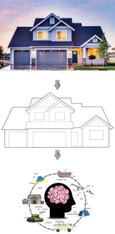

# CNN的初步认识

当阿尔法狗战胜了顶尖围棋高手李世石和柯杰后，人们都在谈论CNN。但是，CNN是什么及CNN是怎样做到的？我们将在如下内容中进行介绍。

让我们首先来思考一下我们人类是通过什么来认识这个世界的。

当你走过一幢建筑物时，你是通过哪些信息知道这是一幢建筑物的？是通过颜色、高度、材料，还是其他？

你可能并不能准确说出原因，但你看到下图时，一定会脱口而出，“哦，这是一座房子”。

:::{figure-md}

图2-22 建筑物特征轮廓
:::

为什么你能知道这是一座房子而不是其他物体呢？

没错，因为你准确提取了它的“轮廓”！而再让你看一些其他颜色不同、大小各异的图片时，你也基本能猜对。

那么，让我们总结这个过程就是：你看到了一张图片，提取了图片特征，进而对图片进行了分类。

:::{figure-md}

图2-23 图像分类的流程
:::

其实，CNN的工作原理也是这样：1. 读取图片；2. 提取特征；3. 图片分类。下面，让我们逐步探索细节！
