# CNN 网络架构

卷积神经网络与前一节介绍的传统神经网络非常相似，是一种为了处理二维输入数据而特殊设计的多层人工神
经网络，可以看成是对传统神经网络的一个改进。

卷积神经网络由输入层、隐藏层和输出层组成。每层都由多个二维平面组成，而每个二维平面由多个独立的神
经元组成，相邻两层的神经元之间互相连接，而处于同一层的神经元之间没有连接。在前馈神经网络中，其中
间层都被称为隐藏层，因为它们的输入和输出都被激活函数和最终卷积所掩盖。卷积神经网络的隐藏层包括卷
积层（convolutional layer）、池化层（pooling layer）及全连接层。图2-24展示了一个典型的卷
积神经网络架构。

:::{figure-md}
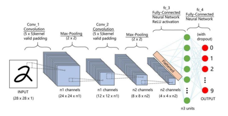

图 2-24 一个典型的卷积神经网络架构
:::

接下来，让我们来具体看看卷积神经网络是如何运作的。

如果对图像进行进一步的思考，我们会发现，大多数有意义的特征（feature）是局部化（localized）的。
我们先把卷积神经网络这个词拆开来看。“卷积”和“神经网络”。卷积也就是说神经网络不再是对每个像素的输
入信息进行处理，而是对图片上的每一小块像素区域进行处理。这种做法加强了图片信息的连续性，使得神经
网络能看到图形，而非一个点，这种做法同时也加深了神经网络对图片的理解。

具体来说，卷积神经网络有一个批量过滤器（卷积核，Filter），持续不断的在图片上滑动以收集图片里各
局部像素区域的信息。然后把收集来的信息进行整合，输出的值，我们可以理解成是一个深度更深，高和宽更
小的“特征图”（Feature Map）。这时候整理出来的信息有了一些实际上的呈现，比如这时的神经网络能看
到一些边缘的图片信息（低层次的特征）。然后再以同样的步骤，用类似的批量过滤器扫过产生的这些边缘信
息，图片的高宽再压缩，深度再增加，这时神经网络可以从这些边缘信息里面提取出更高层的信息结构（中层
次和高层次特征），比如说提取的边缘能够画出眼睛、鼻子等等。最后，我们再把这些信息输入一层或几层普
通的全连接神经层进行分类，这样就能得到输入图片的最终分类结果了。图2-25中，具有层次结构的卷积层
可以发现低层次、中层次和高层次特征。其中，卷积核和特征图的内容只用于说明。

:::{figure-md}
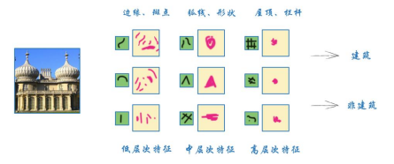

图 2-25 不同层次特征图
:::

在还不知道如何进行卷积计算前，让我们以一个6×6像素的简单笑脸图像为例，查看卷积神经网络的卷积核实
现特征提取的过程。

:::{figure-md}
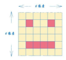

图 2-26 一个6X6 的简单笑脸图像
:::

假设我们的眼睛每次只能看到图像中一个2×2像素的区域。如果我们移动视线，那么我们只能看到一只眼睛或
者看到嘴巴的一部分。我们视线的有限性就体现了我们所说的局部性（locality）。现在我们移动视线，并
计算在2×2像素的区域内有多少个深色像素，我们就可以创建一个新的、汇总局部信息的网格。图2-27直观地
解释了这个过程。

:::{figure-md}
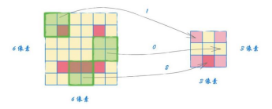

图 2-27 通过局部性计算得到新的像素网格
:::

上图中右边较小的网格大小是3×3像素，汇总了视线在图像上无重叠移动时每个区域的发现。我们可以看到，
它在图像的左上方和右上方各发现了一只眼睛。同时，它也发现了底部的暗像素区域，底部中间格的像素最暗。
此外，中间行没有暗像素。

可以看出，这个汇总网格对于脸部图像的局部特征进行了一定程度的提取，可以看成是特征图，对图像分类有
极大帮助。我们形象地将这种视线在图像上移动并汇总新的图像的过程称为卷积（convolution）。我们的视
线范围就是感受野（receptive field），也代表了卷积神经网络中卷积核的空间尺寸。有关卷积的具体计
算方法，我们将在后文进行详细讲解。

我们已经看到，卷积核可从一幅图像中识别出特征，这对图像分类很有帮助。因此，我们可以选择不同的卷积
核，然后学习每个卷积核的权重。而更好的方案是，不提前设计卷积核，而是通过学习获得卷积核中的权重。
**卷积神经网络的关键在于，网络可以自己学习卷积核的具体值**
。这正是包括PyTorch在内的许多机器学习框架
所采取的方法。

接下来，我们重点关注卷积神经网路中的卷积层、池化层与全连接层，并具体看看他们在卷积神经网络中发挥
的不同作用。

1. 卷积层（CONV）

我们在处理图像这样的高维度输入时，让每个神经元都与前一层中的所有神经元进行全连接是不现实的。实际
上，我们让每个神经元只与输入数据的一个局部区域连接。这个局部连接区域的空间大小叫做神经元的感受野，
它的尺寸是一个超参数，这其实就是滤波器（或称作卷积核，K）的空间尺寸。卷积核，从名字就能看出他是整
个卷积过程的核心。而卷积层，就是由这些可学习的卷积核在深度方向叠加构成。在前向传播时，卷积核
（K，3×3）在输入数据的空间维度（W，7×7）上以一定的步长（S）滑动（更精确地说是卷积），计算卷积核
和输入数据任一处的内积，内积结果形成一个2维的激活图（activation map），激活图给出了每个空间位
置经过卷积核作用后的反应。在卷积核移动的过程中，其值保持不变。也就是说卷积核的值在整个过程中共享，
所以又将卷积核的值称为共享变量。卷积神经网络利用参数共享的方法大大降低了参数数量。

:::{figure-md}
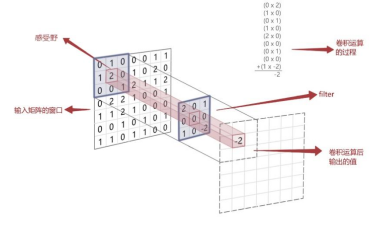

图 2-28 卷积层计算过程示意图
:::

当卷积核沿着输入数据的宽度和高度滑动时，我们必须指定另一个超参数，即滑动的步长（stride），它规定
了卷积核在一个方向上每次移动的像素个数。可以看到，当上图卷积核滑动的步长为stride=1，即卷积核每次
移动1个像素时，生成的激活图尺寸为5×5。当步长stride=2时，即卷积核滑动时每次移动2个像素，生成的
激活图尺寸为3×3。很明显，增加步长会让输出数据在空间上变小。

从上面的例子中我们可以发现，我们把3×3的卷积核用在7×7的输入上时，输出的大小是5×5。注意，这里空间
维度减小了！如果我们继续用卷积核，输出的尺寸会进一步减小到3×3，减小的速度就会超过我们的期望。在早
期的网络层中，我们想要尽可能多地保留原始输入内容的信息，以提取低层级的特征。如果我们想让输出尺寸
维持在7×7，我们应该怎么做呢？又或者，当我们把3×3的卷积核以步长stride=2在7×7的输入上滑动时，我
们发现卷积核窗口部分将在输入矩阵之外，这种情况又当如何处理呢？

为了解决输入数据与卷积核不匹配或为了保证输出数据大小，我们可以对输入数据进行边界填充。零填充
（zero padding）就是采用边界填充的方法，在输入数据的边界用零进行补充，扩大输入数据的高度和宽
度，可以控制输出数据的空间尺寸。零填充的尺寸也是卷积层的一个重要超参数。如图2-29所示，如果我们在
上图输入数据的周围应用两次零填充，那么输入数据的尺寸变为11×11。当我们用3×3的卷积核以stride=2的
步长进行滑动时，我们可以得到一个7×7的输出矩阵。这是零填充一个非常重要的应用点，即保证输入和输出数
据的宽高相等。

:::{figure-md}
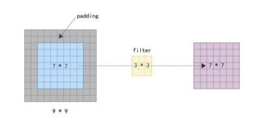

图 2-29 零填充后的卷积层计算
:::

我们可以根据下式计算任意卷积层输出数据的空间尺寸：

$$
\begin{align}
O=\frac {(W-K+2P)} {S} + 1 \ \tag {2-51}
\end{align}
$$

其中，O是输出数据空间尺寸，W是输出数据空间尺寸K是过滤器尺寸，P是零填充尺寸，S是步长。

之前的讨论，由于输入数据、卷积核都是单个，因此从图形的角度来说只有灰度信息，不是彩色图片。在实际
应用中，输入数据往往是多通道的、有深度的，如彩色照片，就可能有红绿蓝三种颜色的信息
（即R，G，B通道），这时深度为3。对于这种情况，我们应该如何进行卷积呢？其实很简单。我们用相同的卷
积核在每个通道分别进行卷积运算，并把运算结果相加，得到输出结果。我们将这些沿着深度方向排列、感受
野相同的神经元集合称为深度列（depth column）。需要强调的是，我们对待卷积核在空间维度（宽和高）
与深度维度的方式是不同的：在空间（宽高）上的连接是局部的，尺寸一般较小，但是在深度上的连接总是和
输入数据的深度保持一致。举例来说，假设输入数据的尺寸为6×6×3，对于卷积神经网络第一层的一个典型的
感受野尺寸可以是3×3，但深度应与输入数据保持一致是3。在前向传播时，我们在3个通道上采用相同的卷积
核在输入数据上以步长strides=1滑动，计算卷积核和输入数据的内积，并将3个通道上的卷积运算结果加权
平均求和，得到最终的输出数据。

:::{figure-md}
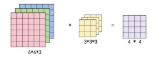

图 2-30 多通道卷积计算
:::

为了让不同神经元被不同方向的边界或者是颜色斑点激活，实现更多边缘检测，我们可以增加卷积核的组数。
图2-31描述了6×6×3的输入，经过4个3×3×3的卷积，得到4×4×4输出的计算过程。

:::{figure-md}

图 2-31 多卷积核计算过程示意图
:::

接下来，与标准的神经网络类似，为保证卷积神经网络的非线性，也需要使用激活函数，即在卷积运算后，把
输出值另加偏移量，输入到激活函数，然后作为下一层的输入（图2-32）。我们可通过
nn.Sigmoid、nn.ReLU、nn.LeakyReLU、nn.Tanh等获取常用的激活函数。

:::{figure-md}
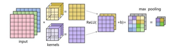

图 2-32 多卷积核整体计算过程示意图
:::

2. 池化层（POOL）

理论上，我们可以将卷积层提取到的所有特征输入至分类器中直接进行训练，输出分类结果，然而这对算力要
求很高，特别是对于大尺寸、高分辨率图像。例如：对于一个输入为128×128大小的图像样本，假设在卷积层
使用100个8×8大小的卷积核对该输入图像进行卷积运算操作，每个卷积核都输出一个
（128-8+1）×（128-8+1）＝14,641维的特征向量，最终卷积层将输出一个14,641×100＝1,464,100维
的特征向量。理论上，我们可以直接使用这些特征训练分类器并进行分类。但是，将如此高维度的特征输入至
分类器中进行训练需要耗费非常庞大的计算资源，同时也会产生过拟合问题。

然而，由于图像中存在较多冗余信息，我们可以用某一局部区域的统计信息（如最大值或均值等）来刻画该区
域中所有像素点呈现的空间分布模式，以替代某一局部区域中所有像素点取值，这种操作称为池化
（Pooling）。池化操作对卷积结果特征图（Feature Map）进行约减，实现了下采样，同时保留了特征图
中主要信息，一般在卷积层之后。

与卷积操作类似，池化操作是池化窗口在特征图上以一定步长滑动，取池化窗口内的平均值
（平均池化，Average Pooling）或最大值（最大池化，Max Pooling）作为结果。池化窗口的大小也称
为池化大小，用kh×kw表示。在卷积神经网络中最常用的池化窗口大小为2×2，步幅为2，这样做的效果就是
输出维度比输入维度缩小一半。

池化层通过对卷积层输出的特征图进行池化约减，实现了下采样。同时，对感受野内的特征进行筛选，提取区
域内最具代表性的特征，保留了特征图中最主要的信息。

:::{figure-md}

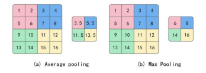

图 2-33 平均池化和最大池化

:::

同时，当输入数据做出少量平移时，经过池化操作后的大多数输出还能保持不变，具有平移不变性。因此，池
化对微小的位置变化具有鲁棒性，模型更加稳健。

:::{figure-md}

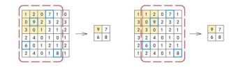

图 2-34 池化的平移不变性

:::

3. 全连接层（FC）

在经过数次卷积操作和池化操作之后，我们最后会先将多维的数据进行“扁平化”，也就是把（深，高，宽）的
数据压缩成长度为深×高×宽的一维数组，这个过程通常由torch.nn.Flatten()实现。然后，我们再将这个
展平的一维数组与全连接层中的神经元全部连接，然后进行激活，其过程与普通的神经网络类似。

4. 卷积神经网络VS普通神经网络

现在看来，CNN与我们上一节学习的普通神经网络，似乎并无很大差别。普通神经网络，其实是多个全连接层
的叠加。而CNN则是把全连接层改成了卷积层和池化层，其优势主要体现在以下方面。

- 参数共享（parameters sharing）

我们对比一下传统神经网络的FC层和由卷积核构成的CONV层：

假设我们输入图像的大小是7×7，也就是49个像素，如果我们采用一个有10个单元的全连接层，那这一层我们
需要训练49×10=490个权重参数（未考虑偏置项）。

:::{figure-md}

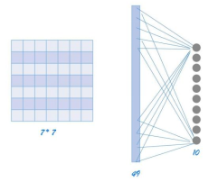

图 2-35 采用FC层作为输入层与10个节点的隐藏层链接

:::

现在，我们对图像进行宽度为1的零填充，得到9×9的图像，让我们看看此时采用3×3的卷积核时有多少权重参
数？很明显，对于不同的区域我们共享同一个卷积核，因此只有9个参数！

由此可见，参数共享机制让CNN网络的参数数量大大减少，即我们可以用较少的参数，训练出更好的模型，并且
有效地避免过拟合，获得更好的泛化能力。同时，在CNN结构中使用池化操作使模型中的神经元个数大大减少，
对输入空间的平移不变性也更具有鲁棒性。

:::{figure-md}

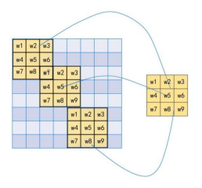

图 2-36 卷积核参数的区域共享

:::

- 局部连接

在卷积操作中，每个神经元只与局部的一块区域进行连接。对于二维图像，局部像素关联性较强，这种局部连
接保证了训练后的卷积核能够对局部特征有最强的响应，使神经网络可以提取数据的局部特征。

同时，由于使用了局部连接，隐含层的每个神经元仅与部分图像相连，对于一幅100×100的输入图像而言，下
一个隐含层的神经元数目同样为10,000个，假设每个神经元只与大小为10×10的局部区域相连，那么此时的
权重参数量仅为10×10×104=106，相较全连接层104×104=108减少了2个数量级。

:::{figure-md}

图 2-37 全连接和局部连接

:::

- 不同层级特征提取

在CNN网络中，通常采用多层卷积达到提取不同类型特征的效果。比如：浅层卷积提取的是图像中的边缘等信
息；中层卷积提取的是图像中的局部信息；深层卷积提取的则是图像中的全局信息。这样，通过加深网络层
数，CNN就可以有效地学习到图像从细节到全局的所有特征。对一个简单的5层CNN进行特征图可视化后的结果
如图2-38所示。

:::{figure-md}

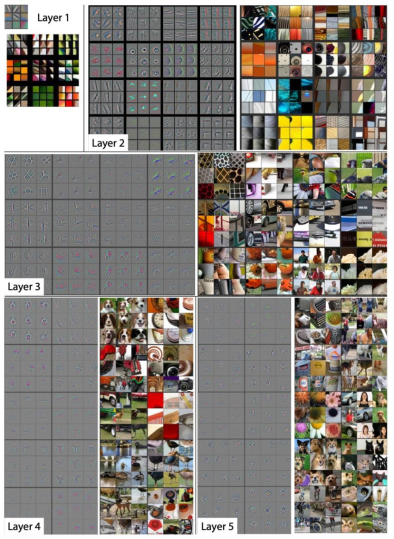

图 2-38 不同层次的卷积特征图可视化[1]

:::
