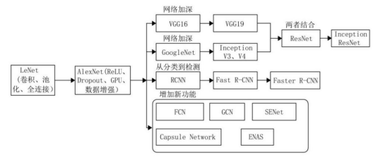
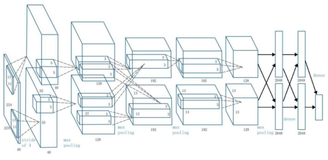
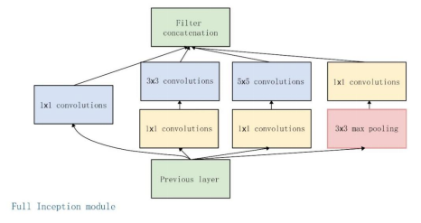
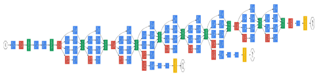
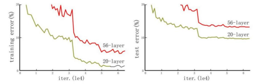
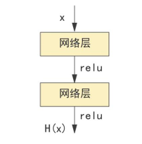
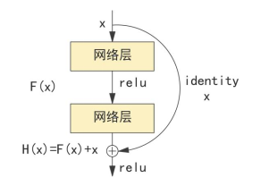

# 经典CNN 网络

卷积神经网络AlexNet在图像分类竞赛中取得突破性进展之后，深度学习进入快速发展期，在此后的五六年
间，出现了一些经典的卷积神经网络模型，这些模型在建筑工程领域也同样被广泛应用，下面我们对这些模型
进行简单的介绍。图2-39为卷积神经网络近几年的大致发展轨迹。

:::{figure-md}

图2-39 卷积神经网络的大致发展轨迹

:::

1. AlexNet

在2012年的ImageNet竞赛中，多伦多大学的Hinton教授带领的SuperVision队伍提出的CNN模型以显著优势摘得分类任务和定位任务桂冠，这个模型在同年发表的论文[4]
里被正式命名为AlexNet，来源于论文第一作者的姓名Alex
Krizhevsky。AlexNet包含6000万个参数和65万个神经元，是赢得ImageNet竞赛的第一个深度神经网络，它的提出受到学术界和工业界广泛关注，堪称深度学习历史上的里程碑事件。自那以后，越来越多的深度神经网络进入人们的视野，深度学习一跃站上人工智能舞台中央。

（1）网络架构

AlexNet由5个卷积层和3个线性全连接层构成，如图2-40所示。

:::{figure-md}

图2-40 AlexNet架构图[4]

:::

（2）网络特点

- 使用ReLU作为激活函数：有效地避免了采用Sigmoid和tanh等非线性激活函数时通常会出现的梯度消失。
  并且，线性的ReLU减少了网络计算量，使得模型收敛速度相较于采用Sigmoid和tanh时有所提高。

- 引入Dropout：Dropout的作用机制是在每次训练中，随机忽略某些层次中的一部分神经元，这些神经元在
  当前训练中不再参与前向传播和反向传播的计算。这样，每一次训练中的神经元都会以不同的方式相连接，即
  每次生成的网络结构都不同，可以提升模型参数的鲁棒性，有效地防止过拟合。

- 采用重叠池化：具体做法是在池化时设置池化窗口的移动步长（stride）小于池化窗口的长度，使池化层的
  输出之间存在重叠，池化层输出的特征更具丰富性。

2. VGG

VGG网络源自牛津大学的Visual Geometry Group，是该小组在2014年的ImageNet竞赛中所提出的CNN
模型。VGG在AlexNet的基础上进一步提升了神经网络的深度，层数高达16或19层，使得网络的计算能力大幅
度提升。在图像定位和分类任务等竞赛中，相较于AlexNet先前一骑绝尘的33.5%和15.3%的Top-5错误率，
VGG将两种任务中Top5错误率降低到25.3%和7.3%，分别取得了第一名和第二名的成绩。

:::{note}
Top-5和Top-1错误率:

Top-5和Top-1错误率均出自于ImageNet竞赛，用于评判分类模型的性能。

Top-5 错误率：模型训练前设定了很多类别，模型训练后样本被划分到每个类别都有一定的概率，取概率最大
的5个类别，即Top-5，只要有一个是符合样本的类别就算对，反之就算预测失败，用预测失败的样本数量除以
样本总数就是Top-5 错误率。

Top-1错误率：只取概率最大的那1个类别，即Top-1，其他条件同上
:::

（1）网络架构

和AlexNet相同，VGG也由卷积层和线性全连接层组成，但总层数高达16层或19层，分别被称为VGG16
（13个卷积层+3个全连接层）和VGG19（16个卷积层+3个全连接层）。图2-41为VGG16的架构示意图。

（2）网络特点

- 采用更深的网络结构，证实了提升网络深度能够一定程度上增强模型的表征能力。
- 采用了更小的卷积核（3×3），代替AlexNet中5×5的卷积核，减少模型的参数量。

:::{figure-md}

图2-41 VGG16架构图[6]

:::

3. GoogLeNet

与VGG一样，GoogLeNet也在2014年的ImageNet竞赛上首次问世，并以6.7%的Top-5错误率取得图像分类
任务第一名。VGG和AlexNet等模型都是通过增加网络深度来提升模型计算能力以获得更好的训练效果，
GoogLeNet则是从增加网络宽度的角度对CNN模型进行改进。

（1）网络架构

GoogLeNet引入了一种重要的结构——Inception。Inception是一种网中网结构，让模型的宽度得到拓展。
每个Inception模块的输入并行地经过四个不同的卷积层，每个卷积层使用不同的滤波器尺寸探索图像，这意
味着不同大小的滤波器可以有效地识别同一图片中不同范围的细节。其基本结构如图2-42所示。

GoogLeNet中总计使用了9个Inception模块，网络层数达到了22层，其完整结构如图2-43所示。

（2）网络特点

- 引入Inception结构。

  除了先前所述的特征融合功能，即通过不同大小的滤波器对图像进行不同尺度的感知，Inception中还穿插了滤波器大小为1×1的卷积层，这样能够实现特征通道的降维，减少通道的数目，起到减少计算量的作用。

- 采用全局平均池化层（Global Average Pooling）。

  GoogLeNet将后面的全连接层全部替换为简单的全局平均池化层，能够有效降低参数量，并且不会过度丢失特征层的信息。

:::{figure-md}

图2-42 Inception模块架构图[7]

:::

:::{figure-md}

图2-43 GoogLeNet架构图[7]

:::

4. ResNet

VGG和GoogLeNet分别证明了增加网络的深度和宽度能够有效地提升网络的计算能力，能更好地拟合出输入
和输出数据潜在的映射关系。但是，实验表明，如果一味地加深网络层数，模型的效果反而会越来越差，
如图2-44所示。

:::{figure-md}

图2-44 不同网络层数在训练中的训练集误差和测试集误差对比图[8]

:::

2015年，微软实验室的何恺明等推出了ResNet，在当年的ImageNet竞赛中超越其他所有模型，获得图像分
类和定位任务的第一名。ResNet为Residual Network的缩写，即残差网络。残差网络模型非常有效地缓解
了深层CNN模型中可能遇到的梯度消失、梯度爆炸和网络退化的问题，让训练出具有强大表征能力的深层次网络
成为可能。

:::{note}

网络退化:

假设已有的最优化网络结构是18层。而当我们设计网络结构时，我们并不知道具体多少层的网络是
最优化的。假设我们设计了34层的网络结构，那么多出来的16层其实是冗余的。这就是随着网络深度增加，
导致的网络退化现象。

:::

（1）网络架构

不同于此前大多采用卷积层和全连接层简单堆叠而成的深度神经网络，ResNet的一个重要思想是跳跃连接
（Shortcut Connection）。如图所示，跳跃连接类似于电路中的短路现象，人为地让神经网络某些层跳
过下一层神经元的连接，隔层相连，直接将输入x送到原本的输出F(x)上，并与之相加求和。
回到ResNet(残差网络)。其中残差指的是观测值与估计值之间的差。图中的H(x)就是观测值，x就是估计
值（也就是上一层输出的特征映射），输入数据x经过层次后的输出为F(x)，F(x) = H(x) – x，即为残差。

:::::{grid} 2

::::{grid-item}
:columns: 4 4 4 4

:::{figure-md}

(a) 标准网络结构

:::

::::

::::{grid-item}
:columns: 8 8 8 8

:::{figure-md}

(b) ResNet网络结构

:::

::::

:::::

::::{grid} 1
:::{grid-item}

图2-45 标准网络结构和
ResNet网络结构对比

:::
::::

求解加入了x的H(x)，相比起直接求解F(x)有哪些优势呢？现在假设，在网络达到某一个深度的时已经达到
最优状态了，也就是说，此时的错误率最低，再往下加深网络会引发网络退化问题，更新下一层的网络参数就
会变得很棘手。

引入跳跃连接的ResNet结构，假设当前网络的深度可以使错误率最低。当ResNet结构层数增加时，为了保
证下一层的网络状态仍然是最优状态，只需要令F(x)=0，因为x是当前输出的最优解，也就是我们希望输出
H(x)= x。这样就很好地避免网络的退化问题。

（2）网络特点

使用跳跃连接实现残差单元，有效地缓解了梯度消失、梯度爆炸和网络退化的问题，可以保证深层网络强大的
计算能力和有效性。完整的ResNet深度可以达到前所未有的152层。我们将在第三章介绍如何采用ResNet
解决一个实际工程问题。
