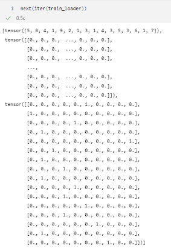
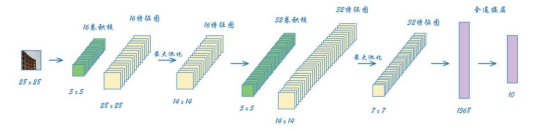
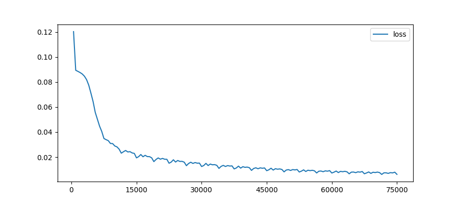

# 采用CNN 对手写数字进行分类

前面的章节我们已经复现了前馈神经网络，对手写数字MNIST数据集成功进行了分类。在学习了卷积神经网络
的基本架构与理论知识后，为了加深理解并为后期更深入的学习做铺垫，让我们开始一起尝试用PyTorch构建
一个使用卷积神经网络的MNIST分类器！

首先，让我们创建一个note，并导入需要的库。

:::{literalinclude} ../codes/chapter_2_2_4_01.py
:caption: chapter_2_2_4_01.py
:language: python
:linenos:
:::

1. 加载数据集

第2.1节中，我们采用读取文件的方式载入了100条MNIST数据。本节中，为了进一步学习采用Pytorch实现
神经网络并进行训练，我们将加载完整的MNIST数据集，同时使之满足PyTorch神经网络对输入的要求。在这
里，我们采用两种方法进行数据集的加载：实例化一个torchvision.datasets.MNIST对象，它会直接从
官网上下载数据集并加载；自定义一个继承torch.utils.data.Dataset的数据集类，读取csv文件获得数据。

第一种方法是从官网上下载数据集、解压并加载。其中，root参数代表数据集存放的根目录，train参数为
True表示获取训练集，为False表示获取测试集。Transform参数表示对数据集的变换操作，在这里我们采
用ToTensor()函数将数据转换成torch.tensor类型，以便输入PyTorch神经网络。download参数表示
从官网上下载数据集的压缩包。如果root目录下已经存在我们所需要的压缩包文件，就不再重复下载。

:::{literalinclude} ../codes/chapter_2_2_4_02.py
:caption: chapter_2_2_4_02.py
:language: python
:linenos:
:::

第二种方法是通过继承Dataset类来实现。实现这个数据集类的基础是读取出csv文件，读者可从2.1.3节的
链接中得到MNIST训练集和测试集的csv文件。我们采用pandas.read_csv()函数来完成csv文件的读取。
数据集实际上是一个可迭代对象，我们可以通过定义__getitem__()函数实现获取某一下标的元素，具体实
现代码如下。其中，在获取元素时，除了得到标签，即手写数字图像对应的真实数字，和图像本身的灰度像素
值以外，我们还额外返回了标签对应的独热（one hot）编码向量target。独热编码又称为一位有效编码，
它是一个长度为标签总数量的向量，每个标签对应其中的一位且被置为1，其余位为0。这样，我们在训练的时
候就可以直接用这个独热编码向量和网络的输出计算损失函数值，十分便捷。我们在后面的代码中使用的训练
集和测试集都是通过实例化这个数据集类得到的。

:::{literalinclude} ../codes/chapter_2_2_4_03.py
:caption: chapter_2_2_4_03.py
:language: python
:linenos:
:::

在2.1.2节中，我们说明了神经网络通常将数据集划分为若干个批量，以批量为单位将数据输入网络进行训练。
torch.utils.data.DataLoader是Pytorch中用来处理模型输入数据的一个工具类，能够帮助我们自动
完成对数据集采样、形成批量的过程。我们将数据集和对应的批量大小batch_size作为参数传给DataLoader，
每次从DataLoader中取出一个批量的数据进行训练即可。

:::{literalinclude} ../codes/chapter_2_2_4_04.py
:caption: chapter_2_2_4_04.py
:language: python
:linenos:
:::

我们用iter()将loader转换为迭代器，然后通过next()取出迭代器中的第一个对象，输出结果如下。
我们可以发现，DataLoader将一个批量中每条数据的label、image_values、target分别组合成一个
张量，装进一个列表里。我们在后续的训练中可以通过for循环，从loader中取出一个批量的label、
image_values、target，输入网络进行训练。

:::{figure-md}

图2-46 查看一个批量的数据
:::

2. CNN分类器

现在我们需要思考如何用卷积核来代替全连接层。要解决的第一个问题是，卷积过滤器需要在二维图像上工作，
而现在输入网络的是一个简单的一维像素值列表。一个简单而快捷的解决方案是，将image_data_tensor变
形为（28，28）。实际上，因为PyTorch的卷积核的输入张量有4个元素（批处理大小、通道、高度、宽度），
因此我们要输入四维张量。在训练中，我们可以在数据输入神经网络前通过view(-1, 1, 28,
28)函数改 变数据的形状。其中，设为-1的维度表示根据数据形状自动确定对应维度的大小。

在下面的代码中，我们通过继承torch.nn.Module实现了CNN分类器。torch.nn.Module是所有神经网络
模块的基类，一个Module中可以包含其他的Module。Module类中包含网络各层的定义及forward()
方法， 其中forward()方法定义了网络的前向传播过程。我们想要利用PyTorch搭建自己的神经网络，
需要继承 Module类，把网络中具有可学习参数的层放在构造函数__init__()
中，并实现forward()方法。

:::{literalinclude} ../codes/chapter_2_2_4_05.py
:caption: chapter_2_2_4_05.py
:language: python
:linenos:
:::

该神经网络的第1个元素是卷积层nn.Conv2d。其中，第1个参数是输入通道数，对于单色图像是1；
第2个参数是输出通道的数量。在上面的代码中，我们创建了10个卷积核，从而生成10个特征图。第3个参
数kernel_size是卷积核的大小，我们将卷积核尺寸设置为5×5。第四个参数stride为步长，我们设置步长
为1，最后将padding设为2。

MNIST图像的大小为28×28，卷积核的大小为5×5，步长为1，padding为2，输出的特征图的大小
为$\frac {28+2 \times 2-5-1}{1} +1=28$，28×28像素。

与之前一样，对于每一层的输出，我们需要一个非线性激活函数。在这里我们使用ReLU。

接下来，我们采用窗口大小为2的最大池化层对结果进行下采样，这样特征图的大小就变成了14×14。

第二个卷积层的代码与第一个卷积层类似。我们使用32个5×5的卷积核，步长为1，padding为2，对特征图进行卷积操作，输出的特征图仍保持大小不变。同样地，我们对输出结果采用ReLU函数进行激活，并进行窗口大小为2的最大池化操作，得到32个7×7的特征图。

在网络的最后一个部分，我们首先将之前的前向传播的大小为(32, 7, 7)
的数据通过2.2.2小节中所提及的nn.Flatten()
展平，将特征图转换成包含32×7×7=1568个值的一维列表。最后，我们采用一个全连接层把这1568个值映射到10个输出节点，每个节点都用一个S型激活函数。之所以需10个输出节点，是因需将图像分类结果对应到10个数字中的某一个。

CNN分类器架构图如图2-47所示。

:::{figure-md}

图2-47 CNN分类器架构图

:::

:::{literalinclude} ../codes/chapter_2_2_4_06.py
:caption: chapter_2_2_4_06.py
:language: python
:linenos:
:::

我们根据反向传播算法的步骤对分类器模型训练20轮（epoch）。首先，我们将数据输入模型中进行前向传
播，得到输出结果output。根据我们对网络架构的定义，output是一个长度为10的张量，每个元素对应了
神经网络认为输入图片是对应数字的概率。然后我们将预测值output和独热编码的真实值target共同输入
损失函数中计算损失值loss。最后，我们将损失值反向传播，更新模型参数。

:::{literalinclude} ../codes/chapter_2_2_4_07.py
:caption: chapter_2_2_4_07.py
:language: python
:linenos:
:::

4. 可视化损失值

为了更直观地得到损失值的变化，我们定义一个绘图函数plot_progress，采用matplotlib.pyplot绘
制损失值的变化曲线图。

:::{literalinclude} ../codes/chapter_2_2_4_08.py
:caption: chapter_2_2_4_08.py
:language: python
:linenos:
:::

运行上述代码，我们可以得到CNN分类器的损失值变化图如下所示。我们采用了随机梯度下降进行优化，因此损
失值会出现一定波动，但总体上看来，损失值迅速下降并接近0，这符合我们的期望。

:::{figure-md}

图2-48 CNN分类器训练损失函数值变化

:::

5. 测试网络

在网络训练完毕后，我们通过下面的代码，利用测试集对网络的泛化能力进行测试。其中，我们对前向传播获
取到的输出用detach()方法对神经网络的反向传播进行截断，表明获得的输出结果不需要计算梯度，然后采
用argmax()方法得到结果最大的节点对应的下标，这便是网络的预测结果，我们可通过汇总预测正确的次数
以计算出准确率。

:::{literalinclude} ../codes/chapter_2_2_4_09.py
:caption: chapter_2_2_4_09.py
:language: python
:linenos:
:::

在这个简单的CNN分类器模型上，我们仅通过10轮训练便获得了高达98%的准确率，这体现出CNN在图像分类
领域的优势和应用价值！ 其中CNN分类器的完整代码可参考附录或扫描二维码下载。
