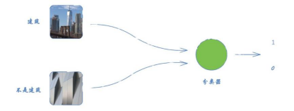
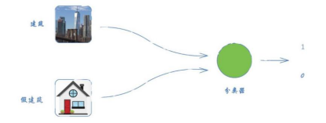
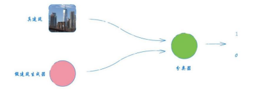
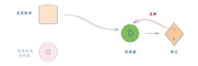
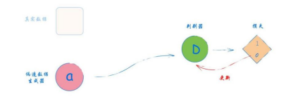

# GAN 的初步认识

2018年10月，佳士得（Christies）拍卖行以43.25万美元的价格卖出了一幅画作。令人惊讶的是，这幅画
作的作者不是人，而是一个神经网络。该神经网络是由一种基于博弈论训练的网络，所以我们又称该架构为生
成对抗网络（Generative Adversarial Network，GAN）。

相比于传统神经网络数十年的研究和积累，GAN是一个很新的网络，在2014年由伊恩·古德费洛
（Ian Goodfellow）提出，并在业界受到了广泛的关注，引用和扩展GAN的工作层出不穷。GAN要解决的问
题是如何从训练样本中学习出新样本，训练样本是什么，输出就生成什么。训练后的GAN打破了传统神经网络
架构的局限性，能自主生成全新的数据，而不仅仅是只对输入数据进行类别或数值预测，应用潜力巨大。

1. GAN的概念

在探索GAN之前，我们先设定一个应用场景。

一个名画伪造者想伪造一幅达芬奇的画作。开始时，他技术不精，将自己的一些赝品和达芬奇的作品混在一起，
请艺术商人对每一幅画进行鉴别，并告诉他哪些看起来像真迹、哪些看起来不像真迹。

伪造者根据艺术商人的反馈，不断改进自己的赝品。同时，随着伪造者的技艺越来越高，艺术商人鉴别赝品的
能力也越来越强。最后，在双方的不断博弈下，他们手上就拥有了一些非常逼真的赝品。

这就是GAN的基本原理。这里有两个角色，一个是伪造者，一个是鉴别者。他们训练的目的都是打败对方并提高
自身能力。因此，从GAN网络的角度看，是一种对抗训练。

2. 对抗训练

下图是一个神经网络，可以学习分类一幅图像是不是房子的图像。

如果网络的输入是一幅房子的图像，输出值应该是1，对应真（true）；如果图像不是一幅房子的图像，输出
值应该是0，对应伪（false）。

:::{figure-md}

图2-49 判断图像是否为建筑的分类器

:::

接着，我们加大任务难度。改动之前，分类器试图区分一幅图像是不是一幅房子的图像；改动之后，分类器可
以区分一幅图像是真实的房子的图像还是卡通房子。

:::{figure-md}

图2-50 鉴别图像是否为真实建筑的分类器

:::

我们可以把分类器想象成一个侦探。在训练之前，侦探无法很好地分辨真房子和假房子。随着训练的进行，侦
探的判别能力越来越强，甚至能将卡通房子与真房子区分开来。

接着，我们不再用一些现有的假的图像，而用一个能生成假图像的网络组件来生成“假”房子。要生成杂乱无章
的、看起来一点也不像房子的图像并不难，比方说，我们可以随意画一些简单的图形，这时分类器的甄别工作
也同样轻松。

:::{figure-md}

图2-51 鉴别图像为真实建筑还是生成的“假”建筑的分类器

:::

注意，关键的步骤来了！

现在，假设我们用一个被训练用于生成图像的神经网络，取代之前只能生成低质量图像的组件，我们称它为
**生成器（generator）**。同时，我们把分类器称为判别器（discriminator），这也是他们在GAN架构中通用的命名。

:::{figure-md}

图2-52 GAN架构示例图

:::

让我们思考一下该如何训练生成器？如何使生成的图像越来越像真图像？

训练的关键在于，我们希望奖励哪些行为，惩罚哪些行为。这也正是损失函数的作用。如果图像通过了判别器的检验，我们奖励生成器。如果伪造的图像被识破，我们惩罚生成器。

判别器的作用是把真实的图像和生成的图像区分开。如果生成器的表现不佳，区分工作就很容易。通过训练生成器，它的表现应该越来越好，并生成越来越逼真的图像。

随着训练的进展，判别器的表现越来越好，生成器也必须不断进步，才能骗过更好的判别器。最终，生成器也变得非常出色，可以生成足以以假乱真的图像。

**判别器和生成器是竞争对手（adversary）关系，双方都试图超越、打败对方，并在这个过程中逐步提高。我们称这种架构为生成对抗网络 （Generative Adversarial Network，GAN）**。这个设计非常巧妙！它不仅利用竞争来驱动进步，同时我们也不需要定义具体的规则来编码到损失函数中的真实图像；相反，我们让GAN自己来学习什么是真正的图像。

这也说明为什么世界顶尖机器学习专家之一的杨立昆，称GAN为“机器学习领域近20年来最酷的想法”。

3. GAN训练

在GAN的架构中，生成器和判别器都需要训练。我们不希望先用所有的训练数据训练其中任何一方，再训练另一方。我们希望它们能一起学习、一起优化，任何一方都不应该超过另一方太多，在动态博弈中达到平衡状态。

下面的三步训练循环是实现这一目标的一种方法，也是大多数GAN训练方案的核心。

- 第1步——向判别器展示一个真实的数据样本，告诉它该样本的分类应该是1.0，并用损失来更新判别器，如图2-53所示。

- 第2步——向判别器显示一个生成器的输出，告诉它该样本的分类应该是0.0，如图2-54所示。我们必须注意只用损失来更新判别器，不更新生成器。因为我们不希望它因为被判别器识破而受到奖励。稍后，在编写GAN的代码时，我们将看到具体如何防止更新回到生成器。

- 第3步——向判别器显示一个生成器的输出，判别器的预期输出应该是1.0，如图2-55所示。我们希望生成器能成功骗过判别器，让它误以为图像是真实的，而不是生成的。在这步中，我们只用结果的损失来更新生成器，而不更新判别器。因为我们不希望因为错误分类而奖励判别器。在编码时，这也很容易做到。

:::{figure-md}

图2-53 用真实数据和期望输出值1.0训练鉴别器

:::

:::{figure-md}

图2-54 用生成器伪造的数据和期望输出值0.0训练判别器

:::

:::{figure-md}

图2-55 采用伪造数据和期望输出1.0训练生成器

:::

这些步骤看起来好像很复杂，但是，我们在之后的实践中会发现，它们非常容易通过编码实现。

然而，成功地设计和训练GAN并不容易。因为GAN的概念还很新，其工作原理以及训练失败的基本理论尚未成熟，正因为我们正在做最前沿的工作，所以任何人都有机会有新的发现和突破，让我们不畏困难、一起努力吧！
