# 采用GAN 生成手写数字

&ensp;&ensp;&ensp;&ensp;
我们从架构图入手，构建一个GAN。真实图像由我们在第2.2节中使用过的MNIST数据集提供。生成器的任务是生成相同大小的手写数字图像。随着训练的进展，我们希望生成的图像越来越真实，并可以骗过判别器。首先，让我们创建一个新的Note并导入所需的库。

:::{literalinclude} ../codes/chapter_2_3_2_01.py
:caption: chapter_2_3_2_01.py
:language: python
:linenos:
:::

1. 数据类

&ensp;&ensp;&ensp;&ensp;
我们将使用之前创建的MnistDataset类加载数据集，对于数据集中的每个样本，我们将获得一个代表实际数字的标签、一个归一化的图像像素值张量，以及一个独热目标张量。另外，我们为MnistDataset类添加一个plot_image方法，它将对数据集中的图像进行可视化。我们可以通过绘制样本图像，测试Dataset类是否可以正常工作。

:::{literalinclude} ../codes/chapter_2_3_2_02.py
:caption: chapter_2_3_2_02.py
:language: python
:linenos:
:::

:::{figure-md}

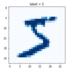

图2-56 可视化数据集中的第一个样本结果

:::

&ensp;&ensp;&ensp;&ensp;
如图2-56所示，我们成功绘制了数据集中第一个样本的图像，它的标签是5。下面让我们开始用PyTorch搭建生成对抗网络模型吧！

2. MNIST判别器

&ensp;&ensp;&ensp;&ensp;
我们先编辑判别器，GAN里面的判别器其实也是一个分类器。跟之前一样，它是一个继承自nn.Module的神经网络。我们按照PyTorch所需要的方式初始化网络，并创建一个forward()
函数。以下是判别器的构造函数。

:::{literalinclude} ../codes/chapter_2_3_2_03.py
:caption: chapter_2_3_2_03.py
:language: python
:linenos:
:::

&ensp;&ensp;&ensp;&ensp;
网络本身很简单。它在输入层有784个节点，因为输入是由28×28=784个像素组成的。在最后一层，其输出是单个值。当该值为1表示为真，该值为0则表示为伪。隐藏的中间层有200个节点，我们采用nn.Sequential将这些网络层按顺序堆叠起来。

3. 测试判别器

&ensp;&ensp;&ensp;&ensp;
在任何机器学习架构中，对重要组件的测试都很有必要。在构建生成器之前，我们先测试判别器，确保它至少能将真实图像与随机噪声区分开。我们定义一个生成随机噪声的函数generate_random()
，它将生成指定尺寸的0-1之间的随机数张量。

:::{literalinclude} ../codes/chapter_2_3_2_04.py
:caption: chapter_2_3_2_04.py
:language: python
:linenos:
:::

&ensp;&ensp;&ensp;&ensp;
和之前一样，我们需要定义损失函数和优化器，在这里我们采用MSELoss损失函数和SGD优化器，同时也创建counter和progress用于记录和输出训练进程。以下为测试判别器的代码。对于训练集中的真实图像，奖励判别器将训练数据判别为真，也就是目标输出1.0。对于每个生成数据样本，我们使用generate_random(

784) 生成一幅由随机像素值组成的反例图像。我们训练判别器识别这些伪造数据，目标输出为0.0。

:::{literalinclude} ../codes/chapter_2_3_2_05.py
:caption: chapter_2_3_2_05.py
:language: python
:linenos:
:::

&ensp;&ensp;&ensp;&ensp;
训练过程中的损失值变化图如下所示，损失值下降并一直保持接近0的值，符合我们的预期。

:::{figure-md}

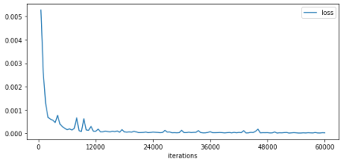

图2-57 判别器损失值变化图

:::

4. MNIST生成器

&ensp;&ensp;&ensp;&ensp;
下面我们开始搭建生成器网络。我们希望它的输出能骗过判别器，生成跟MNIST数据集中图像格式相同的、包含28×28=784像素的图像，这意味着输出层需要有784个节点。

&ensp;&ensp;&ensp;&ensp;
生成器的隐藏层不需要局限于一个特定的大小，不过这个大小应该满足学习的需要，同时，需要配合判别器的学习速度。基于这些考量，许多人从反转判别器的构造入手来设计生成器。

&ensp;&ensp;&ensp;&ensp;
反转后的网络的输出层有784个节点，隐含层有200个节点，输入层有1个节点，如图2-58所示，生成器所输出的784个像素值正是判别器所期待的输入。

:::{figure-md}

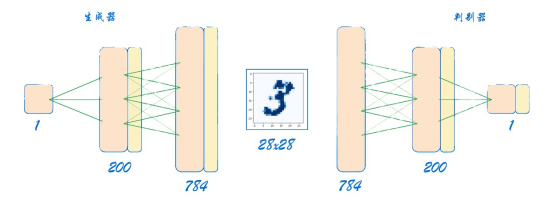

图2-58 通过反转判别器得到生成器架构

:::

&ensp;&ensp;&ensp;&ensp;
我们知道，对于给定的输入，一个神经网络的输出是不变的。然而，我们希望神经网络每次输出不同的、代表训练数据中所有数字的图像。例如，我们希望它生成的图像看起来像1、5、4、9等。为了实现这一设想，需要我们改变生成器的输入，在每个训练循环中，将一个随机值输入生成器。我们更新架构图，加入这个随机种子（random
seed）。

:::{figure-md}

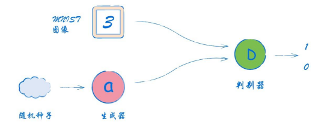

图2-59 GAN架构图

:::

&ensp;&ensp;&ensp;&ensp;
以下是生成器的代码。

:::{literalinclude} ../codes/chapter_2_3_2_06.py
:caption: chapter_2_3_2_06.py
:language: python
:linenos:
:::

5. 检查生成器输出

&ensp;&ensp;&ensp;&ensp;
在正式训练GAN之前，我们需要检查生成器的输出格式是否正确。我们创建一个新的生成器对象，并输入一个随机种子，得到一个输出张量。我们可以通过output.shape来确认该张量有784个值。作为一幅图像，我们可以看到它是相当无规律的。这也符合我们的预期，因为这时生成器还没有经过训练。

:::{literalinclude} ../codes/chapter_2_3_2_07.py
:caption: chapter_2_3_2_07.py
:language: python
:linenos:
:::

:::{figure-md}

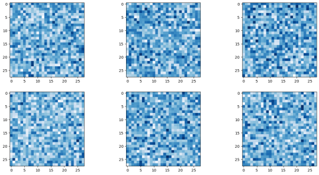

图2-60 生成器的输出（0 epoch）
:::

6. 训练GAN

&ensp;&ensp;&ensp;&ensp;
让我们先看一下训练GAN的代码。从代码中可以看出，生成器类和判别器类的定义最明显的区别在于神经网络层的定义。

:::{literalinclude} ../codes/chapter_2_3_2_08.py
:caption: chapter_2_3_2_08.py
:language: python
:linenos:
:::

&ensp;&ensp;&ensp;&ensp;
首先，我们创建了新的判别器和生成器对象。接着，我们运行训练循环1次。每次循环都重复训练GAN的3个步骤。

&ensp;&ensp;&ensp;&ensp;
第1步，我们用真实的数据训练判别器。

&ensp;&ensp;&ensp;&ensp;
第2步，我们使用一组生成数据来训练判别器。对于生成器输出，detach()
的作用是将其从计算图中分离出来。通常，对判别器损失直接调用backwards()
函数会计算整个计算图路径的所有误差梯度。这个路径从判别器损失开始，经过判别器，最后返回生成器。但我们只希望训练判别器，这么做可以明显地节省大网络的计算成本，因此不需要计算生成器的梯度。生成器的detach()
可以在该点切断计算图。图2-61更直观地解释了这一点。

:::{figure-md}

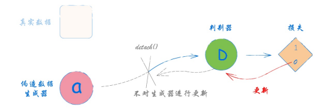

图2-61 使用detach()函数切断生成器梯度传播

:::

&ensp;&ensp;&ensp;&ensp;
第3步，我们输入判别器对象和单数值0.5训练生成器。生成器的训练与判别器的训练稍有不同。对于判别器，我们知道目标输出是什么。而对于生成器，我们不知道目标输出，但我们训练生成器的目标很明确：生成能够骗过判别器的图片。这意味着生成器所生成的图片在经过判别器后的输出，需要最大限度地接近真实标签。因此，我们将根据判别器的损失值计算的误差梯度来更新生成器。这里没有使用detach()
，是因为我们希望误差梯度从判别器损失传回生成器。生成器的train()
函数只更新生成器的链接权重，因此我们不需要防止判别器被更新。

&ensp;&ensp;&ensp;&ensp;
完成训练需要几分钟的时间。让我们查看一个轮次的训练后所得到的判别器和生成器的损失图。

:::{figure-md}

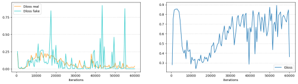

图2-62 判别器、生成器损失图（1 epoch）

:::

&ensp;&ensp;&ensp;&ensp;
首先观察判别器的损失图，我们分别绘制了判别器对于真实数据和生成数据的损失值。可以看到，对于两种数据输入，损失值都先下降到0，并在一段时间内保持在较低水平，表明判别器领先于生成器。接着，损失值上升到0.25左右的位置，这表明判别器和生成器旗鼓相当。不过，判别器随后再次发力，损失值下降并趋近于0，表明该生成器没能学会骗过判别器。

&ensp;&ensp;&ensp;&ensp;
对比观察生成器损失图。起初，判别器能够正确识别生成的图像，这是损失值偏高的原因。接着，生成器和判别器达到一些平衡，损失值下降到0.25上方并保持一段时间。随着训练的继续，判别器再次超过生成器，生成器损失值再度升高。

:::{figure-md}

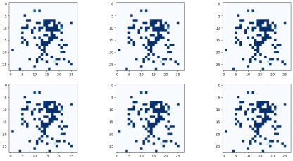

图2-63 生成器输出（1 epoch）

:::

&ensp;&ensp;&ensp;&ensp;
此时，我们查看生成器生成的图像，可以发现生成的图像不是随机噪声，而是有某种形状。生成器最终能否学会生成手写数字呢？让我们继续运行代码，再训练9个轮次。

&ensp;&ensp;&ensp;&ensp;
完成总共10个轮次的训练后，我们再次查看生成器输出的多幅图像，它们与真实的手写数字图像很像！然而，不难发现，这些图像显示的内容几乎都是相同的，像是在显示着同一个数字9。

&ensp;&ensp;&ensp;&ensp;
即使图中显示的数字并不完美，但生成器却已经学会了创建类似的图像，我们用相对简单的代码实现了一个重要的工作！此部分完整代码可参考附录或扫描二维码下载。

:::{todo}

待开源后提供下载github链接

:::

:::{figure-md}

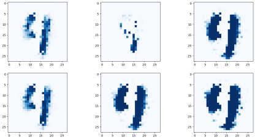

图2-64 生成器输出（10 epochs）

:::

7. 改良GAN

&ensp;&ensp;&ensp;&ensp;
刚刚看到的现象，在GAN训练中非常常见，称为模式崩溃（mode collapse）。在MNIST的案例中，我们希望生成器能够创建代表所有10个数字的图像。当模式崩溃发生时，生成器只能生成10个数字中的一个或部分，无法达到要求。

:::{figure-md}

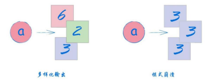

图2-65 GAN的模式崩溃

:::

&ensp;&ensp;&ensp;&ensp;
发生模式崩溃的原因还在分析研究中，许多相关的研究正在进行。下面的一些方法可以用来提高判别器对生成器反馈的质量。

&ensp;&ensp;&ensp;&ensp;
（1）使用二元交叉熵BCELoss()代替损失函数中的均方误差MSELoss()。在神经网络执行分类任务时，二元交叉熵更适用。相比于均方误差，它更大程度地奖励正确的分类结果，同时惩罚错误的结果。

&ensp;&ensp;&ensp;&ensp;
（2）将神经网络中的信号采用LayerNorm()进行归一化，以确保它们的均值为0。同时，归一化也可以有效地限制信号的方差，避免较大值引起的网络饱和。

&ensp;&ensp;&ensp;&ensp;
（3）使用Adam优化器代替SGD优化器，并同时用于判别器和生成器。

&ensp;&ensp;&ensp;&ensp;
（4）在生成过程的起始点提供更多的输入种子，且都是随机值。

&ensp;&ensp;&ensp;&ensp;
（5）根据判别器和生成器的特点，输入不同的随机种子。对MNIST数据集来说，目前的测试是将判别器的性能与随机判断进行对比，输入判别器的随机值需要在0～1的范围内均匀抽取，对应真实数据集中图像像素的范围；输入生成器的随机值不需要符合0～1的范围，从一个平均值为0、方差为1的正态分布中抽取种子更加合理。

&ensp;&ensp;&ensp;&ensp;
我们根据上述的方法对程序进行改进，选用BCELoss替代MSELoss，Adam代替SGD优化器。然后我们对神经网络进行修改，换用LeakyReLU作为激活函数，并在激活函数前使用LayerNorm对数据进行归一化，让数据尽可能集中在激活函数的敏感区域。同时，我们将生成器输入的随机噪声改为100个，并修改生成随机噪声的函数，换用torch.randn()函数，它将生成符合均值为0的标准正态分布的随机数。经过10轮的训练，生成器的生成结果如下图所示，它成功地生成了多种数字！

:::{figure-md}

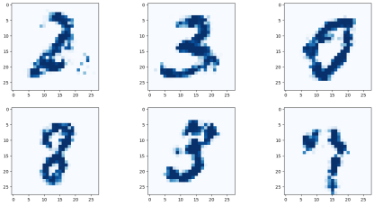

图2-66 改良GAN的生成器输出（10 epochs）

:::

&ensp;&ensp;&ensp;&ensp;
改良GAN训练的完整代码可参考附录或扫描二维码下载。

:::{todo}

后续附链接, chapter_2_3_2_09.py

:::

&ensp;&ensp;&ensp;&ensp;
除了以上提到的方法外，还有更多改良方法有待我们继续探索，请读者大胆尝试。

:::{note}
如果达到了平衡:**生成器的BCELoss和MSELoss应该分别是什么？**

&ensp;&ensp;&ensp;&ensp;
理论上，一个经过完美训练的GAN的最优MSELoss为0.25，最优BCELoss为ln 2。

&ensp;&ensp;&ensp;&ensp;
回顾2.1.2小节中对损失函数的介绍，MSELoss的计算公式为：

$$
MSELoss=\frac {1}{n} \sum_{i=1}^{n}(y_i-f_i(x))^2)
$$

&ensp;&ensp;&ensp;&ensp;
对于一个经过完美训练的GAN，它的生成器能够实现以假乱真，鉴别器也能将真实模式与生成的假数据区别开来。在接收到以假乱真的生成数据时，鉴别器无法辨别输入的数据是真实的还是生成的，因此将输出0.5。代入公式(1)即可得到结果为0.25。

&ensp;&ensp;&ensp;&ensp;
BCELoss是二分类专用的交叉熵计算函数。它的计算公式跟CELoss相同，但由于二分类的真实标签只有0、1两种可能，因此对于每个标签有：

$$
BCELoss_i=\begin{cases}
-log \ p(y_i) , \ y_i = 1 \\
-log(1-p(y_i)), \ y_i =0 \\
\end{cases}
$$

&ensp;&ensp;&ensp;&ensp;
其中yi是真实标签，p(yi)是模型输出的yi的概率。对于生成器生成的以假乱真的数据，标签y = 0，而鉴别器难以作出判断，因此会输出0.5，代入即可得到BCELoss = log 2。

:::
