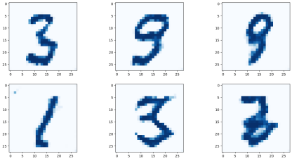

# 采用卷积GAN生成手写数字（MNSIT-CNN-GAN）

1． MNIST-CNN-GAN判别器

我们从之前创建的MNIST GAN入手，思考如何将卷积层应用于GAN。以下为卷积神经网络的判别器参考代码。

:::{literalinclude} ../codes/chapter_2_3_3_01.py
:caption: chapter_2_3_3_01.py
:language: python
:linenos:
:::

我们的CNN判别器代码和2.2.4节中的CNN分类器几乎毫无差异。不同的是，我们采用LeakyReLU(
0.02)
作为激活函数，并将最后线性全连接层的输出节点改为1个，因为判别器的目标是输出一张图像的真假。此外，我们在每次激活后都使用了BatchNorm2d对每个通道的数据进行归一化。

为了测试判别器对随机像素图像的判别能力，我们需要修改先前的判别器训练代码，使generate_random ()
创建大小为（1, 1, 28, 28）的四维张量。下面为修改后的关键代码：

:::{literalinclude} ../codes/chapter_2_3_3_02.py
:caption: chapter_2_3_3_02.py
:language: python
:linenos:
:::

请读者自行运行训练，并观察训练过程中的损失值变化，同时也可以手动测试一下判别器区分真实图像和随机生成样本的得分，并看看我们的判别器网络是不是有效。

2. MNIST-CNN-GAN生成器

生成器网络的设计原则是，生成器应该是判别器的镜像。

那卷积计算的镜像是什么呢？我们已经知道，卷积将较大的张量缩减成较小的张量，而卷积计算的镜像则需要将较小的张量扩展成较大的张量。PyTorch将这种反向卷积称为转置卷积（Transposed
Convolution），需要调用的模块是nn.ConvTranspose2d。有关转置卷积的相关内容详见第四章。

如果将判别器进行镜像，那么不难发现，起始端有一个全连接层，目的是维度变换，变为高维，将噪声向量放大。它将100个种子值映射到32×5×5的张量。接着，它通过View模块转换成转置卷积层所需要的四维（1,
32, 5,
5）张量。View模块的定义如下代码所示，它的功能是修改数据形状。可以看到，它也是通过继承nn.Module来实现的，我们可以把它看作神经网络中的一个层次，数据在这个层次中的计算定义在forward()
函数中。

:::{literalinclude} ../codes/chapter_2_3_3_03.py
:caption: chapter_2_3_3_03.py
:language: python
:linenos:
:::

转置卷积模块共有3个：第一个转置卷积模块的卷积核大小为3×3，步长为2；第二个转置卷积模块的卷积核大小为5×5，步长为2；最后一个转置卷积模块的卷积核大小为5×5，步长为1。前两个转置卷积模块有10个卷积核，最后一个转置卷积模块减少到1个卷积核。output_padding和padding参数的作用在于保证模型最后的输出的大小为（1,
1, 28, 28）。

如下代码定义了生成器神经网络参考实现。

:::{literalinclude} ../codes/chapter_2_3_3_04.py
:caption: chapter_2_3_3_04.py
:language: python
:linenos:
:::

做完所有准备工作后，我们开始对GAN进行训练。观察训练5个周期后，生成器生成的图像效果，不难看出，我们的卷积GAN可以生成基本能被识别的手写数字。读者可以尝试加大训练周期，看看是否可以生成质量更好的图片！

:::{figure-md}

图2-67 卷积GAN的生成器输出

:::

本小节使用的卷积GAN的完整代码可参考附录或扫描二维码下载。

:::{todo}

开源后待附链接 chapter_2_3_3_05.py

:::

同时，读者可以通过尝试自己的想法来改良GAN。比如，尝试不同类型的损失函数、不同大小的神经网络，甚至可以改变基本的GAN训练循环，也可以尝试做一个更适合GAN的对抗性的优化器。
