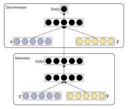
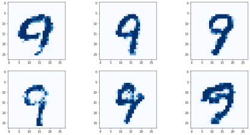

# 采用条件式GAN生成手写数字

&ensp;&ensp;&ensp;&ensp;
我们之前构建的MNIST GAN可以生成各种不同的手写数字输出图像，同时，也很好地避免了单一化和模式崩溃。

&ensp;&ensp;&ensp;&ensp;
如果能通过某种方式引导GAN生成多样化的图像，同时又仅限于生成训练数据中的一类图像，例如，我们可以要求GAN生成不同的、但都代表数字8的图像，满足我们的特定需求，从而实现真正意义上的人机交互，那将是非常有价值的。

1. 条件式GAN架构

&ensp;&ensp;&ensp;&ensp;
为了让训练后的GAN生成器输出指定类型的图像，需要输入我们希望的输出类型。也就是说，我们需要将类型作为生成器输入的一部分，如同随机种子一样。

&ensp;&ensp;&ensp;&ensp;
对于判别器，情况会更加复杂。我们现在希望判别器学习将类型标签与图像关联起来，而不仅仅是尝试将真实的图像和生成的图像分开。因此，我们需要将类型标签与图像一起输入判别器。

&ensp;&ensp;&ensp;&ensp;
下图显示的架构是条件式（conditional）GAN。与GAN的主要区别在于，现在生成器和判别器的输入都在图像数据的基础上加入了类型标签。

:::{figure-md}

图2-68 条件GAN架构图

:::

2. 判别器

&ensp;&ensp;&ensp;&ensp;
我们在之前的MNIST GAN基础上，实现这个架构。

&ensp;&ensp;&ensp;&ensp;
首先，我们需要更新判别器，使它可以同时接收输入图像的像素数据和标签信息。一种简单的方法是扩展forward()
函数，使它可以同时接收图像张量和标签张量为输入变量，再直接将它们拼接起来。标签张量就是我们之前在Dataset类中创建的独热张量。

:::{literalinclude} ../codes/chapter_2_3_4_01.py
:language: python
:linenos:
:::

&ensp;&ensp;&ensp;&ensp;
通过torch.cat()
函数可以方便地将两个张量拼接起来。从Dataset类中返回的图像张量长度为784，标签张量的长度为10，所以拼接起来后的长度为794。

&ensp;&ensp;&ensp;&ensp;
由于我们扩展了输入的大小，因此需要更改第一层神经网络的定义，将预期输入的大小改为784+10，即794。

:::{literalinclude} ../codes/chapter_2_3_4_02.py
:language: python
:linenos:
:::

&ensp;&ensp;&ensp;&ensp;
我们还需要为随机生成的图像搭配一个随机类别标签，我们创建了一个函数generate_random_one_hot()
，来生成一个随机的独热标签向量。

:::{literalinclude} ../codes/chapter_2_3_4_03.py
:language: python
:linenos:
:::

3. 生成器

&ensp;&ensp;&ensp;&ensp;
对于生成器，需要修改forward()
函数，把种子和标签张量输入生成器。因此。我们需要把输入参数拼接起来，再输入神经网络，仍需用到torch.cat()
函数。

:::{literalinclude} ../codes/chapter_2_3_4_04.py
:language: python
:linenos:
:::

&ensp;&ensp;&ensp;&ensp;
网络的第一层需要修改，以便接收10个额外标签张量，变为100+10。

:::{literalinclude} ../codes/chapter_2_3_4_05.py
:language: python
:linenos:
:::

4. 训练

&ensp;&ensp;&ensp;&ensp;
训练循环同样需要修改，随机生成一个类别标签张量，在相应的位置输入给判别器和生成器。以下代码只显示了周期循环内的内容。我们在这里总共对条件式GAN训练10轮。

:::{literalinclude} ../codes/chapter_2_3_4_06.py
:language: python
:linenos:
:::

5. 条件式GAN的结果

&ensp;&ensp;&ensp;&ensp;
我们定义plot_conditional_image函数，它实现了生成并绘制指定标签的图像。

:::{literalinclude} ../codes/chapter_2_3_4_07.py
:language: python
:linenos:
:::

&ensp;&ensp;&ensp;&ensp;
我们将9作为参数传给plot_conditional_image，查看条件式GAN生成的数字9的图像。

:::{figure-md}

图2-69 条件GAN生成器输出

:::

&ensp;&ensp;&ensp;&ensp;
通过仅仅10轮的训练，我们的条件式GAN不仅生成了几幅数字9的图像，而且这些图像都不一样。条件式GAN的完整代码可参考附录或扫描二维码下载。

:::{todo}
待完善
:::

&ensp;&ensp;&ensp;&ensp;
生成指定类型的多样化图像具有很多应用场景，比如生成具有特定情绪表情的人像、具有指定风格的建筑等。而实现这一功能的关键在于，训练数据需要根据我们希望生成的类别进行标记。
