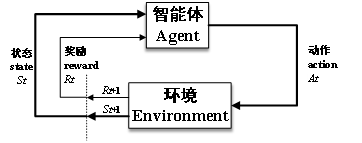
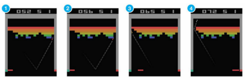
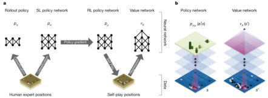

# 强化学习的初步认识

强化学习[1]是智能体的自然学习范例。它包含了智能体（Agent）、环境（Environment），状态（State）、动作（Action）、奖励（Reward）、时刻（t）和策略（π）。

智能体 Agent：在环境中进行探索的计算机控制程序、机器人等；

环境 Environment：智能体所处的真实空间或虚拟空间的统称，包括空间中的物体和空间的边界；

状态S：State，智能体当前所处环境及其自身情况（如位置）的描述，也反映了智能体对当前环境和自己境遇的一种观察（observation），所有状态形成一个集合，因为智能体可以有很多种状态，则用{si}表示状态集合；

动作A：Action，智能体做出的动作；所有动作形成一个集合，因为智能体可以做出很多类动作，则用{ai}表示动作集合；

奖励R：Reward，环境对于智能体动作执行后的反馈，奖励可能为负（即惩罚），是一个标量；

时刻t：智能体所处的时间步，智能体在每个时刻都有其对应的状态、动作和奖励等；

策略：policy，是智能体所处当前环境、状态到智能体选择动作的映射；策略的表现形式一般是一个概率，例如在当前环境和状态下，智能体可选择下一个动作可能为a1、a2、a3。用t (a)表示智能体在t时刻选择动作a的概率；

强化学习创建了一个智能体，该智能体通过从环境中获得动作反馈（惩罚和奖励）来学习，然后调整其行为。强化学习遵循马尔可夫决策过程（Markov Decision Process, MDP）的框架，智能体（Agent）在时间t观察到一个状态St（State），智能体在状态St下采用动作At（Action）并得到环境（Environment）反馈的奖励Rt+1（Reward），并更新状态St+1，以此进行循环学习，见图2-70。在每个周期中，智能体从其环境中获取代表当前状态的信息。根据当前状态习得的知识和目标，选择并执行最适当的动作。通过从环境中获得有关反馈的奖励，智能体可以学会一个策略以调整其行为获得积极奖励并避免受到惩罚，使得累计折扣奖励（Accumulated Discounted Reward）期望最大。

:::{figure-md}

图2-70 强化学习基本架构

:::

我们可以根据不同的规则对强化学习进行分类。根据策略更新方法可以将强化学习分为：（1）基于价值（Value-based）：价值将每对状态和行为与未来预期值相关联，求出最优值函数，然后重构出最优策略；（2）基于策略（Policy-based）：策略是将每个状态映射到所需的行为，直接在策略空间进行搜索。

根据是否依赖环境可以将强化学习分为：（1）无模型（Model-free）：智能体不尝试理解环境，直接接受环境信息，通过交互数据得到最优策略；（2）基于模型（Model-based）：智能体先理解真实世界是什么样的，用数据先学习系统模型，然后基于模型得到最优策略。

根据更新频率可以将强化学习分为：（1）蒙特卡洛更新（Monte-Carlo update）：智能体每完成一个回合任务，对策略进行一次更新；（2）时序差分更新（Temporal-difference update）：智能体一边探索一边学习，进行单步更新，每执行一个动作更新一次策略。

传统的基于表格存储的强化学习方法有动态规划（Dynamic Programming）、Q-learning等。其中Q-learning是强化学习中的一种基本的基于价值的算法，目的是为了学习最优动作价值函数。这些算法在场景较为简单的情况下，可以取得较好的效果。但面对复杂的现实问题，特别是当状态空间和动作空间维数很大时，会占据过多的内存，智能体的搜索次数也会增多，传统的基于表格存储记忆的强化学习不再适用。

近几年在原有强化学习的基础上，深度强化学习（Deep Reinforcement Learning, DRL）逐渐兴起，并在Atari电玩（如图2-71所示）和围棋（如图2-72所示）等领域取得了超过人类的表现，具有解决复杂控制问题的能力。深度强化学习DRL可以通过构建深度神经网络来对收益期望和状态动作对进行关联，可以承载较大的状态空间，从而克服传统强化学习的维度爆炸、内存不够等缺点。

特别是由Google DeepMind团队于《Nature》上提出的深度Q网络（Deep Q Network，DQN），将深度强化学习DRL应用于Atari电玩中，可在游戏的操控上达到人类专家的水平。在深度Q网络中，采用经验回放（Experience Replay）和目标网络（Target Network）等机制来减缓采样数据的相关性和非平稳分布，以缩短训练时间，并使用深度神经网络来替代智能体存储记忆和经验的表格，使得深度强化学习可以用于求解状态空间和动作空间十分复杂的场景，解决传统基于表格存储记忆的强化学习的维度爆炸的问题。在深度Q网络中实现了端到端（End-to-End）的控制，将智能体当前的状态作为神经网络的输入，经过神经网络的正向传播计算，神经网络的输出为智能体要采取的动作。

:::{figure-md}

图2-71 Atari游戏操作[5]

:::

:::{figure-md}

图2-72 Alpha Go架构设计[9]

:::
