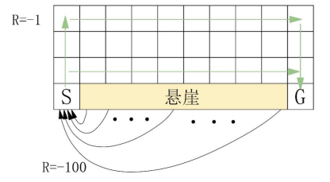

# 采用Q-learning 算法进行智能体路径规划

1. Q-leaning算法介绍

Q-learning是强化学习中的一种基本的基于价值的算法，它以上述所说的贝尔曼最优方程、最优价值函数和时序差分学习为基础。智能体通过与环境的交互和学习，调整智能体本身的行为以适应环境。Q-leaning的伪代码如下表所示。Q(s,a)是在某个状态s下，选择动作a能够获得的奖励期望，环境会根据智能体的动作反馈相应的奖励R，Q-Table则是Q(s,a)奖励期望的集合表格。在Q-table中，表格的列为可选择的动作a，表格的行为不同的状态s。Q-table用于指引智能体在不同的状态s下，选择最合适的动作a。Q-leaning算法的主要思想就是将状态s与动作a构建成一张Q-table来存储Q(s,a)，然后根据Q(s,a)来选取能够获得最大奖励的动作。

<div class="show-mid">表 2-2 Q-learning 算法</div>

***

输入：学习率α∈[0,1]、学习次数 episode、折扣因子γ∈[0,1]

输出：Q*
***

```{code-block}
:linenos:

对所有s∈S、a∈A，初始化所有状态动作对下的表项Q(s,a), Q(terminal)=0
for i＜1 to episode do
    初始化S
    while S != terminal
        根据现有的Q(s,)、当前状态(s)和对应的策略，选择一个动作(a)
        执行动作(a)并观测产生的状态(s’)和奖励(r’)
        更新Q(s,a): Q(s,a)   Q(s,a)+α[rt+1+γmaxQ’(s’,a’)-Q(s,a)]
        令s=s’
    end while
end for
```

智能体在选择并执行动作(at)之后，会通过与环境的交互得到相应的奖励(rt+1)，并通过使用时序差分学习公式 (2-70) 更新Q(s,a)：

[//]: # (公式)
$$

Q_{t+1}(s_t,a_t)=Q_t(s_t,a_t) + \alpha [\gamma_{t+1} + \gamma \max_{a_{t+1}} \ Q_t(S_{t+1},a_{t+1}) -Q_t(s_t,a_t)] \tag {2-71}

$$

其中Qt+1(st,at)是在状态st下选择动作a更新的奖励期望Q值，Qt(st,at)是在状态s下选择动作a的原奖励期望Q值；α是学习率，α∈[0,1]，rt+1在状态st下选择并执行动作at返回的奖励，γ是衰减率，用以衡量未来奖励对当前的影响，γ∈[0,1]， 是在新的状态st+1下所有可选择的动作at+1的最大奖励期望Q值。

在强化学习算法Q-learning中，智能体的目标是最大化累计折扣期望，即：

$$

R=\sum_{i=1}^{\infty} \gamma^t r_t \tag {2-72}

$$

其中rt是在t时刻下采用动作at得到的奖励。


2. 创建强化学习环境

为了成功实施强化学习，我们需要定义强化学习的另一个重要模块：环境（Environment）。强化学习的环境可以是一个网格，其中每个状态对应于二维网格上的一个图块，智能体可以采取的唯一动作是在网格向上、向下、向左或向右移动。智能体的目标是找到以最直接的方式通往目标方块的方法。

假设我们有一个 4×10 的网格，起始位置在左下方，目标位置在右下方。这两者之间的每一块网格都是“悬崖”，如图2-73。如果智能体进入悬崖，他们将获得 -100 奖励并被送回起始位置。而进入悬崖以外的每个网格都会产生 -1 奖励。在这些条件约束下，可获得的最大奖励是 -11（-1 上，-9 右，-1 下）。使用负奖励是鼓励智能体尽快移动并寻找目标状态。我们可以采用以下代码实现上述步骤。

:::{figure-md}


图2-73 创建强化学习环境
:::

:::{literalinclude} ../codes/chapter_2_4_4_01.py
:caption: chapter_2_4_4_01.py
:language: python
:linenos:
:::

3. Epsilon贪心策略

定义了环境之后，我们还需要定义智能体在环境中的动作决策策略。在本文中，我们使用最常见的Epsilon贪心策略。智能体的训练过程是一个平衡探索策略（Exploration）与利用策略（Exploitation）的过程。为了增加对当前环境的了解，智能体尝试之前没有执行过的动作以希望发现超过当前最优行为所获得的奖励，即探索策略。利用策略是智能体倾向采取根据历史经验学习到的获得最大奖励的动作。智能体的目标是最大化累计折扣期望，但如果智能体只采用利用策略，则智能体很可能陷入局部最优解，因为可能存在更好的动作策略没有被智能体发现。因此在Q-learning算法中，采用叫做Epsilon贪心策略，其中ε∈(0,1)，该策略的本质是：智能体每次有1-ε的概率进行探索，即随机选择当前可用的所有动作，有ε的概率利用已学习的经验，即选择贪心动作a=argmaxa∈AQ(s,a)。


:::{literalinclude} ../codes/chapter_2_4_4_02.py
:caption: chapter_2_4_4_02.py
:language: python
:linenos:
:::

4. 创建训练函数


定义了环境和动作决策策略之后，我们还需要定义智能体在环境中训练策略，即如何训练智能体与环境交互来得到最优策略。我们使用Q-learning作为智能体的学习策略，Q-learning的具体实施会在下一节中讲解。本节侧重总体训练框架的搭建。训练函数（learn_environment）用于让智能体在给定的环境中学习。它有五个参数：env是环境对象，learning_rule是学习规则函数，params是参数字典，max_steps是每个episode最多的步数，n_episodes是学习的episode数。该函数会初始化Q-table，并使用 Epsilon贪心策略选择下一个动作。在每一步中，函数会根据当前状态和采取的动作来更新Q-table。在每个 episode 结束后，函数会记录该 episode 的总奖励。最终，函数返回训练后的Q-table和所有 episode 的总奖励。

:::{literalinclude} ../codes/chapter_2_4_4_03.py
:caption: chapter_2_4_4_03.py
:language: python
:linenos:
:::

5. 创建Q-learning 函数


定义完总体训练框架之后，我们需要具体实施Q-learning算法。在Q-learning中采用时序差分更新方法，即智能体每执行一个动作更新一次策略，进行单步更新。根据时序差分算法公式（2-70）得到Q值的更新公式：

$$

Q_{t+1}(s_t,a_t)=Q_t(s_t,a_t) + \alpha[\gamma_{r+1} + \gamma \max_{a_{t+1}} Q_t(S_{t+1},a_{t+1})-Q_t(s_t,a_t)] \tag {2-73}

$$

定义时间差分误差（Temporal Difference Error）：

$$

TD \ error = \gamma_{t+1} + \gamma \max_{a_{t+1}} \ Q_{t}(s_{t+1},a_{t+1}) - Q_t(s_t,a_t) \tag {2-74}

$$

$$

Q_{t+1}(s_t,a_t) = Q_t(s_t,a_t) + \alpha * TD \ error \tag {2-75}

$$
