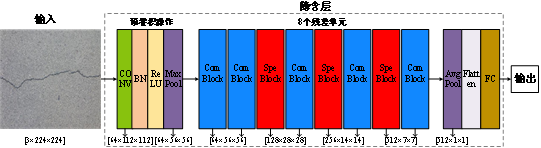
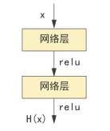
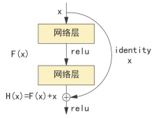

# 残差网络结构

2015年前，VGG[4]网络和GoogLeNet[5]
网络的实验结果表明，网络的深度与模型的表现成正比，深层网络一般比浅层网络效果好。究其原因，主要是因为我们可以把浅层网络的参数完全迁移至深层网络的前面几层，而深层网络之后的层只需做一个等价映射，即输出等于输入，就可达到与浅层网络一样的效果。但是，在网络达到一定深度后，网络越深，梯度消失和梯度爆炸的现象就越明显，在反向传播过程中无法有效的把梯度更新到靠前的网络层，导致训练和测试效果变差。

为了解决这一问题，2015年微软实验室的何凯明等人提出了ResNet[6]
网络，它能在深层网络情况下保持良好的性能，并在当年斩获ImageNet[7]
竞赛中分类任务第一名、目标检测第一名，同时在COCO数据集中获得目标检测第一名、图像分割第一名。相对于VGG网络，ResNet网络拥有更多的网络层数，其主要有ResNet18、ResNet34、ResNet50、ResNet101和ResNet152五个版本，后面的数字代表包含权重的层数，数字越大代表网络越深。

下面，让我们首先认识残差网络的结构，如图3-3所示。

:::{figure-md}

图3-3 ResNet18网络结构
:::

ResNet18和普通卷积神经网络一样，由输入层、隐含层和输出层组成。隐含层内包含多个残差单元和卷积、全连接层。从网络结构图可以发现，ResNet18在网络中间部分连续使用了8个残差单元，其中5个为普通残差单元（CommonBlock），3个为特别残差单元（SpecialBlock），具体位置排布如图3-3所示。在残差单元的前端首先进行预卷积操作，预卷积操作将输入图像连续进行卷积、批量标准化（Batch
Normalization,
BN）、激活和最大池化操作，以减小特征图的尺寸。而在残差单元输出端首先进行全局平均池化来减少训练参数，提高训练速度，然后进行Flatten操作以接入全连接层FC，最后由全连接层输出分类结果。

::::{admonition} TIPS：批量标准化（Batch Normalization, BN）

神经网络学习过程的核心是学习数据分布，并在多个分布中找到平衡点。深度神经网络在训练时，随着参数的不断更新，中间神经元的数据分布往往会和参数更新之前有较大的差异，导致网络要不断的适应新的数据分布，进而使训练变得异常困难。2015年首次提出批量标准化[8]
的想法不仅仅对输入层做标准化处理，还要对每一中间层的输入（激活函数前）做标准化处理，使得输出服从均值为0，方差为1的正态分布，从而避免内部输入变量偏移的问题。

对于卷积神经网络的批量标准化，首先对batch个样本对应特征图的所有像素求均值和方差，然后利用公式更新像素值。具体流程如下图所示。下图为一个batch数据，数据维度为[4, 32, 64, 64]
，4表示一个batch有4个样本，32表示一个样本有32张特征图，64表示每一张特征图的长和宽。

:::{figure} ../../_static/3/3.1/3-b3a4.png
:::

批量标准化时需要计算4个样本对应位置特征图所有像素（4×64×64个像素）的平均值和方差，有32个特征图会算出32个均值uc和方差σc，再经过下列公式更新每个像素。

$$

x_i^* = \frac {x_i - u_c} {\sqrt {\sigma^2 + \varepsilon}}

$$

::::

为什么ResNet能在深层条件下保持更好的性能呢？这全都依赖于ResNet中的残差单元，这也是ResNet与其他卷积神经网络的区别所在。图3-4(
b)为残差单元的结构，可以发现，相较于标准网络结构，残差单元多了一条连接输入与输出支路，通过支路将输出与输入相加构成整个残差单元的输出。

:::::{grid} 2 2 2 2
::::{grid-item}
:::{figure-md}

（a）标准网络结构
:::
::::

::::{grid-item}
:::{figure-md}

（b）残差单元结构
:::
::::
:::::

图 3-4 标准网络结构与残差单元结构

 
 

残差网络可以在增加网络深度的情况下解决梯度消失的问题，这是因为相对于学习原始的输入信号，残差单元学习的是信号的差值。我们通过一个简单例子说明为什么学习残差可以解决梯度消失，参考图3-4结构，为了简化说明，忽略激活函数，网络层为卷积层，标准网络结构和残差单元结构都有两个卷积层，若该结构位于卷积神经网络l层起始位，令为l层的输入，为l+1层的输出，F( )为卷积计算。

对于图3-4(a)的标准网络结构，第一次卷积对应的输出是：

$$

x_{l+1}=F(x_l,w_l)=x_l \times w_l \tag {3-1}

$$

第二次卷积对应的输出

$$
H(x_{l+1})=F(x_{l+1},w_{l+1})=x_{l+1} \times w_{l+1}=x_l \times w_l \times w_{l+1} \tag {3-2}
$$

对于图3-4(b)的残差单元结构，第一次卷积对应的输出与标准结构相同，第二次卷积对应的输出是：

$$
H(x_{l+1})=x_l + F(x_(l+1),w_{l+1})=x_l + x_l \times w_l \times w_{l+1} \tag {3-3}
$$

可以发现，在前向传播过程中，残差单元结构的输出多了起始层的输入$x_l$。

因此，在反向传播过程中，标准网络结构的梯度计算为：

$$

\frac {\partial L} {\partial x_l} = \frac {\partial L} {\partial H(x_{l+1})} \ \frac {\partial H(x_{l+1})} {\partial x_l} = \frac {\partial L} {\partial H(x_{l+1})} w_l w_{l+1} \tag {3-4}

$$

残差网络的梯度计算为：

$$

\frac {\partial L} {\partial x_l} = \frac {\partial L} {\partial H(x_{l+1})} \ \frac {\partial H(x_{l+1})} {\partial x_l} = \frac {\partial L} {\partial H(x_{l+1})}(1+ w_l w_{l+1}) \tag {3-5}

$$

根据链式求导法则，某一层的梯度需要计算该层以后每层的导数，
若一共有L层，则l层梯度计算中的$\frac {\partial L} {\partial H(x_{l+1})}$为
$\frac {\partial L}{\partial H(x_L)} \frac {\partial H(x_L)} {\partial H(x_{L-1})} ··· \frac {\partial H(x_{l+2})} {\partial H(x_{l+1})}$。
对于标准网络结构，
$\frac {\partial H(x_{i+1})} {\partial H(x_i)} \frac {\partial H(x_i)} {\partial H(x_{i-1})} = w_i w_{i+1} $，
如果上式中的偏导数很小，多次连乘后梯度会越来越小，甚至趋近于零。
对于深层网络，这会导致靠近输入的浅层梯度值非常小，使浅层的参数无法有效更新，网络无法被优化。
而对于残差网络结构， $\frac {\partial H(x_{i+1})}{\partial H(x_i)} \frac {\partial H(x_i)}{\partial H(x_{i-1})} = 1+w_iw_{i+1}$，每个残差单元的偏导数内都会加1，这样采用残差单元堆叠而成的ResNet，即使网络层数很深，多次连乘后的梯度也不容易消失。

因此，ResNet网络能够非常有效地缓解深层卷积网络中可能遇到的梯度消失和网络退化问题，让训练出具有强大表征能力的深层次网络成为可能。如何选择合适的ResNet版本，需要结合自己的实际资源条件（包括数据集数量、数据集特征复杂度、检测速度和训练设备等）酌情挑选。

本章针对三种特定场景下（路面、墙面、桥面）有无裂缝进行分类（共6类），具有特征简单、数据量小的特点，所以使用层数较少、效率较高的ResNet18来完成该项目的分类任务。

