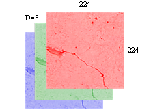
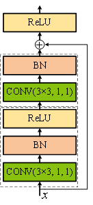
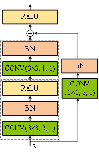

# 残差网络（ResNet18） 的工作机制

本节以裂缝图片分类为例，描述一个样本数据在ResNet18中的传播过程，包括前向传播的输入、卷积、池化、输出操作和反向传播的权重更新，并学习他们在网络中发挥的不同作用。

1. 输入

输入层是网络的第一层，对于任意的输入图像，ResNet18第一步就是将图像格式转换成固定输入格式[3, 224, 224]。其中，3代表输入图像的通道数，为RGB三通道图像，两个224分别为输入图像的长宽尺寸。如图3-5所示。

:::{figure-md}

图3-5 输入图像格式
:::

2. 卷积

当输入固定格式的图像后，需要经过一系列的卷积操作以提取图像特征。ResNet18在网络输入端首先连接有一个预卷积操作，卷积核参数为K=7，S=2，P=3，卷积核数量为64，经过预卷积操作后，特征图维度由[3, 224, 224]变为[64, 112, 112]。

而ResNet18的主要卷积过程是在残差单元中进行，需要经过8个残差单元的16次卷积操作。图3-6描述了两种残差单元的操作细节。其中，虚线框代表在此处进行了一次卷积操作，这里我们把连续进行卷积、批量标准化、激活的操作统称为一次卷积操作。卷积方块内的（K×K, S, P）分别代表卷积核尺寸、步长和填充。

:::::{grid} 2 2 2 2

::::{grid-item}
:::{figure-md}

(a) CommonBlock
:::
::::

::::{grid-item}
:::{figure-md}

(b) SpecialBlock
:::
::::

:::::

图3-6 ResNet18的两种残差单元

 
 

首先，让我们看一下CommonBlock残差块的单元结构。可以看出，输入x经过两次卷积操作后可以直接与x相加，说明这两次卷积操作并没有改变输入x的维度（通道数、长和宽）。要想保证通道数不变，只需在卷积时设置卷积核的数量等于输入的通道数。而长、宽尺寸只需要按照公式（2-51）设定相应的K、S和P值，就能维持原尺寸不变。

我们举例说明CommonBlock单元的运行过程：若此时输入x的维度是[64, 56, 56]，表示输入通道数为64，长、宽都为56。为保证通道数不变，两次卷积操作时的卷积核数量都应为64。同时，为了保证长、宽不变，ResNet18在CommonBlock中两次卷积操作的参数都设置为K = 3，S = 1，P = 1，将参数带入公式（2-51），
计算可得输出尺寸为$\frac {56-3 +2\times 1}{1} +1=56$。因此，采用这些设定参数的运行结果可不改变输入的长、宽尺寸。经过两次这样的卷积操作后，输出仍保持为[64, 56, 56]，可以直接与输入x相加。另外，CommonBlock残差块的第一次卷积操作包含了卷积、BN和激活三步，而第二次卷积操作只包含卷积和BN两步，而将激活放至第二次卷积操作的输出与输入x相加后进行。

我们都知道深度卷积神经网络在前向传播过程中，通常通过不断增加通道数并减小特征图尺寸以达到特征提取的目的。显然，上述CommonBlock残差块并不能满足这一要求。此时，我们可以引入SpecialBlock残差块来改变输入x的维度。

首先，我们希望SpecialBlock残差块能够将输入的通道数增加一倍，同时将尺寸缩小一半。要如何通过设定卷积参数来实现这一变化呢？如CommonBlock部分所述，若要保持通道数不变，只需保持卷积核数量与输入通道数一致；如果我们想通过SpecialBlock增加一倍的通道数，那么只需将卷积核数量设置为输入x的通道数的2倍。同时，按照公式（2-51）设定相应的K、S和P值，就能实现长、宽尺寸缩小一半。

我们举例说明SpecialBlock单元的运行过程：若此时输入x的维度是[64, 56, 56]，为增加一倍通道数，第一次卷积操作时卷积核的数量应为128。同时，为实现长、宽缩小一半，可在进行第一次卷积操作时将卷积核参数设置为K = 3，S = 2，P = 1，根据公式（2-51），
输出尺寸为$\frac {56-3+2 \times 1} {2} +1=28.5$，向下取整为28。经过第一次卷积操作后，维度变为[128, 28, 28]，我们已经通过SpecialBlock的第一次卷积操作实现了“通道数增加一倍、尺寸缩小一半”的目标。所以，SpecialBlock的第二次卷积操作和CommonBlock中的卷积操作参数设置方法相同，我们不再对其维度进行变化，即在第二次卷积操作完成后的输出维度仍保持[128, 28, 28]不变。接着，我们需要将输出与输入x相加，但由于输入维度是[64, 56, 56]，与输出维度[128, 28, 28]不同。为了解决这个问题，SpecialBlock引入了一个旁支卷积，对输入x进行处理，使处理后的维度与输出维度相等。因此，旁支卷积的卷积核个数应与输出通道数相同为128，这时卷积核参数设置为K = 1，S = 2，P = 0，
可以计算得出输出尺寸为$\frac {56-1+2 \times 0}{2}+1=28.5$，向下取整为28。通过旁支卷积后，输入x的维度变成了[128, 28, 28]，与主路第二次卷积操作的输出维度相同，实现了维数减小的目标。最后，将主路和支路的结果相加后进行激活。

3. 池化

在ResNet18中，有两个地方用到了池化：第一次是对经预卷积处理后得到的特征图[64, 112, 112]进行最大池化，采用的池化参数为K=2，步长S=2，填充P=1。由于池化不改变通道数，只改变图像的高宽，所以池化后的输出为[64, 56, 56]。第二次池化是对最后一个残差单元的输出进行全局平均池化，已知经过残差单元后的特征图大小为[512, 7, 7]，经过全局平均池化后维度为[512, 1, 1]。

4. 输出

首先，将上一步经过全局平均池化的结果矩阵[512, 1, 1]展平为512维列向量（Flatten）A(512×1)，然后用全连接矩阵W(6×512)对其进行线性变换W*A，得到一个6维向量，将这个6维向量输入激活函数，最终输出一个6维激活向量值，这6个数分别对应六个类别的概率。

5. 反向传播

在前向传播过程结束后，将得到网络输出的预测值，这时需要反向计算梯度更新权重。卷积神经网络的隐含层中包含卷积层和池化层，池化层没有权重参数和偏置参数，不需要训练，卷积层的参数包括卷积核张量矩阵的元素和相应的偏置，因此训练中需要计算张量矩阵元素和偏置的梯度并进行参数更新。

ResNet18输出端的全连接层其梯度计算过程与前馈网络中相同，这部分内容在第二章已进行了详细介绍，这里不再赘述。与全连接神经网络相比，卷积神经网络的训练更复杂一些，但基本原理相同：即利用链式法则计算损失函数对每个参数的偏导数，然后通过梯度下降对参数进行更新，训练算法依然是反向传播算法。

与前馈网络类似，卷积网络的反向传播算法也可主要分为以下三个步骤：

（1）输入一个做好标签的训练样本，前向传播时计算网络中每个神经元的输出值ai；

（2）反向传播时计算每个神经元的误差项$\delta_i$，$\delta_i$定义为$\delta_i=\frac {\partial L}{\partial z_i}=\frac {\partial a_i}{\partial z_i} \frac {\partial L}{\partial a_i}$，
其中L为损失函数；此公式加上带括号的上角标后，代表是上角标编号层的参数和运算；

（3）计算损失函数对权重w的偏导数，$\frac {\partial L} {\partial w_i^{(l)}}=\frac {\partial z_i^{(l)}} {\partial w_i^{(l)}} \delta_i^{(l)}=a_i^{(l-1)}\delta_i^{(l)}$，
求偏置b的思路相同。

求得权重参数与偏置的梯度后，根据梯度下降法的数学公式便可以更新参数，以此达到训练学习的目的。
