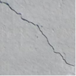
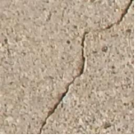
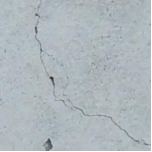
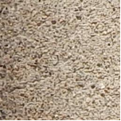
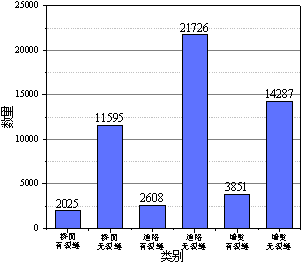

 # 数据集制作

数据的获取可来源于多种途径，包括自己实地采集、网络收集和公共数据集。我们选择来源于kaggle官网的裂缝数据[9]，该数据包含桥面、道路和墙面三个场景下有无裂缝的图片。查看图像数据如图3-8所示。

:::::{grid} 3 3 3 3

::::{grid-item}
:::{figure-md}


裂缝
:::
::::

::::{grid-item}
:::{figure-md}


裂缝
:::
::::

::::{grid-item}
:::{figure-md}


裂缝
:::
::::

::::{grid-item}
:::{figure-md}


无裂缝
:::
::::

::::{grid-item}
:::{figure-md}


无裂缝
:::
::::

::::{grid-item}
:::{figure-md}


无裂缝
:::
::::

::::{grid-item}
:class: show-mid
（a）桥面
::::
::::{grid-item}
:class: show-mid
（b）道路
::::
::::{grid-item}
:class: show-mid
（c）墙壁
::::

:::::
<div class="show-mid">图 3-8 裂缝数据</div>
<br>
<br>

下载的图片总量为56092，各类别图片数量和分布如图3-9所示。

:::{figure-md}


图 3-9 各类别图片数量和分布
:::

为了方便程序读取图片数据和制作标签，我们首先需要将下载的数据按不同类别单独储存在文件夹中。我们在根目录新建文件夹datasets，并按照下图所示对文件夹进行分级和分类。在根目录下有三个一级子目录，分别代表桥面、道路和墙面三个场景，二级子目录分别是对应场景下有无裂缝的文件夹，在二级子文件夹下存放图片，具体存放格式如图3-10所示。

:::{figure-md}


图3-10 图片数据储存方式
:::

将数据存入文件夹之后，接下来需要制作可以直接用于训练的数据集。一共分为三个步骤：1. 读取图片地址和制作标签，并将图片地址和标签存于同一列表下；2. 创建数据集，将图片划分为训练集和测试集后，读取图片并进行预处理；3. 创建DataLoader，设置batch_size，定义从数据集中读取数据的方式。下面我们逐步讲解如何将下载的数据处理成用于训练的数据集。

（1）读取数据路径与制作标签

我们的目标是将所有图片的路径存储到列表data_x内，并将该列表中每个地址对应的标签存储到列表data_y，同时还要将六个类别的标签名存入列表class_name_s。这里需要注意的是，标签和标签名是两个内容。标签是0, 1, 2, 3, 4, 5的数字编号，用于六分类任务，而标签名是类别的名称。我们通过以下程序来实现我们目标。

:::{literalinclude} ../codes/chapter_3_3_1_01.py
:caption: chapter_3_3_1_01.py
:language: python
:linenos:
:::

我们遍历每一个图片的地址，并将其地址存储在列表中。首先打开datasets文件夹，依次遍历一级子目录，parent_class_name对应一级子目录的三个场景文件名。接着按顺序打开一级子目录，依次遍历二级子目录，sub_class_name对应二级子目录的有无裂缝文件名。最后按顺序打开二级子目录，依次遍历文件夹内的图片，sub_data_file_name对应图片名。值得注意的是，标签由class_name_s的长度决定，而class_name_s只有遍历完一个类别的所有图片后才会有新的类别名加入。初始class_name_s为空列表，len（class_name_s）= 0，所以在遍历Decks\Cracked文件夹下的图片时，标签都为0。当循环到二级子目录Decks\Non-cracked，列表class_name_s内只存储了一个文件名Decks.Cracked，此时len（class_name_s）= 1，所以遍历Decks\Non-cracked文件夹下的图片时，标签都为1。直至循环结束，六个类别的图片分别对应的标签为0, 1, 2, 3, 4, 5。我们看一下这些列表里存储的值。

```python
print(class_name_s)
```

```text
['Decks.Cracked', 'Decks.Non-cracked', 'Pavements.Cracked', 'Pavements.Non-cracked', 'Walls.Cracked', 'Walls.Non-cracked']
```

```python
print(data_set)
```
```text
[
(['..\\data\datasets\\Decks\\Cracked\\7001-115.jpg',…],[0,0,0,…]), (['datasets\\Decks\\Non-cracked\\7001-1.jpg',…],[1,1,1,…]),
(['..\\data\datasets\\Pavements\\Cracked\\001-100',…],[2,2,2,…]),
(['..\\data\datasets\\Pavements\\Non-cracked\\001-1.jpg',…],[3,3,3,…]),
(['..\\data\datasets\\Walls\\Cracked\\7069-101.jpg',…],[4,4,4,…]),
(['..\\data\datasets\\Walls\\Non-cracked\\7069-1.jpg',…],[5,5,5,…])
]
```

（2）创建数据集

通过上述步骤，我们已经把图片地址和标签存储到列表data_set，接下来需要读取图片信息并制作数据集。首先，将所有数据划分为训练集和测试集，接着定义图像预处理函数，最后读取图片并处理后储存。创建过程如下：

:::{literalinclude} ../codes/chapter_3_3_1_02.py
:caption: chapter_3_3_1_02.py
:language: python
:linenos:
:::

这一步我们将data_set内的图片按照8:2划分为训练集和测试集，对应的标签划为训练标签和测试标签。各部分对应的数据量可以通过以下程序查看。

```python
print("训练集数据量:" + str(len(x_train_s)))
print("测试集数据量:" + str(len(x_test_s)))
```
```text
训练集数据量:44871
测试集数据量:11221
```

接下来，根据图片地址读取图片信息，读取时我们首先加载用于图像预处理的功能函数transforms.Compose()对图片进行预处理，预处理可以将图片转变为网络模型输入的尺寸，也可以对图片进行翻转、剪切和颜色变化等操作来增强数据特征。

:::{literalinclude} ../codes/chapter_3_3_1_03.py
:caption: chapter_3_3_1_03.py
:language: python
:linenos:
:::

我们在这里只使用了部分图片预处理函数，其他预处理函数的详细用法读者可以自行学习和使用。接下来，我们将进行图片信息的读取与存储。

:::{literalinclude} ../codes/chapter_3_3_1_04.py
:caption: chapter_3_3_1_04.py
:language: python
:linenos:
:::

这一步我们依据图片路径读取了图片，同时还将训练图片和训练标签存入了train_data，测试图片和测试标签存入了test_data，并对图片进行了预处理。

（3）创建数据加载器DataLoader

上一步我们已经将所有图片信息和标签信息读取并存储在train_data和test_data，下一步将定义如何从train_data和test_data中抓取图片到网络模型中进行训练和测试。我们使用torch_data.DataLoader( )构建可迭代的数据装载器，使用超参数batch_size确定网络模型一次读入的图片数量。

:::{literalinclude} ../codes/chapter_3_3_1_05.py
:caption: chapter_3_3_1_05.py
:language: python
:linenos:
:::

通过上述三个步骤，我们完成了数据集制作的全过程。接下来，我们便可以开始进行网络的构建与训练了！
