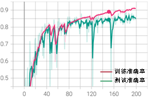
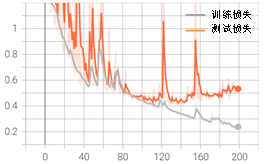

# 模型训练

模型训练一共分为三个步骤：1. 创建网络模型，此处我们将采用两种方法创建。2. 定义训练函数，设置一些必要的显示参数。3. 定义功能函数与训练，设定损失函数与优化函数等功能函数并进行训练。下面我们将逐步讲解如何创建网络并进行训练。

（1）创建网络模型

这一部分我们主要通过两种方式创建ResNet18网络模型。第一种是直接使用PyTorch框架中内嵌的ResNet18包，第二种则是通过PyTorch框架自行编译ResNet18模型。

第一种：直接使用ResNet18内嵌包

:::{literalinclude} ../codes/chapter_3_3_2_01.py
:caption: chapter_3_3_2_01.py
:language: python
:linenos:
:::

在直接使用ResNet18时，我们不仅可以加载ResNet18的网络框架，还可以选择是否载入预训练权重。当pretrained=True时，则表示我们希望载入预训练权重，并将其作为初始权重进行后续训练。预训练数据集大多采用ImageNet数据，在选择是否载入预训练权重时，可以观察自己的训练数据和预训练数据的特征相似性。如果数据特征相似，采用预训练权重可以加快模型收敛速度，节省训练时间，使用预训练权重有时也称为迁移学习。如果数据特征相差较多，则不建议使用预训练权重。对于上述网络，我们在输出端定义了两个全连接层，以提高模型的非线性表达能力。可观察以下程序每次运行后的数据结构信息。

```python
summary(model, (3, 224, 224))
```

```text
----------------------------------------------------------------
        Layer (type)               Output Shape         Param #
================================================================
            Conv2d-1         [-1, 64, 112, 112]           9,408
       BatchNorm2d-2         [-1, 64, 112, 112]             128
              ReLU-3         [-1, 64, 112, 112]               0
                                        ……
                                        ……
             ReLU-62            [-1, 512, 7, 7]               0
           Conv2d-63            [-1, 512, 7, 7]       2,359,296
      BatchNorm2d-64            [-1, 512, 7, 7]           1,024
             ReLU-65            [-1, 512, 7, 7]               0
       BasicBlock-66            [-1, 512, 7, 7]               0
AdaptiveAvgPool2d-67            [-1, 512, 1, 1]               0
           Linear-68                  [-1, 256]         131,328
             ReLU-69                  [-1, 256]               0
           Linear-70                    [-1, 6]           1,542
================================================================
Total params: 11,309,382
Trainable params: 11,309,382
Non-trainable params: 0
----------------------------------------------------------------
Input size (MB): 0.57
Forward/backward pass size (MB): 62.79
Params size (MB): 43.14
Estimated Total Size (MB): 106.51
```

:::{admonition} TIPS：迁移学习
迁移学习是指以学习完毕的权重作为基础，通过替换不同的最终输出层来进行学习的方法，即将学习完毕的模型中，最后的输出层替换成能够对应到我们现有数据的输出层，并使用我们少量的数据对被替换的输出层的连接参数（以及位于其前面的若干层网络的连接参数）进行重新学习，而位于输入层附近的连接参数则仍然继续保持使用之前训练好的参数值不变。

迁移学习的优点是即使我们数据的数量很少，也能比较容易地实现深度学习。此外，如果对位于输入层附近网络层的连接参数也进行更新，则称为微调（Fine Tuning)。
:::

第二种：通过PyTorch框架自行编译ResNet18模型
ResNet18由两种不同的残差单元组成，分别为CommonBloc和SpecialBlock，要搭建ResNet18需要先编译这两个基础模块。这两个残差单元有很多相似之处，我们对照图3-6，通过代码来实现残差单元的功能。

:::{literalinclude} ../codes/chapter_3_3_2_02.py
:caption: chapter_3_3_2_02.py
:language: python
:linenos:
:::

以上步骤可简要表述为：CommonBloc首先将输入x的值直接赋给identity（没有处理），然后将x接连进行第一次卷积操作（卷积标准化激活）第二次卷积操作（卷积标准化）输入（没有处理）+输出（操作处理）激活，最后返回输出结果。

:::{literalinclude} ../codes/chapter_3_3_2_03.py
:caption: chapter_3_3_2_03.py
:language: python
:linenos:
:::

以上步骤可简要表述为：SpecialBlock首先将输入x经旁支卷积处理后赋给identity，然后将x接连进行以下操作：第一次卷积操作（卷积->标准化->激活）第二次卷积操作（卷积->标准化）->经处理后的输入、输出相加->激活，最后返回输出结果。

上面我们已经将两个残差单元写成了标准模块，需要再次强调的是，CommonBlock残差单元不改变输入维度，而SpecialBlock残差块将通道数翻倍而宽高减半。接下来，我们将通过残差单元的调用实现ResNet18网络结构，具体代码如下。

:::{literalinclude} ../codes/chapter_3_3_2_04.py
:caption: chapter_3_3_2_04.py
:language: python
:linenos:
:::

通过上面的代码，我们已经明确了ResNet18的网络结构，也通过程序详细介绍了输入x的维度变化过程。同样观察模型的结构：

```python
summary(model, (3, 224, 224))   # 输出模型结构
```
```text
----------------------------------------------------------------
        Layer (type)               Output Shape         Param #
================================================================
            Conv2d-1         [-1, 64, 112, 112]           9,472
       BatchNorm2d-2         [-1, 64, 112, 112]             128
              ReLU-3         [-1, 64, 112, 112]               0
                                        ……
                                        ……
           Conv2d-46            [-1, 512, 7, 7]       2,359,296
      BatchNorm2d-47            [-1, 512, 7, 7]           1,024
           Conv2d-48            [-1, 512, 7, 7]       2,359,296
      BatchNorm2d-49            [-1, 512, 7, 7]           1,024
      CommonBlock-50            [-1, 512, 7, 7]               0
AdaptiveAvgPool2d-51            [-1, 512, 1, 1]               0
           Linear-52                  [-1, 256]         131,328
             ReLU-53                  [-1, 256]               0
           Linear-54                    [-1, 6]           1,542
================================================================
Total params: 11,309,446
Trainable params: 11,309,446
Non-trainable params: 0
----------------------------------------------------------------
Input size (MB): 0.57
Forward/backward pass size (MB): 51.30
Params size (MB): 43.14
Estimated Total Size (MB): 95.02
```

从上述两个模型的结构可以看出，两个网络输出维度的变化相同，且两个网络框架完全相同。后续的训练测试，我们将以第一种为例进行讲解。

（2）定义训练函数

创建网络模型后，需要定义训练函数，通过计算损失，实现网络参数的训练。同时，为了观察训练细节，还需要输出每批次训练的损失及一个循环完成的准确率、时间等信息。定义如下函数：

:::{literalinclude} ../codes/chapter_3_3_2_05.py
:caption: chapter_3_3_2_05.py
:language: python
:linenos:
:::

我们在训练函数中描述了如何通过网络模型的输出计算损失和准确率，并在每一个bach_size累计损失和准确率，以便计算训练完成一个epoch后评价指标。同时还对每一次epoch的效果进行对比，来判断是否保存当前训练参数。接下来就是定义功能函数与训练。

（3）定义功能函数与训练

在上述学习中我们已经准备好训练数据，并创建好用于训练的模型，同时还定义了训练函数，接下来，需要给训练函数中使用的功能函数进行赋值。训练函数中用到的功能函数有损失函数、优化函数和学习率优化函数，损失函数使用交叉熵损失函数，优化方法使用Adam，学习率优化为lr_scheduler.StepLR。定义好功能函数后便可以调用训练函数开始训练。


:::{literalinclude} ../codes/chapter_3_3_2_06.py
:caption: chapter_3_3_2_06.py
:language: python
:linenos:
:::

在深度学习框架中有多种损失函数和优化函数可以调用，我们可以根据项目类型和需求自行选择。其中batch_size=128，epoch=1时观察输出结果如下：

```text
train:0,loss:1.7950094938278198
train:1,loss:1.785098671913147
………
train:349,loss:1.4534833431243896
train:350,loss:1.3650745153427124
val:0,loss:2.0289664268493652
val:1,loss:1.7434654235839844
………
val:86,loss:1.8223122358322144
val:87,loss:1.6298279762268066
time :0:07:53.236890, epoch :1, loss: 1.4867162976860375, acc :0.2642463952218582val loss:1.881824580820558,val acc: 0.07762231530166652
```

训练集有44871张图片，bach_size设置为128，可以计算一个epoch的loop_i为351，则训练到train:350停止。一个epoch训练完成后，在尾行输出训练时间、训练集和测试集的损失和准确率。同时还会在程序文件根目录生成model文件夹，并在其中保存训练参数best.pt。还会生成logs文件夹，并在其中保存训练过程信息，可以打开观察训练过程曲线。

学到这里，我们的模型已经可以正常运行了，但是想要获得一个好的结果，在训练之前还需要进行一些调参，这是优化模型最简单的方法。在深度学习中一般有两类参数：一类需要从数据中学习和训练得到，称为模型参数（Parameter），比如本项目中卷积参数和全连接参数。还有一类则是模型的调优参数（tuning parameters），称为超参数（Hyperparameter）。比如，迭代次数epoch，批量大小batch_size等。我们常常需要根据现有的经验对其设定“正确”的值。对于迭代次数epoch来说，设置过小，会导致训练不充分，泛化能力差；过大，可能训练过度，导致过拟合。batch_size设置过小会导致每次计算的梯度不稳定，训练震荡较大，难以收敛；过大则容易内存溢出，一般设置为2的n次方。最终需综合考虑数据集量、特征分布、网络结构、设备等多方面因素对上述参数进行调整，以达到最优的分类性能。我们根据设备和数据集情况首先选取训练参数batch_size = 512、epoch = 200、数据集分割比为0.2、初始学习率0.01，衰减率0.9，衰减间隔40个epoch。完整代码可扫描二维码下载，训练结果如图3-11所示。

:::{admonition} 代码下载
需适配线上版本做改动
:::

:::::{grid} 2 2 2 2

::::{grid-item}
:::{figure-md}


（a）准确率
:::
::::

::::{grid-item}
:::{figure-md}


（b）损失
:::
::::

:::::

<div class="show-mid">图3-11训练结果</div>
<br>
<br>
