# 模型优化与验证

上一节我们学会了如何载入模型训练，并尝试通过修改超参来改善模型性能。然而，初次参数的设定往往不能实现最优的训练效果，此时还需要调参或采用其他方法来提高模型的分类效果。我们以实际训练情况为标准，分析网络退化原因，寻找优化方法。首先分析上一节网络的训练结果，图3-11为初始条件下训练集和测试集的准确率和损失曲线。曲线波动较小的为训练集，波动较大的为测试集，验证集最佳准确率达到0.87。从输出曲线可以发现三个问题，问题1：测试集的损失在100个epoch后开始上升；问题2：准确率和损失曲线在训练后期存在大的波动；问题3：测试集曲线整体存在较大震荡。

（1）测试集损失上升

针对问题1的测试集损失上升问题，分析原因可能是过拟合导致。解决过拟合的常用方法是Dropout[10]
。在每个训练批次中，通过忽略一半的特征检测器（让一半神经元值为0），以降低隐藏层节点间的相互作用。简单来说，我们在前向传播的时候，让某个神经元的激活值以一定的概率p停止工作，这样就不会依赖某些局部的特征，可以使模型泛化性更强，处理效果如图3-12所示。

:::::{grid} 2 2 2 2

::::{grid-item}
:::{figure-md}
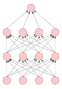

（a）全连接网络
:::
::::

::::{grid-item}
:::{figure-md}
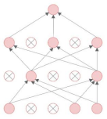

（b）Dropout处理后
:::
::::

:::::
<div class="show-mid">图3-12 Dropout处理效果</div>
<br>
<br>

由于全连接层参数最多，Dropout可以最大限度地减少参数量，降低模型复杂度。因此，为了解决过拟合问题，本项目在ResNet18输出端的两层全连接层使用Dropout。Dropout是PyTorch中的功能包，我们只需在模型框架程序中添加对应的处理模块。在主函数中添加位置和内容如下。

:::{literalinclude} ../codes/chapter_3_3_3_01.py
:caption: chapter_3_3_3_01.py
:language: python
:linenos:
:::

Dropout通常放在激活函数之后，内部参数p表示神经元失活的概率。我们再次输出模型结构，看看添加Dropout后模型结构的变化。

```python
Summary(model, (3, 224, 224))
```

```text
        Layer (type)               Output Shape         Param #
                                        ……
                                        ……
AdaptiveAvgPool2d-67            [-1, 512, 1, 1]               0
          Dropout-68                  [-1, 512]               0
           Linear-69                  [-1, 256]         131,328
             ReLU-70                  [-1, 256]               0
          Dropout-71                  [-1, 256]               0
           Linear-72                    [-1, 6]
1,542================================================================
Total params: 11,309,382
Trainable params: 11,309,382
Non-trainable params: 0
Input size (MB): 0.57
Forward/backward pass size (MB): 62.79
Params size (MB): 43.14
Estimated Total Size (MB): 106.51
----------------------------------------------------------------
```

可以发现，模型在输出端多了两个Dropout结构，刚好与程序中添加的Dropout层的位置对应。值得注意的是，虽然添加了Dropout功能，但是训练的参数量并未减少，说明神经元失活只对当前批次有效，约等于每次都在训练一个Dropout后轻量网络，最后对轻量网络的训练参数进行整合，总参数量无变化。只添加Dropout层，其他训练参数不变。加入Dropout的完整代码可扫描以下二维码下载，其训练结果如图3-13所示。

:::{todo}
代码提供方式需适配线上托管
:::


:::::{grid} 2 2 2 2

::::{grid-item}
:::{figure-md}
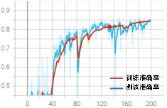

（a）准确率
:::
::::

::::{grid-item}
:::{figure-md}
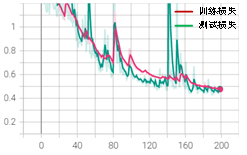

（b）损失
:::
::::

:::::
<div class="show-mid">图3-13 加入Dropout后的准确率变化过程</div>
<br>
<br>


通过与初始训练条件对比发现，加入Dropout训练速度明显变慢，初始条件的验证损失在100个epoch时已经到达0.5，接着开始过拟合，损失上升。而加入Dropout后，在100个epoch时只到达0.6，且一直呈下降趋势，并未产生过拟合现象，其最佳测试准确率为0.85。因此，在网络中加入Dropout后，可以简化模型，缓解过拟合现象，但降低了收敛速度，最佳准确率相差较小。


（2）训练后期大波动

针对问题2中准确率和损失曲线在训练后期存在较大的波动问题，可以从以下两个方面进行考虑：模型训练过度和模型匹配度。

解决模型过度训练的常用办法是EarlyStopping[11]。首先需要定义两个参数，一个是score，用来存入最佳模型的损失值的相反数（模型越好，损失越小，score越大），另一个是参数patience。当更新一次score后，如果连续训练patience个epoch的损失全都比当前的score小，则停止训练，即连续patience个epoch都没有使模型效果提升就停止。在编码时我们首先需要定义并实现EarlyStopping类的功能：

:::{literalinclude} ../codes/chapter_3_3_3_02.py
:caption: chapter_3_3_3_02.py
:language: python
:linenos:
:::

取每一个epoch的验证损失，进行大小比较，如果在设定次数内，验证损失没有下降，则表明模型效果已无法继续提升，再训练下去只会使网络退化，应启动早停程序。这么做的好处不仅可以防止过拟合，还能够提前终止训练，节省训练时间。

定义好功能类之后，还需要在主程序内载入并添加此功能。添加位置和添加内容如下：

:::{literalinclude} ../codes/chapter_3_3_3_03.py
:caption: chapter_3_3_3_03.py 前后两个train_model 差异
:diff: ../codes/chapter_3_3_2_05.py
:language: python
:linenos:
:::


我们把EarlyStopping功能嵌入模型后，按照最初参数设定方式batch_size=512，epoch=200，patience设置为20，再次训练。加入EarlyStopping的完整代码可扫描二维码下载，训练结果如图3-14所示。

:::{todo}

代码提供方式需适配在线托管

:::


:::::{grid} 2 2 2 2

::::{grid-item}
:::{figure-md}
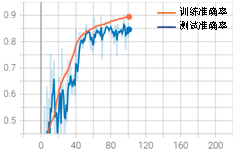

（a）准确率
:::
::::

::::{grid-item}
:::{figure-md}
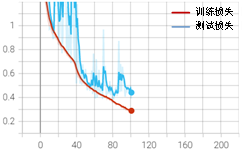

（b）损失
:::
::::

:::::
<div class="show-mid">图3-14 只加入EarlyStopping训练结果</div>
<br>
<br>


在加入EarlyStopping功能后，模型在训练到101个epoch时停止，最佳测试集准确率达到了0.86，训练效果没有明显变化。但加入EarlyStopping能够抑制过度训练导致的后期波动大的问题，并且能在模型最优时及时停止训练，节约训练时间。

模型匹配度问题需要综合考虑数据集数量、数据分布和网络模型。从数据集出发，观察图3-9所示的数据集数量分布可以发现，无裂缝的样本远远多于有裂缝样本，数据分布的均匀性可能是导致数据与模型不匹配的关键。考虑有裂缝样本的数量，将所有无裂缝类别的样本数量缩减到5000，按照相同初始训练条件训练，得到训练结果如图3-15所示。

:::::{grid} 2 2 2 2

::::{grid-item}
:::{figure-md}
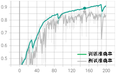

（a）准确率
:::
::::

::::{grid-item}
:::{figure-md}


（b）损失
:::
::::

:::::
<div class="show-mid">图3-15 只缩减数据训练结果</div>
<br>
<br>

从训练结果可以发现，数据数量分布均匀后并未改善后期的大波动问题，最佳测试集准确率达到0.86。这说明缩减数据后虽然减少了大量负样本，但数据分布更加均匀，训练效果依然保持在稳定水平。为了节约训练成本，后面的调试内容都在缩减后的数据集上进行讨论。

（3）训练过程震荡幅度较大

针对测试集曲线整体存在较大震荡的问题，可能由以下两个原因导致：batch_size过大和学习率过大。

batch_size的大小决定每次输入网络的样本数量。batch_size过大，意味着一个epoch内训练的次数会变少。例如，有1024个样本，如果batch_size=1024时，则一个epoch只会训练一个batch_size，当该batch_size内存在大量噪声样本时，会影响整个batch_size的训练效果。我们在其他条件不变的情况下，设置batch_size=256进行训练。减小batch_size的完整代码可扫描二维码下载，训练结果如图3-16所示。

:::{todo}
代码提供方式需适配线上

且单调整batch_size ，是否需要额外提供代码，需讨论
:::

:::::{grid} 2 2 2 2

::::{grid-item}
:::{figure-md}
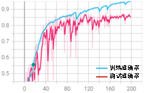

（a）准确率
:::
::::

::::{grid-item}
:::{figure-md}
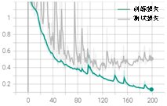

（b）损失
:::
::::

:::::
<div class="show-mid">图3-16 只改变batch_size训练结果</div>
<br>
<br>

从训练结果可以发现，减少batch_size可以明显改善后期的大幅度波动，整体震荡也略有改善。最佳测试集准确率为0.86，训练效果不变。
针对学习率过大问题，我们可以通过调整学习率参数进行改善。原始学习率参数为0.01，衰减率为0.9，间隔epoch为40。现更改为学习率为0.001，衰减率为0.6，间隔epoch为40。其他参数保持不变。修改学习率的完整代码可扫描二维码下载，训练结果如图3-17所示。

:::{todo}
待完善
:::


:::::{grid} 2 2 2 2

::::{grid-item}
:::{figure-md}
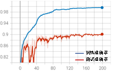

（a）准确率
:::
::::

::::{grid-item}
:::{figure-md}
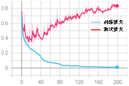

（b）损失
:::
::::

:::::
<div class="show-mid">图3-17 只改变学习率参数训练结果</div>
<br>
<br>

从训练结果可以发现，整体震荡明显变小，波动问题得到显著改善，但是缩小学习率同时带来了过拟合问题。在准确率曲线中，训练集准确率大于测试集；损失曲线中，测试集在20个epoch后开始上升。总结以上训练结果可以发现：学习率太大，容易导致梯度爆炸，使输出曲线振幅较大，模型难以收敛；学习率太小，容易过拟合或陷入“局部最优”点。

针对初始训练结果存在的三个问题，我们提出了相应的解决方法：即Droupout可以解决过拟合问题，早停可以防止模型过度训练，适当减小bach_size可以减小曲线波动，合适的学习率优化方案可以在避免过拟合的前提下，减轻曲线震荡。

综合上述方法，我们设置如下训练参数：采用Droupout，早停patience=30、bach_size=256、学习率0.01，衰减率0.8，间隔epoch为20进行训练。综合优化的完整代码可扫描二维码下载，运行后可得到如图3-18所示的训练结果。

:::{todo}
待完善
:::


:::::{grid} 2 2 2 2

::::{grid-item}
:::{figure-md}
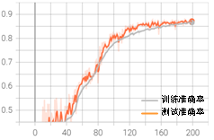

（a）准确率
:::
::::

::::{grid-item}
:::{figure-md}
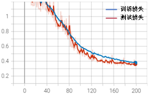

（b）损失
:::
::::

:::::
<div class="show-mid">图3-18 综合优化训练结果</div>
<br>
<br>

从上图可以发现，在早期学习率较大时，波动较大，参数在搜索全局最优解，防止过拟合。随着epoch增加，学习率减小，模型逐步逼近全局最优解。Patience设置为30是为了防止数值过小时由局部最优解导致早停。上述的参数设置有效解决了初始训练中过拟合、整体曲线震荡幅度大和训练后期波动大的问题。

本节以初始训练结果为切入点，和读者一起学习了如何针对训练曲线特点，制定相应的优化方法，并通过训练结果验证优化方法的有效性。在这个过程中我们学会了如何结合实际项目背景、数据集情况、网络结构特点等多方面因素，综合进行调优的方法。

在今后的学习中，我们可能遇到各种问题，这时我们可以仿照上述方案：观察曲线分析原因寻找优化方法训练验证综合优化，来提高模型的检测精度。

对于神经网络来说，提高性能的方法还可以包括图像预处理、网络结构变化等。下面我们对这些方法做一个简单介绍，读者可以根据需要自行深入学习。

① 网络结构优化

本次项目使用的是ResNet18，而对于大批量复杂的数据集，简单的网络结构可能不能满足分类要求，此时就需要改进网络的结构。网络结构的改进可以从多方面进行，比如增加网络的深度，类似于VGG，或改变网络的宽度、连接方式等。同时也可以根据图像特征，改变卷积核的大小并设计每层特征图的尺寸。对于全连接层，我们可以增减全连接的层数和每层的神经元数量，甚至还有不使用全连接层的全卷积神经网络。

网络结构的变化是深度学习进化的主要趋势，针对不同任务、不同的数据类型，我们可以根据需求设计网络，虽然神经网络要进行准确解释较困难，但是想要获得好的网络模型也需要根据理论和经验进行设计。前期，可以从基础入手，对现有的网络结构进行模仿设计，类似ResNet，可以借助现有残差单元设计不同的层数，也可以模仿VGG设计符合要求的结构等，待到学成归来，我们便可以大胆尝试新的结构、新的方法，达到新的高度。

② 图像预处理

图像预处理是在图像输入网络之前对其目标特征进行增强，以突出图像特征或变相增加图片数量，实现分类精度的提升。深度学习框架中通常集成了一些简单的处理方法，包括随机图像灰度化、随机仿射变换、图像属性（亮度、对比度、饱和度和色调）变换和反转等。这些都是现有可用的方法，我们可以直接载入使用。但这些方法对性能提升有限，因此可以采用更多的方法对图像进行处理，如图3-19所示。

:::{figure-md}
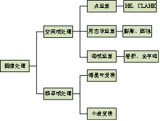

图3-19部分常见图像处理方法
:::

图像增强有助于改善图像的视觉效果，可以将数据转换为更适合人或机器分析处理的形式，也可以突出对人或机器分析有意义的信息，抑制无用信息，提高图像的使用价值。具体方法包括：图像锐化、平滑、去噪、灰度调整（对比度增强）等。

此外，我们可以通过对图片进行如翻转、旋转、裁剪等图像增强操作生成图像变体，扩充数据集，从而解决在实践应用中学习样本偏少的问题。不同的增强方法适用场景不同，我们可以根据自己的数据形式合理有效地进行选择。
