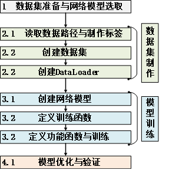

# 采用Resnet18实现裂缝分类

3.2节我们学习了ResNet18的网络架构，同时我们在第二章也对卷积、池化和激活函数的基础知识进行了详细描述。至此，我们已经具备了将ResNet18带入项目实例，实现对裂缝图像分类学习的全部基础知识。下面我们将依照深度学习的实现流程，实现三个场景下有无裂缝的项目进行分类（共计6个种类），具体流程如图3-7所示。

:::{figure-md}


图3-7使用PyTorch进行深度学习的实现流程
:::


:::{literalinclude} ../codes/chapter_3_3_01.py
:caption: chapter_3_3_01.py
:language: python
:linenos:
:::
```{toctree}
---
maxdepth: 3
hidden:
---

3.3.1
```
