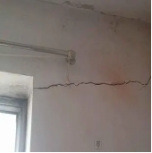
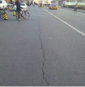
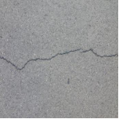
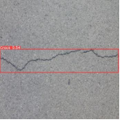
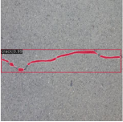

# 采用深层卷积网络实现裂缝分类

随着中国经济社会的蓬勃发展，城市基础建设方兴未艾。建筑、道路等作为基础建设的重要环节，其安全性受到社会各界的广泛关注。然而，这些基础设施在施工或运营期间常会出现各种质量问题，包括裂缝、蜂窝、麻面、露筋[1]等。这些质量缺陷中，裂缝最为常见（图3-1），轻则影响使用性能，重则损害结构的整体性。因此，在基础设施的全生命周期，及时检测、发现裂缝，并制定相应的整改措施，具有重要意义。

:::::{grid} 2 2 2 2
::::{grid-item}
:::{figure-md}


(a) 墙面裂缝
:::
::::

::::{grid-item}
:::{figure-md}


(b) 道路裂缝
:::
::::
:::::
<div class="show-mid">图 3-1 常见裂缝</div>
<br>
<br>

但长期以来，现场裂缝检测大多依靠人工视觉，主观程度高、测量记录过程繁琐且效率低。近几年，随着人工智能技术的发展，裂缝的自动识别技术精度得到进一步提高。其中人工智能在裂缝检测中的应用主要可以分为以下三种（图3-2）：(a)图像分类[2]，通过对裂缝图像和非裂缝图像进行分类，判断图像中是否含有裂缝；(b)目标检测，通过对图像中的裂缝区域进行标注训练，学习裂缝的具体位置并用矩形框进行标识；(c)语义分割[3]，通过对裂缝本体标注，实现裂缝本体的高亮检测。

:::::{grid} 3 3 3 3
::::{grid-item}
:::{figure-md}


(a) 裂缝分类
:::
::::

::::{grid-item}
:::{figure-md}


(b) 裂缝检测
:::
::::

::::{grid-item}
:::{figure-md}


(c) 裂缝分割
:::
::::
:::::
<div class="show-mid">图3-2 裂缝检测的深度学习方法</div>
<br>
<br>

在本章，我们将从最为基础的图像分类问题出发，采用深层卷积神经网络中的残差网络（Residual Network，ResNet）对不同场景下的裂缝图像和非裂缝图像进行分类。通过这个案例，我们可以了解深度学习在实际工程中的具体应用；同时，读者可以尝试将这个方法迁移至建筑工程的其他类似场景，进行拓展学习。

```{toctree}
---
maxdepth: 3
hidden:
---

3.1/index
3.2
```
