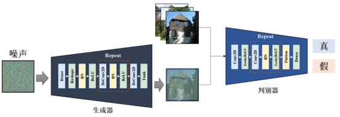
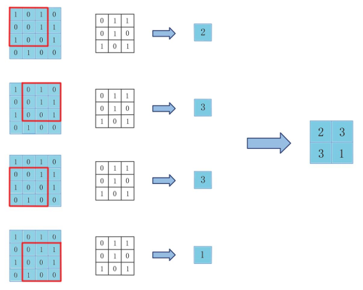
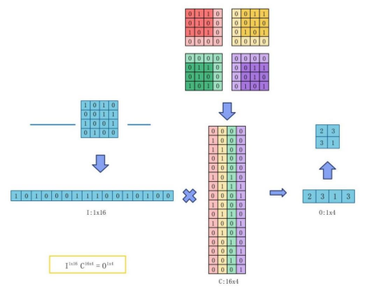
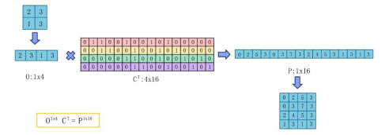
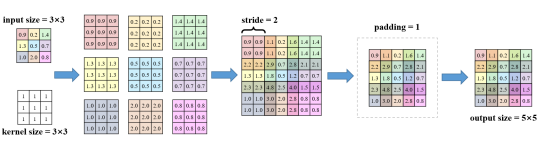

# 深度卷积生成对抗网络概述

深度卷积生成对抗网络是CNN与GAN的结合。DCGAN利用CNN优秀的特征提取能力来提高GAN的生成效果。在第二章中我们学习了CNN网络和GAN网络及其基础知识，本节将对结合了两者的DCGAN的相关原理进行进一步的详细介绍。

DCGAN仍然采样GAN的基本思想，但其使用卷积模块对生成器和判别器的内部结构进行了改进。DCGAN在生成器中使用转置卷积，在判别器中则使用普通卷积，但取消了CNN中使用的池化层。此外，DCGAN在生成器和判别器中每一层网络后都添加了BN层，用以解决参数初始化不良导致的训练不稳定问题和收敛问题。

:::{figure-md}



图4-1 DCGAN模型架构示意图
:::


从图4-1可以看出，DCGAN的判别器使用普通卷积对数据进行运算，而生成器则使用转置卷积对数据进行运算。基于前面的基础知识，我们知道采用普通卷积模块对输入图像进行特征提取后，图像的尺寸通常会变小，实现了一种从大尺寸到小尺寸的下采样过程。例如，当我们使用卷积网络对一张图像进行分类时，就可将整个网络视为一个连续的下采样过程。如果我们希望将这个过程反过来，通过神经网络从某个类别得到一张完整的图像，即完成从小尺寸到大尺寸的上采样过程，我们应该采用什么方法实现呢？下面将要介绍的转置卷积就可以实现这种映射。

首先让我们从另一种思路理解卷积计算过程。以单通道为例，当我们输入一张4×4的图像，设定步长为1，经过3×3的卷积核运算后，将得到2×2的特征图A，具体运算过程如图4-2所示。

:::{figure-md}



图4-2 卷积运算示意图
:::

现在，我们将4×4的二维图像按行排开，变换为长度为16的一维行向量I。同时在卷积核的四周依次添加值为0的padding将其变成4个大小为4×4的矩阵，并将每个矩阵按行排开成长度为16的一维行向量后转置，合并为16×4的新卷积核矩阵C，这时的卷积运算可表示为输入向量I与新卷积核矩阵C的矩阵乘法，计算结果为长度为4的一维行向量O。将向量O进行整理得到的2×2的矩阵与原2×2的特征图A完全相同。图4-3展示了采用这种思路进行卷积运算的流程。

:::{figure-md}



图4-3 将图像展开后的卷积运算示意图
:::

现在，如果已知一个2×2的图像，我们想将其变换为4×4的图像，我们尝试将上述卷积过程进行镜像，看是否可以实现图像的上采样。我们首先将2×2的图像按行排开为长度为4的一维行向量O。如果我们想得到4×4的图像，也就是长度为16的一维向量I，很明显我们需要乘上一个4×16的矩阵。而上述卷积运算中的新卷积核矩阵C为16×4，容易发现，我们现在所需的4×16矩阵应为该16×4的矩阵C的转置，该4×16的矩阵可用符号CT表示。我们将长度为4的一维行向量I与CT相乘，可得长度为16的一维行向量P。将向量P按行整理，可得到4×4的图像。可以看到，通过这样的方式，我们将输入尺寸为2×2的图像转换为尺寸为4×4的输出图像，成功实现了图像的上采样，整个过程如图4-4所示，这个运算过程即为转置卷积。


:::{figure-md}



图4-4 将图像展开后的转置卷积运算示意图
:::

经过上面的介绍，我们了解了转置卷积实际上就是卷积的逆过程，接下来我们从计算公式的角度来学习转置卷
积的计算原理。在先前学习的神经网络卷积层中，我们通常会用到三个参数：卷积核尺寸K、卷积滑动步幅S、
填充尺寸P。卷积核尺寸的意义在于将输入图像中尺寸为K的区域内的像素变为1个像素；步长的意义是卷积核
每次在图像上滑动的步数；填充尺寸针对输入数据，在进行卷积运算前，在输入数据的四周填充P行或P列0，
再将填充完毕的数据进行运算。回顾第2.2.2小节，我们给出了卷积层对于输入数据尺寸I的输出数据尺寸O计
算公式：

$$
O=\frac {I -K + 2P} {S} + 1 \tag {4-1}
$$

我们用一个例子加深对上述公式的理解。假设我们需要对5×5的输入数据进行卷积运算，即I = 5，设定卷积运
算的填充尺寸P为1，卷积核尺寸K为3，卷积滑动步幅S为2，则$O=\frac {(5-3+2)} {2} +1 = 3$，
我们将得到3×3的输出数据。

由于转置卷积是卷积运算的镜像过程，因此将式（4-1）中的输入I和输出O位置对调，即可得到转置卷积中的输入和输出数据尺寸的关系：

$$
I = \frac {(O-K+2P)} {S} +1 \tag {4-2}
$$

进一步变换后，我们便得到输出数据尺寸的计算公式如下：

$$
O=(I-1) \times S +K -2P \tag {4-3}
$$

在转置卷积中，K、S、P这三个参数的具体意义又是什么呢？在卷积中，我们希望实现下采样，将多个像素的特征聚合到一个像素中。现在我们的目标是对每个像素进行上采样，因此现在K的意义就是把一个像素扩充为尺寸为K×K个像素的区域。同理，先前的S表示卷积核在输入图像上移动的步长，我们思考其镜像过程，那么现在的S是将我们通过对每个像素上采样得到的尺寸为K×K的区域相互叠加的间隔。由式（4-3）可以看出，填充尺寸P在最后一步参与计算，将长宽维度的大小各减去2P，从而得到最终的输出数据尺寸。这跟卷积运算中P的作用恰好相反，在卷积运算中我们会在开始卷积前把输入数据的长宽维度各加上2P。

根据我们分析得到的计算公式中参数的意义，下面我们以3×3的输入数据为例，通过公式中参数计算对应的具体步骤，完成对其进行转置卷积的过程，加深对转置卷积运算过程的理解。

我们仍然使用先前的参数，即卷积核尺寸K为3，卷积滑动步幅S为2，填充尺寸P为1，现在我们对一幅3×3的输入图像进行转置卷积计算，整个过程如图4-5所示，我们采用不同颜色区分输入图像中的每个像素。首先，我们将输入图像中的每个像素值乘以卷积核，得到9个3×3的像素矩阵。接下来根据S = 2，我们把这些上采样得到的矩阵每间隔2个像素相互叠加，得到一个7×7的像素矩阵。最后，我们根据P = 1，把像素矩阵的每个方向各去掉1行或1列像素，即长宽维度大小各减少2P，得到的5×5特征图便是转置卷积最终的输出结果。

:::{figure-md}



图4-5 转置卷积运算示意图
:::

在PyTorch中，转置卷积可通过torch.nn.ConvTranspose2d方法实现，其输入输出格式和参数解释如下所示：

```python
# 输入：(B,Cin,Hin,Win)
# 输出：(B,Cout,Hout,Wout)
torch.nn.ConvTranspose2d(
    in_channels, # 输入通道数
    out_channels, # 输出通道数
    kernel_size, # 卷积核尺寸
    stride, # 步幅
    padding, # 输入填充
    output_padding, # 输出填充
    groups, # 输入通道到输出通道的阻塞连接数
    bias, # 是否添加偏置
    dilation, # 卷积核元素之间的距离
    padding_mode, # 填充的数字
    device, # 训练设备
    dtype # 数据格式
)
```
