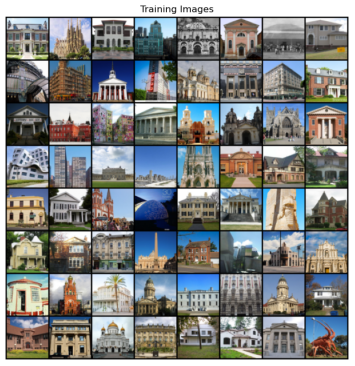

# 数据集加载与可视化

我们使用的数据集是Kaggle中的Architecture Styles数据集[11]。此数据集除了能用于建筑风格分类外，也可用于其他深度学习任务，本章我们将其用于不同风格的建筑立面生成。我们对原数据集进行了简单处理，删除了一些质量不高的图片，得到的数据集包含24种风格的建筑立面，共9636张图像。处理后的数据集可扫描二维码下载。（二维码）

:::{todo}

提供数据下载链接

:::

现在我们已经有了所需的数据集，如何把这些数据进行加载，并处理成网络需要的格式呢？PyTorch中的ImageFolder类可以完成我们的需求。ImageFolder类默认数据集已经按照类型分成了不同的文件夹，一种类型的文件夹下只存放一种类型的图片。ImageFolder有两个主要参数：

1. root：数据集的保存路径。
2. transform：对数据进行转换操作，由一个transforms.Compose对象的实例表示。transforms.Compose对象可以看作一个容器，它能够装入多种数据变换操作。在这里，我们对数据进行了四种变换：transforms.Resize将输入图片按照我们设定的尺寸进行缩放；transforms.CenterCrop以输入图片的中心点为参考点，剪裁出一张长宽为设定值的图片；transforms.ToTensor将PIL图片格式转换为Tensor格式，以便PyTorch处理；transforms.Normalize将图像的每个通道按照设定的均值和标准差进行标准化。

通过ImageFolder，我们已将图片加载并处理为需要的数据格式，同时获得了所有数据的集合dataset。在训练模型时，需要将数据样本载入内存，并在每次迭代中对内存中的所有样本进行计算。因此，出于内存空间的限制以及对训练时间的考虑，我们不能将所有数据一次性载入模型，需要将dataset划分为多个批量（batch）输入到模型进行训练。DataLoader类可以完成这个任务。DataLoader起到一个采样器的作用，按照设定的batch_size将dataset划分为多个批量，其中shuffle参数决定对数据进行采样时是否打乱顺序。实际代码如下所示。

:::{literalinclude} ../codes/chapter_4_2_4_01.py
:caption: chapter_4_2_4_01.py
:language: python
:linenos:
:::

接下来，我们运行以下代码对一个批次的前64张图片进行可视化。首先，我们通过iter函数将dataloader转换为一个迭代器，以便用next函数取出其中的一个批次。同时，由于dataset和dataloader中的图片数据均是由PIL图像变换而成的，各个通道是按照R、G、B的顺序而存储的，而matplotlib中显示的图片通道需要按照G、B、R的顺序存储，因此我们采用numpy.transpose函数将三个通道的位置重新排布。可视化的结果如图4-7所示。

:::{literalinclude} ../codes/chapter_4_2_4_02.py
:caption: chapter_4_2_4_02.py
:language: python
:linenos:
:::

:::{figure-md}

图4-7 训练图片
:::

