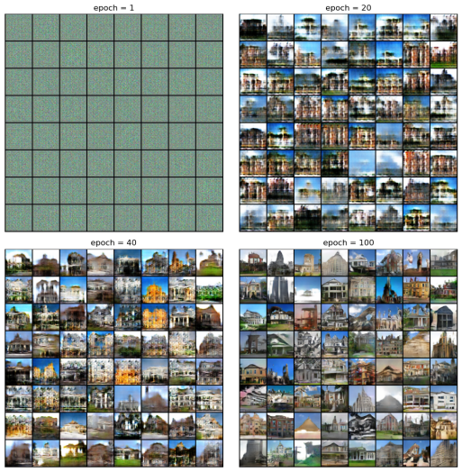

# 模型训练与可视化

训练过程的代码如下所示。和第二章2.3节中的过程类似，在对一个批次数据的训练中，我们依次对判别器网络netD和生成器网络netG进行训练。

在进入训练循环前，我们定义一个固定噪声变量fixed_noise，其中包含64个随机噪声。在训练中每间隔一段时间，将这个固定噪声输入生成器网络，并对网络的输出进行可视化，以直观的形式体现生成器的训练效果。

:::{literalinclude} ../codes/chapter_4_2_9_01.py
:caption: chapter_4_2_9_01.py
:language: python
:linenos:
:::

下面我们按照训练流程来说明代码中的一些细节问题。

在判别器的训练过程中，首先使用zero_grad方法将判别器netD模型参数的梯度置为0，这是因为我们是每个批量计算一次梯度，并进行一次模型参数更新，在计算下一个批量的梯度时，并不需要前一批量数据的梯度。因此，为了保证存储空间不被无关信息占用，我们使用zero_grad方法将每个批量的初始梯度设置为0。然后，我们将从dataloader中取出的数据data放到我们训练网络使用的设备device中去，和神经网络所在的设备保持一致。为了计算判别器损失，我们需要创建一个真标签列表label，此列表有这一批量所有数据的标签，数值为1，表示为真，尺寸为(128,)。随后我们将这一批数据全部输入到判别器中，得到对应的预测结果，此时判别器输出张量的尺寸为(128,1,1,1)。可以发现，输出张量的尺寸与标签列表label的尺寸不同，我们使用view方法将输出张量的尺寸也展平为(128,)，这样方便损失函数对判别器输出与标签列表进行运算。在真实数据的损失计算完毕后，使用backward方法将损失向输入侧进行反向传播，同时对所有需要梯度的变量计算获得梯度，并将其存储备用。

前面已完成判别器对真实数据的处理，接下来介绍判别器对生成数据的处理过程。首先，我们创建一个批量的噪声(128,100,1,1)，并将该噪声输入到生成器netG生成fake图像。需要注意的是，在这里我们使用了生成器netG，若我们直接使用backward方法进行反向传播，梯度会同时分配到生成器netG和判别器netD上。但此时我们只训练判别器，不训练生成器，所以不需要计算生成器netG的梯度，因此使用detach方法使生成fake图像不保留梯度信息。同样的，我们创建一个假标签列表，数值为0表示为假，尺寸为(128,)。随后我们将这一批生成数据全部输入到判别器中，得到判别结果。此时判别器输出张量的尺寸也为(128,1,1,1)，然后使用view方法将输出张量的尺寸展平为一维(128,)。在生成数据的损失计算完毕后，使用backward方法将损失向输入侧进行反向传播，同时对所有需要梯度的变量计算获得梯度，并将其存储备用。这时，我们将真实数据的损失和生成数据的损失加起来就可得到判别器的损失。最后，我们使用判别器的优化器step方法对判别器参数进行更新。

类似的，在生成器的训练过程中，首先使用zero_grad方法将生成器netG模型参数的梯度置为0。然后创建一个真标签列表label，此列表有这一批量所有数据的标签，数值为1，表示为真，尺寸为(128,)。将生成fake图像输入到判别器得到判别结果，并使用view方法将输出张量的尺寸展平为一维(128,)。随后计算生成器的损失，并使用backward方法将损失向输入侧进行反向传播，同时对所有需要梯度的变量计算获得梯度，并将其存储备用。最后，使用生成器的优化器step方法对生成器参数进行更新。需注意的是，生成器依据判别器的判断更新参数，此时输入到判别器netD的生成fake图像便需要梯度，所以此处不使用detach方法。基于DCGAN的建筑立面生成的完整代码可扫描二维码下载。

:::{todo}
待适配
:::

:::{literalinclude} ../codes/chapter_4_2_9_02.py
:caption: chapter_4_2_9_02.py
:language: python
:linenos:
:::

:::{figure-md}

图4-8 训练中生成器生成的图片效果
:::

图4-8为训练过程中生成器利用固定噪声生成的图片的可视化效果。在第1轮训练中，生成器对于如何生成我们想得到的图片一无所知，输出的图片只有噪声。随着训练轮次的增加，生成器的输出逐渐变得清晰可辨起来，当训练到第100轮时，对于我们输入的64个噪声数据，生成器已经能够将它们中的大多数转换为能够以假乱真的图片了，我们成功地完成了基于DCGAN的建筑立面生成！
