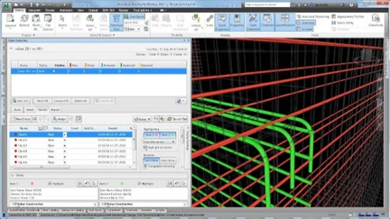
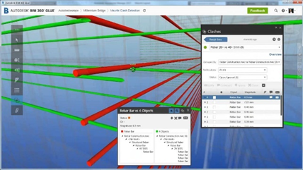

# 基于强化学习的钢筋排布避障设计

当前我国正在大力推广装配式建筑，与传统建造方式相比，采用模块化设计、工厂化生产与标准化装配相结合的装配式建筑，可极大提高施工效率、降低施工成本、减少污染并改善现场作业环境，而设计作为装配式建筑中的核心环节，其设计质量对后续的建造质量乃至项目成败具有极为重要的意义。目前设计人员根据设计规范要求（GB50010-2010[1]，GB 50011-2010[2]）进行配筋和排布钢筋时，其过程繁琐且工作量大，在节点区域钢筋排布密集，极易发生钢筋硬碰撞（如钢筋之间或不同专业之间的物理碰撞）、钢筋软碰撞（如钢筋间距过低或间距不满足施工性要求）等问题，其设计成果（图纸或模型）质量难以保重，此类问题极大影响设计质量及建造成本。

目前装配式建筑在设计中广泛使用计算机辅助设计软件（如Autodesk Robot Structural Analysis Professional，CSI ETABS，PKPM，盈建科YJK等）进行设计，但此类软件一般只能计算钢筋面积并得到钢筋基本信息，部分软件（如Solibri Model Checker，Fuzor和Autodesk Navisworks Manage等）可实现碰撞构件的检测和及可视化显示，如下图5-1所示，但仍无法实现无碰撞的钢筋网自动排布。

强化学习（Reinforcement Learning，RL）算法在复杂自适应系统和复杂序列决策领域中已取得了许多重大进展，例如移动机器人路径规划。近年来，随着深度学习的发展，结合深度学习和强化学习的深度强化学习（Deep Reinforcement Learning，DRL）逐渐兴起，为强化学习解决复杂真实世界中的决策问题提供了可能。

设计人员进行钢筋设计时，通常从构件的一端到另一端进行钢筋排布，同时对多根钢筋进行协调，以避免碰撞。多智能体路径规划，智能体从定义的起点行走至定义的终点，同时避免智能体之间的碰撞。根据多智能体路径规划和钢筋设计的相似性，本章我们将和大家一起，采用多智能体强化学习（Multi-gent Reinforcement Learning，MARL）方法实现钢筋混凝土梁柱节点的无碰撞钢筋智能设计。

:::::{grid} 2 2 2 2

::::{grid-item}
:::{figure-md}


(a) Navisworks 中钢筋碰撞检测
:::
::::

::::{grid-item}
:::{figure-md}


(b) BIM360 Glue 中钢筋碰撞检测
:::
::::

:::::

<div class="show-mid">图5-1 钢筋碰撞问题图片</div>
<br>
<br>

```{toctree}
---
maxdepth: 3
hidden:
---

5.1/index
5.2/index
5.3/index
5.4/index
references
```
