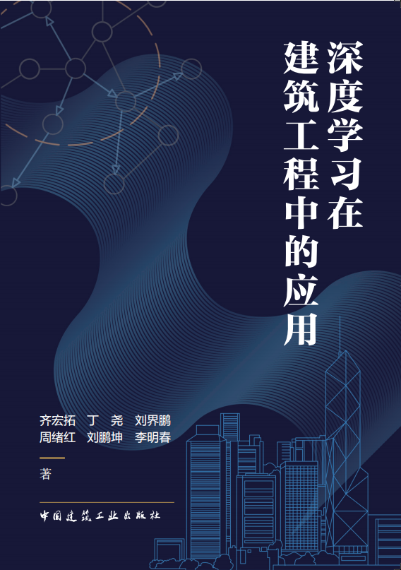

# 《深度学习在建筑工程中的应用》

<br>
<br>

::::{grid} 1 1 1 2
:::{grid-item}


:::
:::{grid-item}
<div class="show-right">
<div>
《深度学习在建筑工程中的应用》
</div>

<div>介绍介绍介绍介绍介绍介绍介绍介绍介绍介绍介
</div>

<div>绍介绍介绍介绍介绍介绍介绍</div>

<div>介绍介绍介绍介绍介绍介绍介绍介绍介绍介绍介绍</div>

<div>介绍介绍介绍介绍介绍介绍介绍介绍介绍介绍介绍</div>

</div>

:::
::::


:::::::{grid} 2 2 2 2
::::::{grid-item}
:columns: 2 2 2 2
<div class="auth-div">
作者
</div>

::::::

::::::{grid-item}
:columns: 10 10 10 10

:::::{grid} 3
::::{grid-item}
:::{figure-md}


齐宏拓
:::
::::

::::{grid-item}
:::{figure-md}


丁尧
:::
::::

::::{grid-item}
:::{figure-md}


刘界鹏
:::
::::

::::{grid-item}
:::{figure-md}


周绪红
:::
::::

::::{grid-item}
:::{figure-md}


刘鹏坤
:::
::::

::::{grid-item}
:::{figure-md}


李明春
:::
::::
:::::

::::::

:::::::


<div class="show-mid">
<h2>引用</h2>
</div>

```text
@book{dl_in_building,
    year={2023}
    publisher={中国建筑工业出版社}
    title={深度学习在建筑工程中的应用},
    author={齐宏拓,丁尧,刘界鹏,周绪红,刘鹏坤,李明春},
}
```

```{toctree}
---
maxdepth: 3
numbered:
hidden:
---


1/index
2/index
3/index
4/index
5/index
```
